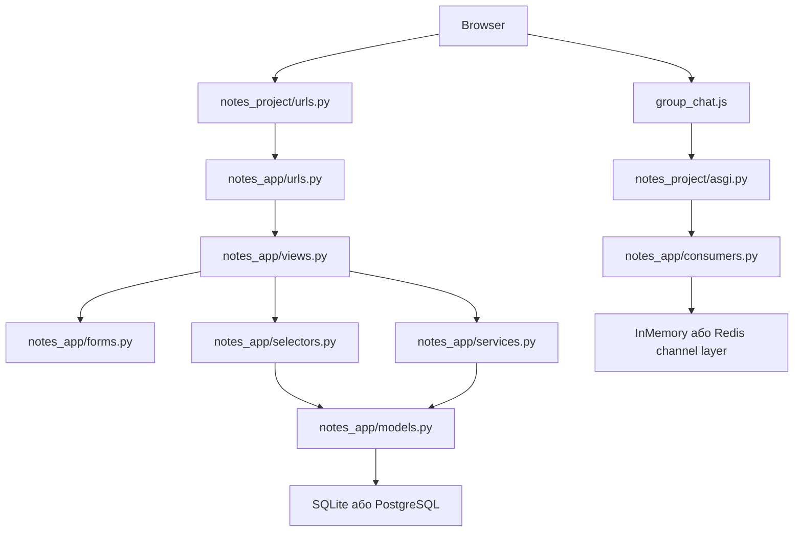

# Notes Chat App

Навчальний Django-репозиторій, який веде студента від web foundations до фінального Django-застосунку з нотатками, списками, груповим доступом і WebSocket-чатом.

## Про проєкт

`Notes Chat App` показує, як виростає Django-застосунок:

- від URL routing і function-based views;
- до models, migrations, ORM і оптимізації запитів;
- до forms, templates, Bootstrap і Crispy Forms;
- до services/selectors, authentication, permissions і tests;
- до ASGI, Django Channels і WebSocket-чату;
- до мислення про Docker, Redis, PostgreSQL і deployment.

UI проєкту використовує назву `CrispyNotes`. Django project package - `notes_project`, Django app - `notes_app`.

## Можливості

| Напрям | Реалізація |
| --- | --- |
| Notes | CRUD, пошук, notebooks, tags, priority, pinned |
| Todo lists | списки, items, toggle, direct sharing |
| Shopping lists | товари, кількість, estimated price, sharing |
| Groups | створення груп, учасники, group-owned notes/shopping lists |
| Chat | real-time group chat через Django Channels |
| Auth | registration, login/logout, password change/reset templates |
| Tests | models, services, forms, views, consumers, Selenium |

## Технології

- Python 3.12 у середовищі аудиту.
- Django `>=5.2,<6.0`.
- Bootstrap 5 і Bootstrap Icons.
- `django-crispy-forms` + `crispy-bootstrap5`.
- Django Channels, Daphne, Uvicorn, `channels-redis`.
- SQLite локально без `DATABASE_URL`.
- PostgreSQL і Redis через environment variables.
- Selenium, coverage, GitHub Actions.

## Швидкий запуск

```bash
git clone https://github.com/NikoriakViktot/notes_chat_app.git
cd notes_chat_app

python3 -m venv .venv
source .venv/bin/activate

python -m pip install --upgrade pip
pip install -r requirements.txt

python manage.py migrate
python manage.py createsuperuser
python manage.py runserver
```

Windows PowerShell:

```powershell
py -3.12 -m venv .venv
.\.venv\Scripts\Activate.ps1
python -m pip install --upgrade pip
pip install -r requirements.txt
python manage.py migrate
python manage.py runserver
```

## Основні URL

| URL | Призначення |
| --- | --- |
| `/` | стартова сторінка |
| `/register/` | реєстрація |
| `/accounts/login/` | login |
| `/notes/` | нотатки |
| `/todo/` | списки справ |
| `/shopping/` | списки покупок |
| `/groups/` | групи |
| `/groups/<pk>/chat/` | HTML-сторінка чату |
| `/ws/groups/<pk>/chat/` | WebSocket endpoint |
| `/admin/` | Django admin |

## Архітектура



## Документація

Документація побудована на [MkDocs + Material](https://squidfunk.github.io/mkdocs-material/).

**Онлайн:** https://nikoriakviktor.github.io/notes_chat_app/

### Локальний перегляд

```bash
source .venv/bin/activate
pip install -r requirements-docs.txt
mkdocs serve
```

Відкрий у браузері: **http://localhost:8000**

`mkdocs serve` автоматично перезавантажує при зміні будь-якого `.md` файлу.

### Публікація на GitHub Pages

```bash
git add mkdocs.yml requirements-docs.txt docs/ .github/workflows/docs.yml
git commit -m "docs: update documentation"
git push
```

GitHub Actions автоматично збудує сайт і задеплоїть у гілку `gh-pages`.
Статус: https://github.com/NikoriakViktot/notes_chat_app/actions

> **Перший деплой:** зайди в **Settings → Pages**, вибери Source = `gh-pages` / `/ (root)`, натисни Save.

### Структура документації

| Розділ | Опис |
|--------|------|
| [Книга](docs/00_getting_started/README.md) | 12 модулів: Web → Django → DB → Forms → Frontend → Architecture → Auth → Testing → Async → Linux → Deploy |
| [Notes Chat App](docs/12_final_project/README.md) | Архітектура, моделі, тести, деплоймент фінального проєкту |
| [Практика](docs/tutorials/README.md) | Туторіали та labs |
| [Довідник](docs/reference/README.md) | Cheatsheets, глосарій, troubleshooting |
| [Викладачу](docs/TEACHING_GUIDE.md) | Teaching guide, learning path |

## Навчальний маршрут

1. [Getting started](docs/00_getting_started/README.md)
2. [Web foundations](docs/01_web_foundations/README.md)
3. [Django core](docs/02_django_core/README.md)
4. [Database and ORM](docs/03_database_and_orm/README.md)
5. [Forms and validation](docs/04_forms_and_validation/README.md)
6. [Frontend and templates](docs/05_frontend_and_templates/README.md)
7. [Application architecture](docs/06_application_architecture/README.md)
8. [Auth and security](docs/07_auth_and_security/README.md)
9. [Testing and quality](docs/08_testing_and_quality/README.md)
10. [Async and realtime](docs/09_async_and_realtime/README.md)
11. [Linux and DevOps](docs/10_linux_and_devops/README.md)
12. [Deployment](docs/11_deployment/README.md)
13. [Final project](docs/12_final_project/README.md)

## Демо-дані (`seed_demo_data`)

Команда заповнює базу даних реалістичними прикладами для швидкого старту та демонстрації.

### Команди

```bash
# Звичайний запуск (ідемпотентний — не дублює якщо вже є)
python manage.py seed_demo_data

# Очистити всі demo-дані і створити заново
python manage.py seed_demo_data --reset

# Дозволити запуск при DEBUG=False (production-guard bypass)
python manage.py seed_demo_data --force

# Через Docker
docker compose run --rm web python manage.py seed_demo_data
docker compose run --rm web python manage.py seed_demo_data --reset
```

### Автоматичний запуск у Docker

`SEED_DEMO_DATA=1` в `docker-compose.yml` → сідер запускається автоматично при старті контейнера через `entrypoint.sh`.

### Демо-користувачі

Пароль для всіх: **`demo1234`**

| Логін | Ім'я | Email |
|-------|------|-------|
| `demo_alice` | Аліса Шевченко | alice@demo.example.com |
| `demo_bob` | Боб Коваленко | bob@demo.example.com |
| `demo_carol` | Кароль Мельник | carol@demo.example.com |

### Демо-групи

| Назва групи | Учасники |
|-------------|----------|
| Команда розробки | demo_alice, demo_bob, demo_carol |
| Сімейний чат | demo_alice, demo_carol |

### Що створюється

| Об'єкт | Кількість | Деталі |
|--------|-----------|--------|
| Користувачі | 3 | alice, bob, carol |
| Групи | 2 | Команда розробки, Сімейний чат |
| Теги | 18 | 6 тегів × 3 юзери (робота, особисте, навчання, важливо, ідеї, перечитати) |
| Записники | 9 | 3 записники × 3 юзери (Робочі нотатки, Особисте, Навчання Python) |
| Нотатки | 30 | 10 нотаток × 3 юзери, з тегами, пріоритетами і прикріпленими |
| Нагадування | 12 | 4 нагадування × 3 юзери |
| Списки справ | 9 | 3 Todo-списки × 3 юзери, з items і sharing між юзерами |
| Список покупок | 9 | 3 shopping-списки × 3 юзери, з цінами і кількостями |
| Повідомлення чату | 30 | Реалістичний діалог у групі «Команда розробки» |

### Теги (у кожного юзера)

`робота` · `особисте` · `навчання` · `важливо` · `ідеї` · `перечитати`

### Нотатки (10 тем, однакові для всіх юзерів)

- Архітектура нового модуля *(робота, важливо — pinned, shared з групою)*
- Docker Compose + PostgreSQL *(робота, навчання)*
- Django Channels: channel layer *(навчання — pinned)*
- Ідея: фільтрація нотаток за датою *(ідеї, робота)*
- Книги до прочитання *(навчання, перечитати)*
- Конспект: asyncio event loop *(навчання)*
- Зворотний зв'язок після демо *(робота, shared з групою)*
- Рефакторинг selectors.py *(робота, важливо)*
- Плани на вихідні *(особисте)*
- WebSocket: оптимізація history *(ідеї, навчання — pinned, shared з групою)*

### Ідемпотентність

Повторний запуск `seed_demo_data` (без `--reset`) **не дублює** дані — використовується `update_or_create` за username / title. Безпечно запускати декілька разів.

Для повного скидання демо-даних (тільки `demo_*` об'єкти, без торкання даних реальних юзерів):

```bash
python manage.py seed_demo_data --reset
```

## ngrok — публічний доступ ззовні

[ngrok](https://ngrok.com) створює захищений тунель від публічного URL до твого локального порту 80 (nginx).
Зручно щоб показати проєкт без деплою або протестувати вебхуки.

Твій статичний домен: **`https://fawn-natural-mayfly.ngrok-free.app`**

### Варіант 1: через Docker Compose (рекомендовано)

Додай у `.env`:

```env
NGROK_AUTHTOKEN=your_ngrok_authtoken_here
NGROK_DOMAIN=fawn-natural-mayfly.ngrok-free.app
```

> **Важливо:** якщо ngrok вже запущений локально (`ngrok http 80`) — зупини його перед `docker compose up`. Один статичний домен не може бути активним двічі (помилка `ERR_NGROK_334`).

Запусти:

```bash
docker compose up -d
```

ngrok-сервіс підніметься автоматично і прокине тунель до nginx:80.
Веб-інтерфейс ngrok: **http://localhost:4040**

### Варіант 2: локально (без Docker)

Спочатку запусти стек (`docker compose up -d`), потім у окремому терміналі:

#### Linux

```bash
# Встановлення
curl -sSL https://ngrok-agent.s3.amazonaws.com/ngrok.asc \
  | sudo tee /etc/apt/trusted.gpg.d/ngrok.asc >/dev/null \
  && echo "deb https://ngrok-agent.s3.amazonaws.com bookworm main" \
  | sudo tee /etc/apt/sources.list.d/ngrok.list \
  && sudo apt update && sudo apt install ngrok

# Авторизація
ngrok config add-authtoken YOUR_AUTHTOKEN

# Запуск
ngrok http --url=fawn-natural-mayfly.ngrok-free.app 80
```

#### macOS

```bash
# Встановлення
brew install ngrok

# Авторизація
ngrok config add-authtoken YOUR_AUTHTOKEN

# Запуск
ngrok http --url=fawn-natural-mayfly.ngrok-free.app 80
```

#### Windows

```powershell
# Встановлення через winget
winget install ngrok

# Авторизація
ngrok config add-authtoken YOUR_AUTHTOKEN

# Запуск
ngrok http --url=fawn-natural-mayfly.ngrok-free.app 80
```

> Токен знаходиться в [ngrok Dashboard → Your Authtoken](https://dashboard.ngrok.com/get-started/your-authtoken). Зберігай його як пароль, не комітти в git.

## Тести

```bash
python manage.py check
python manage.py test
```

Async HTTP demo modules у поточному working tree відсутні і не описуються як активна feature. Реальний async-компонент проєкту - WebSocket chat через ASGI, Channels і `GroupChatConsumer`.

## Deployment status

Проєкт має заготовки `Dockerfile`, `docker-compose.yml`, `entrypoint.sh` і `.env.example`, але Docker path зараз неузгоджений: compose/build налаштування згадують директорію `notes`, якої немає в корені. Production deployment треба доробити і перевірити.

## Подальший розвиток

- Якщо потрібно повернути async HTTP demo, відновити `async_views.py`, `async_selectors.py`, `async_services.py` разом із routes.
- Виправити Docker build context.
- Винести `SECRET_KEY`, `DEBUG`, `ALLOWED_HOSTS` у environment.
- Увімкнути Redis channel layer для production.
- Додати production-ready logging і monitoring.
