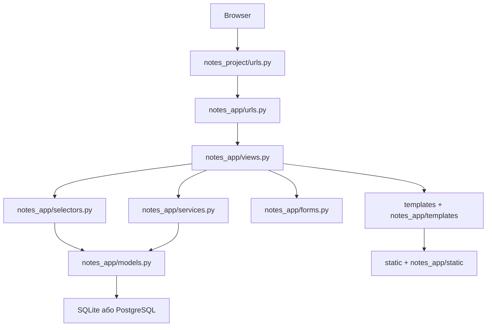
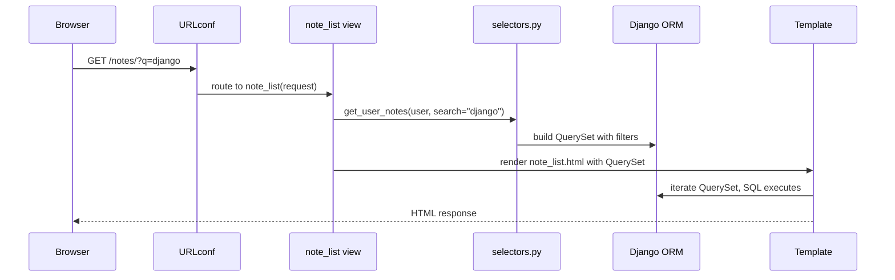
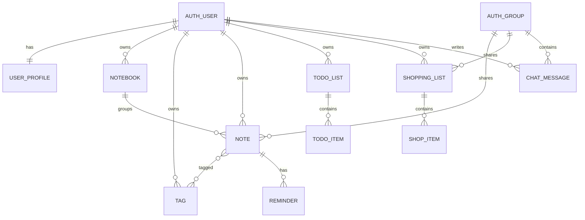
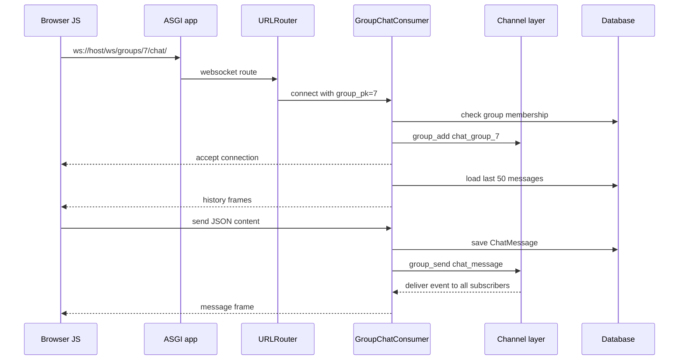
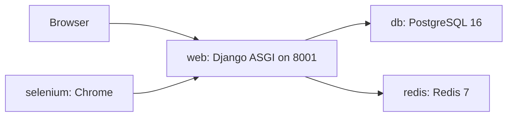

# Notes Chat App

Навчальний Django-проєкт для персональних нотаток, списків справ, списків покупок, групового доступу і WebSocket-чату.

Цей репозиторій показує не тільки "як запустити застосунок", а й як мислити про великий Django-проєкт: де живе routing, де зберігаються models, чому views краще тримати тонкими, навіщо потрібні selectors і services, як templates збираються через inheritance, як працює authentication, authorization, sessions, Django Channels і WebSocket.

> Важливо: цей README описує поточний окремий репозиторій `notes_chat_app`, а не старі навчальні директорії з монорепозиторію. Усі шляхи нижче відносні до кореня цього репозиторію.

## Зміст

1. [Про проєкт](#1-про-проєкт)
2. [Що реалізовано](#2-що-реалізовано)
3. [Навчальна цінність](#3-навчальна-цінність)
4. [Поточний стан після аудиту](#4-поточний-стан-після-аудиту)
5. [Швидкий запуск](#5-швидкий-запуск)
6. [Повне встановлення для початківця](#6-повне-встановлення-для-початківця)
7. [Змінні середовища](#7-змінні-середовища)
8. [Структура репозиторію](#8-структура-репозиторію)
9. [Архітектура одним поглядом](#9-архітектура-одним-поглядом)
10. [Як проходить HTTP request](#10-як-проходить-http-request)
11. [URL routing](#11-url-routing)
12. [Models і база даних](#12-models-і-база-даних)
13. [Migrations](#13-migrations)
14. [Selectors і services](#14-selectors-і-services)
15. [Views](#15-views)
16. [Forms і Crispy Forms](#16-forms-і-crispy-forms)
17. [Templates, Bootstrap і static files](#17-templates-bootstrap-і-static-files)
18. [Authentication, sessions і password flows](#18-authentication-sessions-і-password-flows)
19. [Authorization і захист від IDOR](#19-authorization-і-захист-від-idor)
20. [Груповий доступ](#20-груповий-доступ)
21. [WebSocket-чат і Django Channels](#21-websocket-чат-і-django-channels)
22. [JavaScript-клієнт чату](#22-javascript-клієнт-чату)
23. [Sync, async, WSGI і ASGI](#23-sync-async-wsgi-і-asgi)
24. [Тестування](#24-тестування)
25. [GitHub Actions CI](#25-github-actions-ci)
26. [Docker, PostgreSQL і Redis](#26-docker-postgresql-і-redis)
27. [Підготовка до production](#27-підготовка-до-production)
28. [Основні URL](#28-основні-url)
29. [Типові помилки](#29-типові-помилки)
30. [Навчальний маршрут](#30-навчальний-маршрут)
31. [Практичні завдання](#31-практичні-завдання)
32. [Словник термінів](#32-словник-термінів)
33. [Куди рухатись далі](#33-куди-рухатись-далі)

## 1. Про проєкт

`Notes Chat App` - це Django-застосунок, який починається з класичного CRUD для нотаток, а поступово виростає до системи з:

- обліковими записами користувачів;
- приватними нотатками;
- записниками;
- тегами;
- нагадуваннями;
- todo lists;
- shopping lists;
- прямим sharing між користувачами;
- групами на базі `django.contrib.auth.models.Group`;
- груповими нотатками і списками покупок;
- real-time груповим чатом через Django Channels;
- unit, integration, consumer і Selenium E2E тестами;
- CI workflow у GitHub Actions;
- заготовками для Docker, PostgreSQL і Redis.

Назва у UI: `CrispyNotes`. Назва репозиторію і застосунку: `notes_chat_app`.

Головна навчальна ідея: студент має побачити, що Django-проєкт складається не з одного "магічного" файлу, а з шарів. Кожен шар відповідає за свою частину роботи.

## 2. Що реалізовано

| Напрям | Поточна реалізація |
| --- | --- |
| Django project package | `notes_project` |
| Django app | `notes_app` |
| Головний entrypoint | `manage.py` |
| UI | Bootstrap 5 через CDN, Bootstrap Icons, власний CSS |
| Forms | Django Forms + `django-crispy-forms` + `crispy-bootstrap5` |
| Auth | Django built-in auth URLs, register view, login/logout, password reset/change templates |
| Notes | CRUD, пошук, фільтр за notebook/tag, priority, pinned, archived field |
| Notebooks | CRUD, default notebook flag, color |
| Tags | створення, нормалізація назви, унікальність у межах user |
| Reminders | створення і видалення нагадувань для нотаток |
| Todo lists | CRUD, items, toggle, sharing з іншим user |
| Shopping lists | CRUD, items, price estimate, toggle purchased, sharing з іншим user |
| Groups | створення, членство, додавання/видалення учасників, вихід з групи |
| Group sharing | `Note.group` і `ShoppingList.group` |
| WebSocket chat | `GroupChatConsumer`, `ChatMessage`, `/ws/groups/<pk>/chat/` |
| Channel layer | Redis якщо є `REDIS_URL`, інакше `InMemoryChannelLayer` |
| DB локально | SQLite через `db.sqlite3`, створюється після `migrate` |
| DB у Docker/settings | PostgreSQL через `DATABASE_URL` |
| Tests | `notes_app/tests/` |
| CI | `.github/workflows/django-tests.yml` |

## 3. Навчальна цінність

Після вивчення цього репозиторію студент має розуміти:

- що таке Django project і Django app;
- як `urls.py` направляє request до view;
- чим відрізняються `model`, `form`, `view`, `template`;
- як працює ORM і чому QuerySet лінивий;
- навіщо існують migrations;
- чому `selectors.py` читає дані, а `services.py` змінює дані;
- як `login_required` захищає сторінки;
- чому authentication не дорівнює authorization;
- що таке IDOR і чому треба фільтрувати об'єкти за user/group;
- як працює template inheritance;
- як Crispy Forms прибирає дублювання Bootstrap HTML;
- як session cookie дозволяє Django пам'ятати user;
- чим HTTP request/response відрізняється від WebSocket;
- чому WebSocket потребує ASGI і Consumer;
- чому `InMemoryChannelLayer` підходить для навчання, але не для production з кількома процесами;
- як запускати Django checks, tests і CI.

## 4. Поточний стан після аудиту

Цей README написано за фактичним станом файлів у репозиторії. Є кілька важливих моментів, які треба знати перед запуском.

| Перевірка | Стан |
| --- | --- |
| Git remote | `https://github.com/NikoriakViktot/notes_chat_app.git` |
| Python у WSL під час аудиту | `Python 3.12.3` |
| Django dependency | у `requirements.txt`: `Django>=5.2,<6.0` |
| Local dependency state | `python3 manage.py check` не дійшов до Django check, бо у поточному WSL Python не встановлено `django` |
| Async HTTP demo files | `notes_app/urls.py` імпортує `async_views`, але `notes_app/async_views.py`, `async_selectors.py`, `async_services.py` у working tree відсутні |
| WebSocket chat | файли `notes_project/asgi.py`, `notes_project/routing.py`, `notes_app/consumers.py`, `ChatMessage`, `group_chat.js` присутні |
| Docker files | присутні, але `docker-compose.yml` має `build: notes`, а `Dockerfile` має `COPY notes .`; директорії `notes/` у корені немає |

Практичний наслідок:

- спочатку встановіть залежності у virtual environment;
- потім запустіть `python manage.py check`;
- якщо після встановлення залежностей Django впаде на `ImportError` через `async_views`, треба або відновити async-файли, або прибрати async routes з `notes_app/urls.py`;
- Docker-команди не варто вважати готовими до запуску, доки не виправлено build context і `COPY` шлях.

## 5. Швидкий запуск

Цей сценарій для користувача, який уже розуміє Git, virtual environment і pip.

```bash
git clone https://github.com/NikoriakViktot/notes_chat_app.git
cd notes_chat_app

python -m venv .venv
source .venv/bin/activate

python -m pip install --upgrade pip
pip install -r requirements.txt

python manage.py migrate
python manage.py createsuperuser
python manage.py runserver
```

Відкрийте:

- `http://127.0.0.1:8000/` - стартова сторінка;
- `http://127.0.0.1:8000/register/` - реєстрація;
- `http://127.0.0.1:8000/accounts/login/` - вхід;
- `http://127.0.0.1:8000/notes/` - список нотаток;
- `http://127.0.0.1:8000/admin/` - Django admin.

Для явного ASGI-запуску, потрібного для WebSocket-чату:

```bash
uvicorn notes_project.asgi:application --reload --port 8001
```

Після цього відкрийте:

- `http://127.0.0.1:8001/groups/` - групи;
- `http://127.0.0.1:8001/groups/<pk>/chat/` - сторінка групового чату;
- WebSocket endpoint: `ws://127.0.0.1:8001/ws/groups/<pk>/chat/`.

## 6. Повне встановлення для початківця

### 6.1. Що таке клонування

Клонування - це створення локальної копії GitHub-репозиторію на вашому комп'ютері.

```bash
git clone https://github.com/NikoriakViktot/notes_chat_app.git
cd notes_chat_app
```

`cd notes_chat_app` переводить термінал у корінь репозиторію. Саме з цього місця треба виконувати `python manage.py ...`.

### 6.2. Windows PowerShell

```powershell
git clone https://github.com/NikoriakViktot/notes_chat_app.git
cd notes_chat_app

py -3.12 -m venv .venv
.\.venv\Scripts\Activate.ps1

python -m pip install --upgrade pip
pip install -r requirements.txt

python manage.py migrate
python manage.py createsuperuser
python manage.py runserver
```

Якщо PowerShell не дозволяє активувати venv:

```powershell
Set-ExecutionPolicy -ExecutionPolicy RemoteSigned -Scope CurrentUser
.\.venv\Scripts\Activate.ps1
```

### 6.3. Linux, macOS або WSL

```bash
git clone https://github.com/NikoriakViktot/notes_chat_app.git
cd notes_chat_app

python3 -m venv .venv
source .venv/bin/activate

python -m pip install --upgrade pip
pip install -r requirements.txt

python manage.py migrate
python manage.py createsuperuser
python manage.py runserver
```

### 6.4. Навіщо virtual environment

Virtual environment - це ізольована папка з Python-пакетами саме для цього проєкту.

Без venv залежності різних проєктів змішуються. Один проєкт може потребувати Django 5.2, інший - Django 4.2, і глобальна установка швидко стає хаотичною.

### 6.5. Що роблять команди

| Команда | Що робить |
| --- | --- |
| `python -m venv .venv` | створює ізольоване Python-середовище |
| `source .venv/bin/activate` | активує venv у Linux/macOS/WSL |
| `.\.venv\Scripts\Activate.ps1` | активує venv у PowerShell |
| `python -m pip install --upgrade pip` | оновлює installer пакетів |
| `pip install -r requirements.txt` | встановлює Django, Channels, Crispy Forms, Selenium та інші залежності |
| `python manage.py migrate` | створює таблиці БД за migrations |
| `python manage.py createsuperuser` | створює admin user |
| `python manage.py runserver` | запускає development server |
| `Ctrl+C` | зупиняє server у терміналі |

Development server зручний для навчання, але не є production server. У production потрібні окремі налаштування: `DEBUG=False`, `ALLOWED_HOSTS`, HTTPS, application server, reverse proxy, static files, logging і secrets через environment.

## 7. Змінні середовища

У корені є `.env.example`. Його можна скопіювати у `.env`, але важливо розуміти: сам `settings.py` зараз напряму читає тільки `DATABASE_URL` і `REDIS_URL` через `os.environ.get(...)`. Автоматичного завантаження `.env` файлу через `python-dotenv` або `django-environ` у поточному коді немає.

```bash
cp .env.example .env
```

Поточні змінні з `.env.example`:

| Змінна | Для чого |
| --- | --- |
| `POSTGRES_DB` | назва PostgreSQL database для Docker |
| `POSTGRES_USER` | user PostgreSQL для Docker |
| `POSTGRES_PASSWORD` | password PostgreSQL для Docker |
| `SECRET_KEY` | має бути secret у production, але поточний `settings.py` його ще не читає |
| `DATABASE_URL` | якщо задано, Django перемикається з SQLite на PostgreSQL |
| `REDIS_URL` | якщо задано, Channels використовує Redis channel layer |
| `SELENIUM_REMOTE_URL` | remote Selenium WebDriver для E2E тестів |
| `WEB_HOST` | hostname web-сервісу для Docker/Selenium сценаріїв |

### 7.1. Database selection

У `notes_project/settings.py` логіка така:

- якщо `DATABASE_URL` задано, використовується PostgreSQL;
- якщо `DATABASE_URL` не задано, використовується SQLite файл `db.sqlite3`;
- для тестів SQLite має файлову test DB `test_db.sqlite3`, щоб live server і Channels tests могли працювати між потоками.

### 7.2. Channel layer selection

У `notes_project/settings.py`:

- якщо є `REDIS_URL`, використовується `channels_redis.core.RedisChannelLayer`;
- якщо `REDIS_URL` немає, використовується `channels.layers.InMemoryChannelLayer`.

`InMemoryChannelLayer` підходить для навчального запуску в одному процесі. Для production з кількома workers потрібен Redis.

## 8. Структура репозиторію

```text
.
├── manage.py
├── requirements.txt
├── .env.example
├── Dockerfile
├── docker-compose.yml
├── entrypoint.sh
├── run_server.ps1
├── .github/
│   └── workflows/
│       └── django-tests.yml
├── notes_project/
│   ├── settings.py
│   ├── urls.py
│   ├── asgi.py
│   ├── wsgi.py
│   ├── routing.py
│   └── middleware.py
├── notes_app/
│   ├── models.py
│   ├── admin.py
│   ├── forms.py
│   ├── views.py
│   ├── urls.py
│   ├── selectors.py
│   ├── services.py
│   ├── consumers.py
│   ├── context_processors.py
│   ├── migrations/
│   ├── static/
│   │   └── notes_app/
│   │       ├── css/app.css
│   │       └── js/group_chat.js
│   ├── templates/
│   │   └── notes_app/
│   └── tests/
├── templates/
│   ├── base.html
│   ├── layouts/dashboard.html
│   ├── components/
│   └── registration/
├── static/
│   └── css/project.css
├── staticfiles/
└── raw/
    ├── README_1.md
    ├── README_2.md
    ├── README_3.md
    ├── README_4.md
    ├── README_5.md
    ├── README_6.md
    ├── README_7.md
    └── README_8.md
```

`raw/README_*.md` - історичні навчальні матеріали. Вони корисні як пояснення еволюції, але не всі шляхи та приклади з них відповідають поточному окремому репозиторію.

## 9. Архітектура одним поглядом



Коротко по шарах:

| Шар | Файл | Відповідальність |
| --- | --- | --- |
| Project config | `notes_project/settings.py` | apps, middleware, DB, static, auth, Channels |
| HTTP routing | `notes_project/urls.py`, `notes_app/urls.py` | URL -> view |
| WebSocket routing | `notes_project/routing.py` | WS URL -> Consumer |
| HTTP layer | `notes_app/views.py` | request, permissions, form handling, render/redirect |
| Read layer | `notes_app/selectors.py` | SELECT queries |
| Write layer | `notes_app/services.py` | create/update/delete, transactions |
| Domain model | `notes_app/models.py` | tables, fields, relationships, constraints |
| Forms | `notes_app/forms.py` | validation, field filtering, Crispy layout |
| Templates | `templates/`, `notes_app/templates/` | HTML pages |
| Static | `static/`, `notes_app/static/` | CSS і JavaScript |
| WebSocket | `notes_app/consumers.py` | long-lived chat connection |

## 10. Як проходить HTTP request

Приклад: користувач відкриває `GET /notes/?q=django`.



Важлива думка: `selectors.get_user_notes(...)` повертає QuerySet. QuerySet у Django лінивий. SQL часто виконується не в момент створення QuerySet, а коли template починає його перебирати.

## 11. URL routing

### 11.1. Project-level URLs

Файл: `notes_project/urls.py`.

| URL | Що підключає |
| --- | --- |
| `/admin/` | Django admin |
| `/accounts/` | built-in auth URLs: login, logout, password change/reset |
| `/` | `notes_app.urls` |
| `__debug__/` | debug toolbar URLs через `debug_toolbar_urls()` |

### 11.2. App-level URLs

Файл: `notes_app/urls.py`.

| URL | View | Призначення |
| --- | --- | --- |
| `/` | `index` | landing/index, redirect для authenticated user |
| `/register/` | `register` | створення user і auto-login |
| `/notes/` | `note_list` | список нотаток |
| `/notes/new/` | `note_create` | створення нотатки |
| `/notes/<pk>/` | `note_detail` | деталі нотатки |
| `/notes/<pk>/edit/` | `note_edit` | редагування |
| `/notes/<pk>/delete/` | `note_delete` | підтвердження і видалення |
| `/notebooks/` | `notebook_list` | список записників |
| `/notebooks/new/` | `notebook_create` | створення записника |
| `/notebooks/<pk>/edit/` | `notebook_edit` | редагування записника |
| `/notebooks/<pk>/delete/` | `notebook_delete` | видалення записника |
| `/tags/new/` | `tag_create` | створення тегу |
| `/todo/` | `todo_list_list` | списки справ |
| `/todo/new/` | `todo_list_create` | новий список справ |
| `/todo/<pk>/` | `todo_list_detail` | деталі todo list |
| `/todo/<pk>/share/` | `todo_list_share` | direct sharing |
| `/shopping/` | `shopping_list_list` | списки покупок |
| `/shopping/new/` | `shopping_list_create` | новий список покупок |
| `/shopping/<pk>/` | `shopping_list_detail` | деталі shopping list |
| `/shopping/<pk>/share/` | `shopping_list_share` | direct sharing |
| `/groups/` | `group_list` | групи користувача |
| `/groups/new/` | `group_create` | створення групи |
| `/groups/<pk>/` | `group_detail` | учасники групи |
| `/groups/<pk>/chat/` | `group_chat` | HTML-сторінка чату |

### 11.3. WebSocket URLs

Файл: `notes_project/routing.py`.

| URL | Consumer | Призначення |
| --- | --- | --- |
| `/ws/groups/<group_pk>/chat/` | `GroupChatConsumer` | real-time чат групи |

### 11.4. Async HTTP routes

У `notes_app/urls.py` також оголошено:

```text
/async/notes/
/async/notes/create/
/async/notes/<pk>/
/async/notes/<pk>/delete/
/async/notes/<pk>/pin/
```

Але у поточному working tree файли `notes_app/async_views.py`, `notes_app/async_selectors.py`, `notes_app/async_services.py` відсутні. Тому цей блок зараз є не робочою функцією, а неузгодженістю між URLs і файлами.

## 12. Models і база даних

Файл: `notes_app/models.py`.



### 12.1. Model table

| Model | Основна роль |
| --- | --- |
| `UserProfile` | профіль user: display name, avatar URL, timezone, bio |
| `Tag` | user-owned тег з name і color |
| `Notebook` | user-owned записник для нотаток |
| `Note` | нотатка з priority, pinned/archive flags, notebook, tags, optional group |
| `Reminder` | дата/час нагадування для note |
| `TodoList` | список справ, owner і `shared_with` users |
| `TodoItem` | item всередині todo list |
| `ShoppingList` | список покупок, owner, optional group, `shared_with` users |
| `ShopItem` | товар, quantity, unit, estimated price |
| `ChatMessage` | повідомлення групового чату |

### 12.2. Корисні constraints та indexes

У коді є приклади реальних DB-level правил:

- `Tag.unique_together = [('user', 'name')]` - user не може мати два однакові теги;
- `Note.priority` має validators і `CheckConstraint` від 1 до 4;
- `Note` має indexes для `user + updated_at` і `user + is_pinned`;
- `ShopItem.quantity` має validator і DB constraint `quantity > 0`;
- `ChatMessage` має index `group + timestamp`, бо чат читає останні повідомлення групи.

## 13. Migrations

Фактичні migrations:

| Migration | Що додає |
| --- | --- |
| `0001_initial.py` | базові моделі notes/notebooks/tags/reminders/todo/shopping/profile |
| `0002_shoppinglist_shared_with_todolist_shared_with.py` | direct sharing для todo і shopping lists |
| `0003_note_group_shoppinglist_group.py` | group sharing для notes і shopping lists |
| `0004_chatmessage.py` | `ChatMessage` для WebSocket-чату |

Основні команди:

```bash
python manage.py makemigrations
python manage.py migrate
python manage.py showmigrations
python manage.py sqlmigrate notes_app 0004
```

`makemigrations` створює Python-опис зміни схеми. `migrate` застосовує ці зміни до database.

## 14. Selectors і services

Файли:

- `notes_app/selectors.py`;
- `notes_app/services.py`.

Це архітектурний поділ, який робить великий Django-код читабельнішим.

| Файл | Що дозволено | Що не варто робити |
| --- | --- | --- |
| `selectors.py` | SELECT, filters, annotations, prefetch/select_related | INSERT/UPDATE/DELETE |
| `services.py` | create/update/delete, transactions, business rules | render, redirect, HTTP response |
| `views.py` | request, form, messages, permissions, redirect/render | складний ORM і business logic прямо у view |

### 14.1. Приклад selector

`get_user_notes(user, search=..., tag=..., notebook=...)`:

- бере власні нотатки user;
- додає нотатки груп, у яких user є учасником;
- фільтрує archived state;
- додає optional search/tag/notebook filters;
- використовує `select_related` для FK;
- використовує `prefetch_related` для tags;
- сортує pinned -> priority -> updated.

Це одночасно і security rule, і performance rule.

### 14.2. Приклад service

`create_note(...)`:

- відкриває `transaction.atomic()`;
- створює `Note`;
- фільтрує tag ids за поточним user;
- прив'язує tags через M2M;
- повертає створений object.

Service приховує business operation за одним зрозумілим викликом. View не повинна знати всі деталі запису в БД.

## 15. Views

Файл: `notes_app/views.py`.

Поточна реалізація використовує Function-Based Views. У старих навчальних README є матеріал про Class-Based Views, але у фактичному `views.py` класів `ListView`, `CreateView`, `UpdateView`, `DeleteView` зараз немає.

Типовий view у цьому проєкті:

1. перевіряє authentication через `@login_required`;
2. читає URL params або query params;
3. отримує object через selector або `get_object_or_404`;
4. перевіряє ownership/group membership;
5. для POST створює form і викликає service;
6. додає Django message;
7. робить redirect після успішного POST;
8. для GET рендерить template.

Це відповідає PRG pattern: POST -> Redirect -> GET. Після успішної зміни даних browser не залишається на POST response, тому refresh не повторить створення/видалення.

## 16. Forms і Crispy Forms

Файл: `notes_app/forms.py`.

Проєкт використовує `django-crispy-forms` і `crispy-bootstrap5`. Ідея: validation лишається Django-логікою, а Bootstrap layout описується у Python через `FormHelper` і `Layout`.

### 16.1. Важливі форми

| Form | Для чого |
| --- | --- |
| `NoteForm` | створення/редагування нотатки, filter queryset за user |
| `NotebookForm` | записник, color picker, default flag |
| `TagForm` | тег, color picker, `clean_name()` |
| `TodoListForm` | список справ |
| `TodoItemForm` | inline форма item, `form_tag=False` |
| `ShoppingListForm` | список покупок, optional group |
| `ShopItemForm` | inline товар |
| `ReminderForm` | datetime-local нагадування |
| `ShareForm` | direct sharing за username |
| `GroupCreateForm` | створення group |
| `GroupAddMemberForm` | додавання учасника group |

### 16.2. Security у forms

`NoteForm.__init__(..., user=request.user)` фільтрує:

- notebooks тільки поточного user;
- tags тільки поточного user;
- groups тільки groups, де user є учасником.

Без цього Alice могла б побачити чужі notebooks/tags/groups у dropdown. Це була б не тільки UI-помилка, а й potential data leak.

## 17. Templates, Bootstrap і static files

Головні template layers:

```text
templates/base.html
└── templates/layouts/dashboard.html
    └── notes_app/templates/notes_app/*.html
```

`base.html`:

- задає HTML skeleton;
- підключає Bootstrap 5 CDN;
- підключає Bootstrap Icons;
- підключає `notes_app/css/app.css`;
- має blocks `title`, `body`, `content`, `extra_css`, `extra_js`.

`layouts/dashboard.html`:

- додає sidebar;
- додає topbar;
- показує Django messages як Bootstrap alerts;
- використовує дані з `sidebar_context`.

`notes_app/context_processors.py` автоматично додає у кожен template:

- `sidebar_notebooks`;
- `sidebar_tags`;
- `sidebar_todo_count`;
- `sidebar_shopping_count`;
- `sidebar_groups`.

Так view не дублює один і той самий код для sidebar на кожній сторінці.

## 18. Authentication, sessions і password flows

Authentication - це відповідь на питання "хто ти?". У цьому проєкті:

- `/register/` створює user через `UserCreationForm`;
- `/accounts/login/` надає Django built-in login view;
- `/accounts/logout/` завершує session;
- `/accounts/password_change/` і password reset routes приходять з `django.contrib.auth.urls`;
- templates для auth живуть у `templates/registration/`.

Після login Django створює session і ставить browser cookie. Далі `AuthenticationMiddleware` читає cookie, знаходить session і заповнює `request.user`.

Важливі settings:

| Setting | Поточне значення |
| --- | --- |
| `LOGIN_URL` | `/accounts/login/` |
| `LOGIN_REDIRECT_URL` | `/notes/` |
| `LOGOUT_REDIRECT_URL` | `/accounts/login/` |
| `EMAIL_BACKEND` | console backend для password reset у development |
| `SESSION_COOKIE_HTTPONLY` | `True` |
| `CSRF_COOKIE_HTTPONLY` | `False` |
| `SESSION_COOKIE_SAMESITE` | `Lax` |
| `X_FRAME_OPTIONS` | `DENY` |
| `SECURE_CONTENT_TYPE_NOSNIFF` | `True` |

## 19. Authorization і захист від IDOR

Authorization - це відповідь на питання "що тобі дозволено?". `@login_required` перевіряє тільки authentication. Він не гарантує, що user має право бачити конкретну нотатку.

IDOR - Insecure Direct Object Reference. Типовий приклад:

```text
Alice відкриває /notes/5/
Bob змінює URL на /notes/6/
Якщо note 6 належить Alice і код не перевіряє owner, Bob може побачити чужі дані.
```

У цьому проєкті захист реалізовано через:

- `get_object_or_404(..., user=request.user)` для owner-only об'єктів;
- `Q(user=request.user) | Q(group__in=user_groups)` для group-visible notes;
- `shared_with` checks для todo/shopping direct sharing;
- membership check у `group_chat`;
- membership check у `GroupChatConsumer.connect()`.

Важлива різниця:

- читати group note може учасник group;
- редагувати і видаляти чужу group note поточний code не дозволяє, якщо `note.user != request.user`.

## 20. Груповий доступ

Проєкт використовує built-in Django model `Group`.

У цьому коді `Group` використовується не як permission system, а як domain object для sharing.

Груповий сценарій:

1. user створює group у `/groups/new/`;
2. creator автоматично додається як перший member;
3. у `/groups/<pk>/` можна додати інших users за username;
4. note або shopping list може отримати `group`;
5. members бачать group-owned notes/shopping lists;
6. group має chat page `/groups/<pk>/chat/`.

`TodoList` і `ShoppingList` також мають direct sharing через `shared_with`. Це окремий механізм: direct user-to-user доступ, не через group.

## 21. WebSocket-чат і Django Channels

Файли:

- `notes_project/asgi.py`;
- `notes_project/routing.py`;
- `notes_app/consumers.py`;
- `notes_app/models.py` -> `ChatMessage`;
- `notes_app/templates/notes_app/group_chat.html`;
- `notes_app/static/notes_app/js/group_chat.js`.

HTTP і WebSocket працюють по-різному:

| HTTP | WebSocket |
| --- | --- |
| request -> response -> connection closes | connection stays open |
| browser ініціює кожен request | server теж може надсилати data |
| view живе один request | Consumer живе поки socket відкритий |
| підходить для HTML pages і forms | підходить для chat, notifications, live state |

### 21.1. WebSocket flow



### 21.2. Що робить Consumer

`GroupChatConsumer`:

- читає `scope['user']`;
- відхиляє anonymous users;
- читає `group_pk` з WebSocket URL;
- перевіряє membership у group;
- додає connection до channel layer group `chat_group_<pk>`;
- приймає WebSocket;
- надсилає останні 50 повідомлень;
- приймає нові JSON messages;
- зберігає `ChatMessage` у DB;
- broadcast-ить message всім підписникам;
- відписується при disconnect.

Django ORM синхронний. Тому consumer використовує `database_sync_to_async`, щоб ORM-запити виконувались не прямо в event loop.

## 22. JavaScript-клієнт чату

Файл: `notes_app/static/notes_app/js/group_chat.js`.

JavaScript:

- читає `data-group-pk` і `data-username` з `#chat-config`;
- будує URL `ws://` або `wss://` залежно від `window.location.protocol`;
- відкриває `new WebSocket(...)`;
- показує статус: connecting, connected, disconnected, error;
- блокує input до підключення;
- приймає `history` і `message` frames;
- додає chat bubbles у DOM;
- екранує user content через `escapeHtml`;
- має reconnect з exponential backoff і jitter.

Важлива security point: user-generated content не можна вставляти у `innerHTML` без escaping. У цьому коді `escapeHtml()` захищає chat від простого XSS.

## 23. Sync, async, WSGI і ASGI

### 23.1. Sync Django

Класичний Django CRUD у цьому проєкті реалізований sync views у `notes_app/views.py`.

Sync request добре підходить для:

- CRUD;
- server-rendered pages;
- forms;
- admin;
- простих DB operations.

### 23.2. ASGI

ASGI - async-capable interface для Python web apps. Він потрібен для WebSocket, бо WebSocket connection живе довго.

У `notes_project/asgi.py` використано:

- `ProtocolTypeRouter`;
- `ASGIStaticFilesHandler`;
- `AuthMiddlewareStack`;
- `URLRouter`;
- `websocket_urlpatterns`.

### 23.3. Поточний стан async HTTP demo

Dependencies для async HTTP demo є (`uvicorn`, `httpx`), і `notes_app/urls.py` має async routes. Але відповідні `async_views.py`, `async_selectors.py`, `async_services.py` зараз відсутні у working tree.

Тому у поточному стані треба розрізняти:

- WebSocket async stack - присутній через `asgi.py`, `routing.py`, `consumers.py`;
- async HTTP demo routes - оголошені, але не завершені у working tree.

## 24. Тестування

Тести живуть у `notes_app/tests/`.

| Файл | Що тестує |
| --- | --- |
| `test_models.py` | models, validators, constraints, defaults |
| `test_services.py` | business operations у services |
| `test_forms.py` | validation і security filtering у forms |
| `test_views.py` | HTTP views, redirects, access control |
| `test_consumers.py` | WebSocket Consumer через Channels testing |
| `test_selenium.py` | browser E2E flows, включно з chat page і WebSocket case |

Перед тестами:

```bash
python manage.py check
python manage.py migrate
```

Запуск усіх Django tests:

```bash
python manage.py test
```

Окремі групи:

```bash
python manage.py test notes_app.tests.test_models -v 2
python manage.py test notes_app.tests.test_services -v 2
python manage.py test notes_app.tests.test_forms -v 2
python manage.py test notes_app.tests.test_views -v 2
python manage.py test notes_app.tests.test_consumers -v 2
python manage.py test notes_app.tests.test_selenium -v 2
```

Coverage:

```bash
coverage run manage.py test
coverage report --show-missing
coverage xml -o coverage.xml
```

Під час аудиту команда `python3 manage.py check` у системному WSL Python не пройшла, бо Django не був встановлений у цьому середовищі. Це типовий симптом неактивованого venv або невстановлених dependencies:

```text
ModuleNotFoundError: No module named 'django'
```

## 25. GitHub Actions CI

Файл: `.github/workflows/django-tests.yml`.

Workflow має два jobs:

| Job | Що робить |
| --- | --- |
| `unit-and-integration` | checkout, Python 3.12, install dependencies, `manage.py check`, unit/integration/consumer tests, coverage |
| `selenium-e2e` | запускає Selenium E2E tests після unit/integration job |

Triggers:

- push у `main` або `master`;
- pull request у `main` або `master`;
- manual `workflow_dispatch`.

CI використовує SQLite і `InMemoryChannelLayer`, якщо не задано `DATABASE_URL` і `REDIS_URL`.

Практичний нюанс: workflow коментар містить старий GitHub Actions URL з попереднього навчального repo. Для цього окремого repo орієнтуйтесь на actual remote:

```text
https://github.com/NikoriakViktot/notes_chat_app
```

## 26. Docker, PostgreSQL і Redis

У репозиторії є:

- `Dockerfile`;
- `docker-compose.yml`;
- `entrypoint.sh`;
- `.env.example`.

Задумана архітектура:



`docker-compose.yml` описує services:

| Service | Призначення |
| --- | --- |
| `db` | PostgreSQL 16 |
| `redis` | Redis для Channels Redis channel layer |
| `web` | Django/ASGI application |
| `selenium` | standalone Chrome для browser tests |

`entrypoint.sh`:

```bash
python manage.py migrate --noinput
python manage.py collectstatic --noinput
python -m uvicorn notes_project.asgi:application --host 0.0.0.0 --port 8001 --reload
```

### 26.1. Поточна Docker неузгодженість

У поточних файлах є важлива проблема:

- `docker-compose.yml` має `build: notes`;
- `Dockerfile` має `COPY notes .`;
- директорії `notes/` у корені репозиторію немає.

Тому `docker compose up --build` у такому стані, ймовірно, не зможе зібрати image без виправлення build context і copy path.

Типовий напрям виправлення:

- у `docker-compose.yml` build context має вказувати на корінь репозиторію;
- у `Dockerfile` треба копіювати фактичні файли репозиторію, а не неіснуючу директорію.

Це свідомо описано як production/deployment gap, а не як готова інструкція.

## 27. Підготовка до production

Поточний проєкт є навчальним і development-oriented. Для production потрібна додаткова робота.

### 27.1. Що вже є

- Django settings файл;
- static settings: `STATIC_URL`, `STATICFILES_DIRS`, `STATIC_ROOT`;
- PostgreSQL selection через `DATABASE_URL`;
- Redis channel layer через `REDIS_URL`;
- security settings: `SESSION_COOKIE_HTTPONLY`, `SESSION_COOKIE_SAMESITE`, `X_FRAME_OPTIONS`, `SECURE_CONTENT_TYPE_NOSNIFF`;
- Docker-related files як заготовка;
- CI workflow як заготовка перевірок.

### 27.2. Що треба доробити

- винести `SECRET_KEY` з коду в environment;
- поставити `DEBUG=False`;
- налаштувати реальний `ALLOWED_HOSTS`;
- увімкнути HTTPS settings: `SESSION_COOKIE_SECURE`, `CSRF_COOKIE_SECURE`, `SECURE_SSL_REDIRECT`, HSTS;
- виправити Docker build context;
- налаштувати production application server без `--reload`;
- додати reverse proxy, наприклад Nginx;
- виконувати `collectstatic`;
- використовувати PostgreSQL з backup strategy;
- використовувати Redis для Channels у multi-worker deployment;
- налаштувати logging;
- налаштувати monitoring;
- додати секрети через environment або secret manager;
- перевірити CI після виправлення async/Docker gaps.

GitHub push не дорівнює deployment. GitHub зберігає код і запускає CI. Production server запускає application і обслуговує users.

## 28. Основні URL

| URL | Призначення |
| --- | --- |
| `/` | index |
| `/register/` | registration |
| `/accounts/login/` | login |
| `/accounts/logout/` | logout |
| `/accounts/password_change/` | password change |
| `/accounts/password_reset/` | password reset |
| `/admin/` | Django admin |
| `/notes/` | notes list |
| `/notes/new/` | create note |
| `/notebooks/` | notebooks |
| `/tags/new/` | create tag |
| `/todo/` | todo lists |
| `/shopping/` | shopping lists |
| `/groups/` | groups |
| `/groups/<pk>/chat/` | group chat page |
| `/ws/groups/<pk>/chat/` | WebSocket endpoint |

## 29. Типові помилки

### 29.1. `No module named django`

Симптом:

```text
ModuleNotFoundError: No module named 'django'
```

Причина: не активовано venv або не встановлено dependencies.

Перевірка:

```bash
which python
python -m pip show Django
```

Виправлення:

```bash
source .venv/bin/activate
pip install -r requirements.txt
```

### 29.2. `ImportError` або `cannot import name async_views`

Симптом: Django падає при import `notes_app.urls`.

Причина: `notes_app/urls.py` імпортує `async_views`, але async module files відсутні у working tree.

Виправлення: відновити `notes_app/async_views.py`, `async_selectors.py`, `async_services.py`, або прибрати async routes/import з `notes_app/urls.py`.

### 29.3. `no such table`

Причина: migrations ще не застосовано.

```bash
python manage.py migrate
```

### 29.4. Port already in use

Причина: інший process уже слухає порт `8000` або `8001`.

```bash
python manage.py runserver 8002
uvicorn notes_project.asgi:application --reload --port 8002
```

### 29.5. `DisallowedHost`

Причина: `ALLOWED_HOSTS` не містить host. У поточному development settings стоїть `['*']`, але для production це треба замінити на конкретні hosts.

### 29.6. `CSRF verification failed`

Причина: POST form без `` або неправильний CSRF setup для JS request.

Перевірка: у form templates має бути ``.

### 29.7. `TemplateDoesNotExist`

Причина: неправильний path до template або template не лежить у `templates/` чи `notes_app/templates/`.

Перевірка:

- `TEMPLATES["DIRS"]` містить `BASE_DIR / "templates"`;
- `APP_DIRS=True`;
- app template path має вигляд `notes_app/templates/notes_app/name.html`.

### 29.8. `NoReverseMatch`

Причина: неправильне URL name, namespace або args.

Перевірка:

- `app_name = "notes_app"` у `notes_app/urls.py`;
- template uses ``.

### 29.9. WebSocket не підключається

Можливі причини:

- server запущено не через ASGI;
- URL не `/ws/groups/<pk>/chat/`;
- user не authenticated;
- user не member group;
- `ws://`/`wss://` не відповідає http/https сторінки;
- Redis недоступний, якщо задано `REDIS_URL`;
- browser console має JS error.

Перевірка:

- відкрийте DevTools -> Console;
- відкрийте Network -> WS;
- перевірте server logs;
- спробуйте `uvicorn notes_project.asgi:application --reload --port 8001`.

### 29.10. Docker build не знаходить `notes`

Симптом: build падає через missing directory.

Причина: у поточному Docker setup згадується директорія `notes/`, якої немає.

Виправлення: привести `docker-compose.yml` і `Dockerfile` до фактичної структури репозиторію.

## 30. Навчальний маршрут

### Рівень 1. Запуск і структура

Прочитати:

- `manage.py`;
- `notes_project/settings.py`;
- `notes_project/urls.py`;
- `notes_app/urls.py`.

Запустити:

```bash
python manage.py check
python manage.py migrate
python manage.py runserver
```

Контрольна перевірка: пояснити, чому `/notes/` відкриває саме `note_list`.

### Рівень 2. Models і ORM

Прочитати:

- `notes_app/models.py`;
- `notes_app/migrations/`.

Запустити:

```bash
python manage.py shell
```

Спробувати створити user, notebook, note, tag через ORM.

Контрольна перевірка: пояснити різницю між FK, OneToOne і ManyToMany.

### Рівень 3. Views, selectors, services

Прочитати:

- `notes_app/views.py`;
- `notes_app/selectors.py`;
- `notes_app/services.py`.

Контрольна перевірка: показати, де саме виконується SELECT, а де INSERT/UPDATE/DELETE.

### Рівень 4. Forms і templates

Прочитати:

- `notes_app/forms.py`;
- `templates/base.html`;
- `templates/layouts/dashboard.html`;
- `notes_app/templates/notes_app/note_form.html`.

Контрольна перевірка: пояснити, чому `NoteForm` отримує `user`.

### Рівень 5. Authentication і permissions

Прочитати:

- `notes_app/views.py`;
- `templates/registration/`;
- `notes_project/settings.py`.

Контрольна перевірка: пояснити різницю між login і правом редагувати конкретний object.

### Рівень 6. Tests і CI

Прочитати:

- `notes_app/tests/`;
- `.github/workflows/django-tests.yml`.

Запустити:

```bash
python manage.py test notes_app.tests.test_models -v 2
python manage.py test notes_app.tests.test_views -v 2
```

Контрольна перевірка: пояснити різницю між unit, integration і E2E test.

### Рівень 7. WebSocket і ASGI

Прочитати:

- `notes_project/asgi.py`;
- `notes_project/routing.py`;
- `notes_app/consumers.py`;
- `notes_app/static/notes_app/js/group_chat.js`;
- `notes_app/templates/notes_app/group_chat.html`.

Запустити:

```bash
uvicorn notes_project.asgi:application --reload --port 8001
```

Контрольна перевірка: пояснити, чому WebSocket Consumer живе довше, ніж HTTP view.

### Рівень 8. Production thinking

Прочитати:

- `Dockerfile`;
- `docker-compose.yml`;
- `entrypoint.sh`;
- `.env.example`;
- production checklist у цьому README.

Контрольна перевірка: пояснити, чому `DEBUG=True` і hardcoded `SECRET_KEY` не підходять для production.

## 31. Практичні завдання

### Базові

- Додати нове поле до `Note`, створити migration і показати його у template.
- Додати новий filter у `note_list`.
- Додати новий color default для notebooks.
- Зареєструвати `ChatMessage` у Django admin.
- Додати template test для empty notes state.

Критерій виконання: є migration, `manage.py check` проходить, behavior видно в UI.

### Середні

- Додати selector для archived notes.
- Додати service для archive/unarchive note і підключити view.
- Додати test на заборону редагування чужої group note.
- Додати pagination до `note_list`.
- Додати search для shopping lists.

Критерій виконання: logic у selectors/services, views лишаються тонкими, tests покривають permission rules.

### Просунуті

- Відновити або прибрати async HTTP demo так, щоб `manage.py check` проходив.
- Виправити Docker build context і перевірити `docker compose up --build`.
- Перенести `SECRET_KEY`, `DEBUG`, `ALLOWED_HOSTS` в environment.
- Додати Redis-backed Channels local scenario.
- Додати WebSocket notification для reminders.
- Додати coverage threshold у CI.

Критерій виконання: documented command запускається у чистому clone, CI проходить, production gaps явно зменшені.

## 32. Словник термінів

| Термін | Пояснення |
| --- | --- |
| framework | набір правил і інструментів для побудови застосунку |
| repository | Git-сховище з історією коду |
| project | Django package з settings, urls, asgi/wsgi |
| app | Django module з models, views, forms, templates |
| request | вхідний HTTP-запит від browser/client |
| response | відповідь server на request |
| route | URL rule, який направляє request |
| view | Python-функція або клас, що обробляє request |
| model | Python-клас, що описує database table |
| ORM | шар Django для роботи з DB через Python objects |
| migration | версійний опис зміни database schema |
| template | HTML-файл з Django template language |
| form | object для validation і rendering input fields |
| middleware | шар між request і view або між view і response |
| session | server-side state, прив'язаний до browser cookie |
| authentication | перевірка, хто user |
| authorization | перевірка, що user може робити |
| selector | функція для читання даних з DB |
| service | функція для зміни даних і business operation |
| transaction | група DB operations, яка проходить повністю або відкочується |
| WSGI | класичний sync Python web interface |
| ASGI | async-capable Python web interface |
| coroutine | async function execution object |
| WebSocket | довге двостороннє connection між browser і server |
| Consumer | Channels-клас, аналог view для WebSocket |
| channel layer | pub/sub шар для передачі messages між Consumers |
| CI | автоматична перевірка коду у GitHub Actions |
| deployment | запуск застосунку на сервері для users |

## 33. Куди рухатись далі

Найближчі корисні кроки для репозиторію:

1. Встановити dependencies у чистому venv і запустити `python manage.py check`.
2. Вирішити async routes mismatch: відновити async modules або прибрати async URLs.
3. Запустити unit/integration tests.
4. Виправити Docker build context.
5. Винести production-sensitive settings в environment.
6. Оновити CI workflow comments так, щоб вони вели на поточний repo.
7. Додати короткий `CONTRIBUTING.md`, якщо проєкт використовуватиметься студентами групи.

Цей README має бути точкою входу: спочатку студент запускає застосунок, потім читає архітектуру, після цього відкриває конкретні файли і перевіряє кожну ідею на живому коді.
