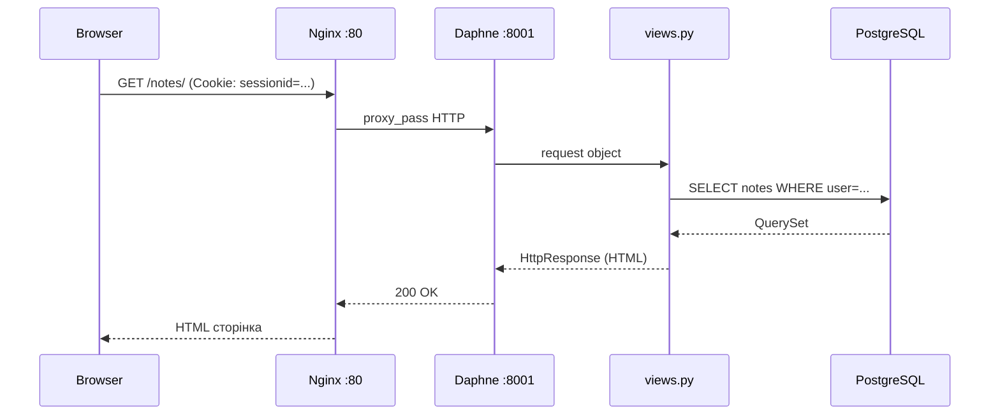

# Частина I. Web Foundation

Django — це бібліотека поверх HTTP. Без розуміння HTTP Django виглядає як магія. Ця частина будує фундамент: TCP/IP, DNS, HTTP request/response, браузер і сервер.

**Передумови:** базовий Python.
**Рівень:** Foundation.

---

## Розділи

| Документ | Що вивчимо |
|----------|-----------|
| [Мережевий фундамент](network_foundation_full.md) | IP, TCP, DNS, порти, пакети — фізична основа інтернету |
| [HTTP та HTTPS](http_https.md) | request/response, методи (GET/POST/PUT/DELETE), заголовки, status codes, TLS |
| [HTTP Requests: архітектура](http_requests_docs.md) | структура запиту, тіло, query params, cookie, content-type |
| [Браузер ↔ Сервер](browser_server_lifecycle.md) | повний lifecycle: введення URL → DNS → TCP → HTTP → HTML |
| [Web сервери та ядро](server.md) | socket, bind, accept, синхронна та асинхронна обробка підключень |
| [Мережеві діаграми](network_mermaid_full.md) | Mermaid-схеми OSI-стеку, TLS handshake, request/response flow |

---

## Ключові концепти

```
URL → DNS lookup → TCP handshake → (TLS handshake) → HTTP request
                                                    ← HTTP response
```

| Концепт | Суть |
|---------|------|
| HTTP методи | `GET` — читання (safe, idempotent); `POST` — зміна стану; `PUT`/`PATCH`/`DELETE` — REST |
| Status codes | 200 OK · 201 Created · 301/302 Redirect · 400 Bad Request · 403 Forbidden · 404 Not Found · 500 Server Error |
| Stateless | кожен HTTP-запит незалежний — сесія емулюється через `Cookie: sessionid=...` |
| HTTPS | TLS шифрує трафік між браузером і сервером; сертифікат підтверджує ідентичність |
| DNS | доменне ім'я → IP-адреса (наприклад `notes.example.com` → `93.184.216.34`) |

**Чому Django stateless:** коли браузер робить GET `/notes/`, Django не знає "хто це". Він читає `Cookie: sessionid=abc123` → шукає сесію → дізнається `request.user`.

---

## Де це у Notes Chat App

| Файл | Що показує |
|------|-----------|
| `notes_project/urls.py` | перший рівень Django routing після отримання HTTP-запиту |
| `notes_app/views.py` | функції що обробляють `GET`/`POST` і повертають `HttpResponse`/`redirect` |
| `nginx/nginx.conf` | reverse proxy: приймає HTTP :80, передає Daphne :8001 |
| `notes_project/settings.py` | `CSRF_TRUSTED_ORIGINS`, `SESSION_COOKIE_SECURE`, `SECURE_SSL_REDIRECT` |

**Mermaid: request до Notes Chat App**



---

## Педагогічний зв'язок

```text
HTTP request lifecycle   (Частина I)
  → Django URL dispatcher (Частина II)
    → View function → HttpResponse
      → ORM query → PostgreSQL (Частина III)
        → Template render → HTML (Частина V)
```

**Zero to Hero:** Крок 1 (hello_project) — перший `HttpResponse`. Студент бачить HTTP своїми руками через `manage.py runserver`.

---

## Практика

1. Відкрий DevTools → Network → зроби GET-запит на будь-який сайт. Знайди: Request Headers, Response Headers, Status Code, Cookie.
2. Зроби POST через форму входу — знайди Request Body (`username=...&password=...&csrfmiddlewaretoken=...`).
3. Запусти `docker compose up` і у DevTools переглянь запит до `/notes/`.

---

## Контрольні питання

- Що таке stateless і чому це ускладнює авторизацію? Як Django вирішує цю проблему?
- Яка різниця між `200 OK` і `302 Found`? Коли Django повертає `302`?
- Навіщо потрібен DNS? Чому браузер не звертається напряму до IP?
- Що таке TLS handshake і коли він відбувається? Що шифрується?
- Чому Django потребує `CSRF_TRUSTED_ORIGINS` при роботі через ngrok або reverse proxy?
- Яка різниця між `GET` і `POST`? Чому форма входу використовує `POST`?

---

**Далі →** [Частина II. Django Core](../02_django_core/README.md) — де Python зустрічається з HTTP.
