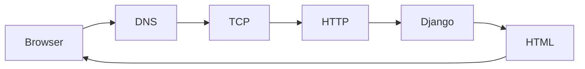

# Browser Server Lifecycle

> Коли студент вводить URL, Django бачить уже готовий HTTP request, а не всю мережеву магію.

## Що студент вивчить

- базову ментальну модель теми;
- як тема працює у Django;
- де її побачити у фінальному проєкті;
- як перевірити, що розуміння не лише теоретичне.

## Передумови

- Вміти відкрити репозиторій.
- Розуміти, що всі шляхи в документації відносні до кореня `notes_chat_app`.

## Flow

У development `runserver` приймає HTTP напряму. У production перед Django зазвичай стоїть reverse proxy.

## Де це знайти у фінальному проєкті

| Файл | Що подивитися |
| --- | --- |
| `notes_project/wsgi.py` | sync entrypoint |
| `notes_project/asgi.py` | ASGI entrypoint |

## Практичне завдання

Поясніть, чому `127.0.0.1:8000` працює тільки локально.

## Контрольні питання

- Що є входом у цей процес?
- Який результат очікується?
- Де найчастіше виникає помилка?
- Яка команда або test допомагає перевірити зміну?

## Далі

Далі: [Django core](../02_django_core/README.md).
