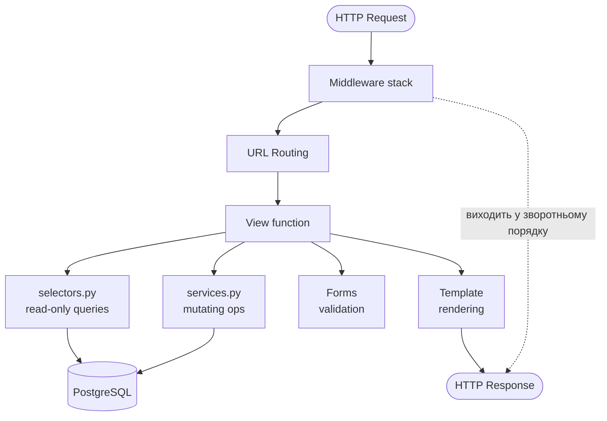

# Django Request Lifecycle

> Коли HTTP запит досягає Django — він проходить крізь кілька шарів перед тим як повернутись відповіддю.
> Розуміти ці шари означає розуміти де шукати баги і як організувати код.

---

## Загальна схема



---

## Крок за кроком

### 1. Middleware stack — вхід

Кожен запит проходить крізь `MIDDLEWARE` список зверху вниз:

```python
# notes_project/settings.py
MIDDLEWARE = [
    'django.middleware.security.SecurityMiddleware',
    'whitenoise.middleware.WhiteNoiseMiddleware',
    'django.contrib.sessions.middleware.SessionMiddleware',    # ← читає session cookie
    'django.middleware.common.CommonMiddleware',               # ← /notes → /notes/
    'django.middleware.csrf.CsrfViewMiddleware',              # ← перевіряє CSRF token
    'django.contrib.auth.middleware.AuthenticationMiddleware', # ← встановлює request.user
    'django.contrib.messages.middleware.MessageMiddleware',
    'django.middleware.clickjacking.XFrameOptionsMiddleware',
]
```

**Що кожен middleware робить:**

| Middleware | Вхід | Що додає до request |
|-----------|------|---------------------|
| `SecurityMiddleware` | request | redirect HTTP→HTTPS (prod) |
| `SessionMiddleware` | request | `request.session` dict |
| `CsrfViewMiddleware` | POST request | перевіряє `csrftoken` cookie == POST param |
| `AuthenticationMiddleware` | request + session | `request.user` (User або AnonymousUser) |
| `MessageMiddleware` | request | `request._messages` storage |

**Порядок важливий:** `AuthenticationMiddleware` має стояти ПІСЛЯ `SessionMiddleware` — бо читає `request.session['_auth_user_id']`.

### 2. URL Routing

Middleware передає request в URLconf:

```python
# notes_project/urls.py
urlpatterns = [
    path('admin/', admin.site.urls),
    path('accounts/', include('django.contrib.auth.urls')),
    path('', include('notes_app.urls', namespace='notes_app')),
]
```

Django перебирає `urlpatterns` зверху вниз, порівнює `request.path` з паттерном. Перший збіг виграє.

```python
# notes_app/urls.py
app_name = 'notes_app'

urlpatterns = [
    path('', views.home, name='home'),                              # GET /
    path('notes/', views.note_list, name='note_list'),              # GET /notes/
    path('notes/new/', views.note_create, name='note_create'),      # GET/POST /notes/new/
    path('notes/<int:pk>/', views.note_detail, name='note_detail'), # GET /notes/42/
    path('notes/<int:pk>/edit/', views.note_update, name='note_update'),
    path('notes/<int:pk>/delete/', views.note_delete, name='note_delete'),
    ...
]
```

Якщо жоден паттерн не збігся → 404 Not Found.

### 3. View function

URL routing виклакає view з двома аргументами: `request` і URL параметри:

```python
# notes_app/views.py

@login_required  # ← middleware-like декоратор: якщо AnonymousUser → redirect /login/
def note_detail(request, pk):   # pk з URL pattern <int:pk>
    # 1. Отримати дані (через selector)
    note = selectors.get_note_for_user(pk=pk, user=request.user)
    if note is None:
        raise Http404   # → 404 response

    # 2. Обробити форму (якщо POST)
    if request.method == 'POST':
        # обробка коментаря або іншої дії
        ...
        return redirect('notes_app:note_detail', pk=pk)   # PRG pattern

    # 3. Рендерити template
    return render(request, 'notes_app/note_detail.html', {
        'note': note,
    })
```

**View має THREE обов'язки — і тільки три:**
1. Взяти дані з request
2. Скоординувати selectors/services/forms
3. Повернути response (render або redirect)

### 4. Selector — читання з БД

```python
# notes_app/selectors.py

def get_note_for_user(pk: int, user) -> Note | None:
    """Повертає нотатку якщо user має доступ. None якщо немає або не існує."""
    user_groups = user.groups.all()
    return Note.objects.filter(
        Q(pk=pk) &
        (Q(user=user) | Q(group__in=user_groups))
    ).select_related('user', 'notebook').prefetch_related('tags').first()
```

Selector — **тільки читання**. Ніколи не `save()`, не `delete()`, не `create()`.

### 5. Service — мутації

```python
# notes_app/services.py

def update_note(*, note: Note, title: str, content: str, priority: int, ...) -> Note:
    """Оновлює нотатку і повертає її."""
    note.title = title
    note.content = content
    note.priority = priority
    note.save()
    return note
```

Service — **тільки мутації**. Викликається після валідації форми.

### 6. Template rendering

```python
return render(request, 'notes_app/note_detail.html', {
    'note': note,
    'tags': note.tags.all(),
})
```

Django знаходить шаблон у `TEMPLATES[0]['DIRS']` і `APP_DIRS = True` (шукає в `notes_app/templates/`).

### 7. Middleware stack — вихід (зворотній порядок)

Відповідь проходить middleware у **зворотньому порядку**:

```
Response ← XFrameOptions ← Messages ← Auth ← Csrf ← Common ← Session ← Whitenoise ← Security
```

`SecurityMiddleware` додає HSTS заголовок, `XFrameOptionsMiddleware` додає `X-Frame-Options: DENY`.

---

## Де все ламається

| Симптом | Де шукати |
|---------|-----------|
| `403 Forbidden` на POST | `CsrfViewMiddleware` — форма без `` |
| `403 Forbidden` при логіні | `SessionMiddleware` — cookie заблокована (HTTPS only?) |
| `404` для валідного URL | URL порядок у `urlpatterns` — перевір конфліктуючі паттерни |
| `redirect loop /login/ → /login/` | `@login_required` + `LOGIN_URL` вказує на саму себе |
| View повертає дані не того юзера | Selector не фільтрує по `user` |
| `500 SynchronousOnlyOperation` | ORM у async view без `sync_to_async` |

---

## 403 CSRF: найчастіша помилка у формах

```
Forbidden (403): CSRF verification failed. Request aborted.
```

**Причина:** `CsrfViewMiddleware` перевіряє що POST містить токен рівний cookie. Якщо форма не має ``:

```html
<!-- НЕПРАВИЛЬНО — отримаєш 403 -->
<form method="post">
  <input type="text" name="title">
  <button type="submit">Зберегти</button>
</form>

<!-- ПРАВИЛЬНО -->
<form method="post">
     ← генерує <input type="hidden" name="csrfmiddlewaretoken" value="...">
  <input type="text" name="title">
  <button type="submit">Зберегти</button>
</form>
```

---

## Перевірка у shell

```bash
docker compose exec web python manage.py shell
```

```python
# Симулювати request lifecycle вручну
from django.test import RequestFactory, Client

# Client — повний lifecycle з middleware
client = Client()
client.login(username='demo_alice', password='demo1234')
response = client.get('/notes/')
print(response.status_code)    # 200
print(response.context['notes'].count())

# RequestFactory — без middleware (для unit tests)
from django.test import RequestFactory
from notes_app import views

factory = RequestFactory()
request = factory.get('/notes/')
request.user = User.objects.get(username='demo_alice')
response = views.note_list(request)
```

---

## У книзі

- [Browser Lifecycle](../01_web_foundations/browser_server_lifecycle.md) — від URL до Django
- [HTTP та HTTPS](../01_web_foundations/http_https.md) — HTTP методи, статус коди
- [Частина VI. Архітектура](../06_application_architecture/README.md) — services, selectors, thin views

---

## Офіційна документація

- [Django: How Django processes a request](https://docs.djangoproject.com/en/5.2/topics/http/urls/#how-django-processes-a-request) — кроки 1-4
- [Django: Middleware](https://docs.djangoproject.com/en/5.2/topics/http/middleware/) — написання і порядок
- [Django: URL dispatcher](https://docs.djangoproject.com/en/5.2/topics/http/urls/) — path(), include(), re_path()
- [Django: View functions](https://docs.djangoproject.com/en/5.2/topics/http/views/) — shortcuts, errors
