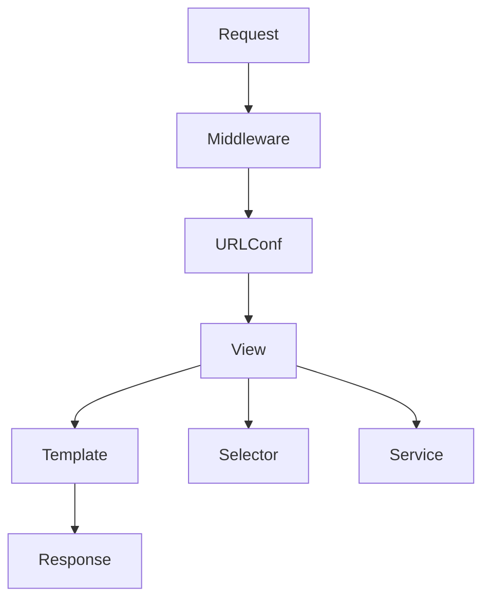

# Request Lifecycle

> Request lifecycle пояснює, чому Django code треба розкладати по шарах.

## Що студент вивчить

- базову ментальну модель теми;
- як тема працює у Django;
- де її побачити у фінальному проєкті;
- як перевірити, що розуміння не лише теоретичне.

## Передумови

- Вміти відкрити репозиторій.
- Розуміти, що всі шляхи в документації відносні до кореня `notes_chat_app`.

## Flow

View не повинна бути місцем для всього. Вона координує request, permissions, forms і redirects.

## Де це знайти у фінальному проєкті

| Файл | Що подивитися |
| --- | --- |
| `notes_project/middleware.py` | custom debug middleware |
| `notes_app/views.py` | thin view pattern |

## Практичне завдання

Відкрийте `note_create` і розбийте його на steps.

## Контрольні питання

- Що є входом у цей процес?
- Який результат очікується?
- Де найчастіше виникає помилка?
- Яка команда або test допомагає перевірити зміну?

## Далі

Далі: [URLs and views](urls_and_views.md).
