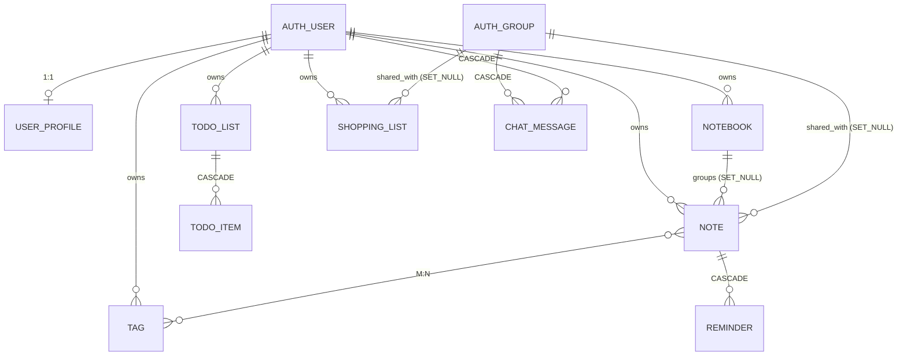

# Django Models

> Model — це одночасно Python клас і таблиця в базі даних.
> Кожен атрибут класу → колонка у таблиці. Django ORM перетворює Python у SQL.

---

## Навіщо моделі

Без ORM ти б писав SQL вручну:

```python
# Без ORM — SQL руками
cursor.execute(
    "INSERT INTO notes (title, content, user_id, priority) VALUES (%s, %s, %s, %s)",
    [title, content, user.id, priority]
)
```

З Django ORM:

```python
# З ORM — Python клас
note = Note.objects.create(
    title=title, content=content, user=user, priority=Note.PRIORITY_MEDIUM
)
```

ORM:
- генерує SQL автоматично (і оптимально)
- захищає від SQL injection
- дозволяє рефакторити (перейменував поле → генерується ALTER TABLE)
- підтримує PostgreSQL, SQLite, MySQL без зміни коду

---

## Анатомія Model класу

```python
# notes_app/models.py

class Note(models.Model):
    # ── Константи для choices ─────────────────────────────────────────
    PRIORITY_LOW    = 1
    PRIORITY_MEDIUM = 2
    PRIORITY_HIGH   = 3
    PRIORITY_URGENT = 4

    PRIORITY_CHOICES = [
        (PRIORITY_LOW,    '🟢 Низький'),
        (PRIORITY_MEDIUM, '🟡 Середній'),
        (PRIORITY_HIGH,   '🟠 Високий'),
        (PRIORITY_URGENT, '🔴 Терміново'),
    ]

    # ── Поля (Field types) ────────────────────────────────────────────
    user     = models.ForeignKey(User, on_delete=models.CASCADE, related_name='notes')
    group    = models.ForeignKey(Group, on_delete=models.SET_NULL, null=True, blank=True, related_name='notes')
    notebook = models.ForeignKey(Notebook, on_delete=models.SET_NULL, null=True, blank=True, related_name='notes')
    tags     = models.ManyToManyField(Tag, blank=True, related_name='notes')

    title      = models.CharField(max_length=200)
    content    = models.TextField(blank=True)
    priority   = models.PositiveSmallIntegerField(choices=PRIORITY_CHOICES, default=PRIORITY_LOW)
    is_pinned  = models.BooleanField(default=False)
    is_archived= models.BooleanField(default=False)
    created_at = models.DateTimeField(auto_now_add=True)   # ← встановлюється один раз при CREATE
    updated_at = models.DateTimeField(auto_now=True)        # ← оновлюється при кожному save()

    # ── Спеціальні методи ─────────────────────────────────────────────
    def __str__(self):
        pin = "📌 " if self.is_pinned else ""
        return f"{pin}{self.title}"

    # ── Meta клас ─────────────────────────────────────────────────────
    class Meta:
        ordering = ['-is_pinned', '-priority', '-updated_at']  # дефолтний ORDER BY
        verbose_name = 'Нотатка'
        verbose_name_plural = 'Нотатки'
        indexes = [
            models.Index(fields=['user', '-updated_at'], name='cnote_user_updated_idx'),
            models.Index(fields=['user', 'is_pinned'],   name='cnote_user_pinned_idx'),
        ]
        constraints = [
            models.CheckConstraint(
                check=models.Q(priority__gte=1) & models.Q(priority__lte=4),
                name='cnote_priority_valid_range'
            ),
        ]
```

---

## Типи полів

| Field type | Колонка PostgreSQL | Використання в проєкті |
|-----------|-------------------|----------------------|
| `CharField(max_length=N)` | `VARCHAR(N)` | `title`, `name`, `color` |
| `TextField()` | `TEXT` | `content`, `bio`, `description` |
| `BooleanField()` | `BOOLEAN` | `is_pinned`, `is_archived`, `is_done` |
| `PositiveSmallIntegerField()` | `SMALLINT` | `priority` (1–4) |
| `DateTimeField(auto_now_add=True)` | `TIMESTAMPTZ` | `created_at` |
| `DateTimeField(auto_now=True)` | `TIMESTAMPTZ` | `updated_at` |
| `DateField()` | `DATE` | `due_date` у TodoItem |
| `DecimalField(max_digits, decimal_places)` | `NUMERIC` | `quantity`, `estimated_price` |
| `URLField()` | `VARCHAR(200)` | `avatar_url` |
| `ForeignKey()` | `INT` + FK constraint | `user`, `group`, `notebook` |
| `ManyToManyField()` | junction table | `tags`, `shared_with` |
| `OneToOneField()` | `INT` UNIQUE + FK | `UserProfile.user` |

### blank vs null

```python
# null=True  → NULL у базі даних
# blank=True → дозволяє порожній рядок у формі (і '' у рядкових полях)

notebook = models.ForeignKey(Notebook, on_delete=models.SET_NULL, null=True, blank=True)
# null=True → FK може бути NULL у БД (notebook не обов'язковий)
# blank=True → форма не вимагає notebook (validation)

content = models.TextField(blank=True)
# НЕ null=True для рядків — Django зберігає '' замість NULL
# (порожній рядок кращий за NULL для текстових полів)
```

---

## Зв'язки між моделями

### ForeignKey (1:N)

```python
# Один Notebook → багато Note
class Note(models.Model):
    notebook = models.ForeignKey(
        Notebook,
        on_delete=models.SET_NULL,   # якщо Notebook видалено → Note.notebook = NULL
        null=True,
        blank=True,
        related_name='notes',        # notebook.notes.all() → всі нотатки цього блокнота
    )
```

**on_delete варіанти:**

| `on_delete` | Поведінка | Де використано |
|-------------|-----------|---------------|
| `CASCADE` | видаляє дочірній запис | `Note.user`, `Reminder.note`, `ChatMessage.author` |
| `SET_NULL` | встановлює `NULL` | `Note.notebook`, `Note.group`, `ShoppingList.group` |
| `PROTECT` | забороняє видалення | — (не використано) |
| `DO_NOTHING` | нічого (небезпечно) | — (не використано) |

### ManyToMany

```python
class Note(models.Model):
    tags = models.ManyToManyField(Tag, blank=True, related_name='notes')
    # Django автоматично створює таблицю:
    # notes_app_note_tags (id, note_id, tag_id)
```

Використання:
```python
note.tags.add(tag)              # додати тег
note.tags.remove(tag)           # видалити тег
note.tags.set([tag1, tag2])     # замінити теги
note.tags.all()                 # всі теги нотатки
tag.notes.all()                 # всі нотатки з цим тегом (related_name)
```

### OneToOne

```python
class UserProfile(models.Model):
    user = models.OneToOneField(
        User,
        on_delete=models.CASCADE,
        related_name='profile',
    )
```

Кожен `User` має рівно один `UserProfile`. Доступ:
```python
user.profile.display_name   # через related_name
user.profile.timezone
```

---

## ER діаграма (повна)



---

## Meta клас — конфігурація моделі

```python
class Meta:
    # Дефолтне сортування для queryset (без .order_by())
    ordering = ['-is_pinned', '-priority', '-updated_at']

    # Назви у Django Admin і для verbose виводу
    verbose_name = 'Нотатка'
    verbose_name_plural = 'Нотатки'

    # Складений унікальний constraint
    unique_together = [('user', 'name')]   # у Tag: кожен тег має унікальне ім'я для юзера

    # Індекси (детальніше → query_optimization.md)
    indexes = [
        models.Index(fields=['user', '-updated_at'], name='cnote_user_updated_idx'),
    ]

    # Database-level CHECK constraints
    constraints = [
        models.CheckConstraint(
            check=models.Q(priority__gte=1) & models.Q(priority__lte=4),
            name='cnote_priority_valid_range'
        ),
    ]
```

---

## choices — enum-like поля

```python
class Note(models.Model):
    PRIORITY_LOW    = 1
    PRIORITY_MEDIUM = 2

    PRIORITY_CHOICES = [
        (PRIORITY_LOW,    '🟢 Низький'),
        (PRIORITY_MEDIUM, '🟡 Середній'),
    ]

    priority = models.PositiveSmallIntegerField(
        choices=PRIORITY_CHOICES,
        default=PRIORITY_LOW,
    )
```

У базі зберігається `1`, `2` (integer). Django знає як показати `'🟢 Низький'` у формах і Admin.

```python
# Доступ у коді
note.priority                     # 2 (integer)
note.get_priority_display()       # '🟡 Середній' (читабельний рядок)
note.priority == Note.PRIORITY_MEDIUM  # True (константи замість magic numbers)
```

---

## auto_now_add vs auto_now

```python
created_at = models.DateTimeField(auto_now_add=True)
# Встановлюється ОДИН РАЗ при першому збереженні
# Не можна перезаписати через code — поле read-only
# SQL: DEFAULT CURRENT_TIMESTAMP при INSERT

updated_at = models.DateTimeField(auto_now=True)
# Оновлюється при КОЖНОМУ .save()
# SQL: UPDATE SET updated_at = NOW() при кожному UPDATE
```

---

## Де в notes_chat_app

| Файл | Вміст |
|------|-------|
| `notes_app/models.py` | всі 10 моделей |
| `notes_app/migrations/` | автогенеровані міграції |
| `notes_app/admin.py` | реєстрація моделей у Django Admin |
| `notes_app/selectors.py` | read-only QuerySet через ці моделі |
| `notes_app/services.py` | create/update/delete через ці моделі |

---

## Практичне завдання

```bash
docker compose exec web python manage.py shell
```

```python
from notes_app.models import Note, Tag, Notebook
from django.contrib.auth.models import User

# Знайти юзера
user = User.objects.get(username='demo_alice')

# Всі його нотатки
notes = Note.objects.filter(user=user)
print(f"Нотаток: {notes.count()}")

# Перша нотатка і її теги
note = notes.first()
print(note.title)
print(note.get_priority_display())
print([t.name for t in note.tags.all()])

# Скільки нотаток у кожному ноутбуці
from django.db.models import Count
Notebook.objects.filter(user=user).annotate(n=Count('notes')).values('title', 'n')
```

---

## У книзі

- [Migrations](migrations.md) — як Django перетворює зміни моделей у SQL
- [Query Optimization](query_optimization.md) — select_related, prefetch_related, N+1
- [Transactions і PostgreSQL](transactions_indexes_postgresql.md) — цілісність даних

---

## Офіційна документація

- [Django: Models](https://docs.djangoproject.com/en/5.2/topics/db/models/) — повний опис
- [Django: Field types](https://docs.djangoproject.com/en/5.2/ref/models/fields/) — всі типи полів з опціями
- [Django: Relationships](https://docs.djangoproject.com/en/5.2/topics/db/examples/) — приклади всіх зв'язків
- [Django: Meta options](https://docs.djangoproject.com/en/5.2/ref/models/options/) — ordering, constraints, indexes
