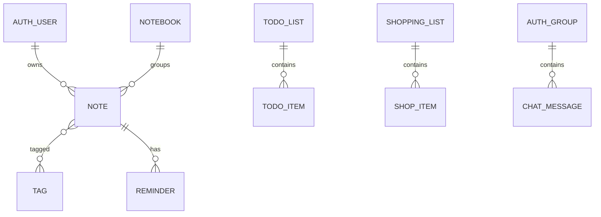

# Django Models

> Model - це Python-опис таблиці і business entity.

## Що студент вивчить

- базову ментальну модель теми;
- як тема працює у Django;
- де її побачити у фінальному проєкті;
- як перевірити, що розуміння не лише теоретичне.

## Передумови

- Вміти відкрити репозиторій.
- Розуміти, що всі шляхи в документації відносні до кореня `notes_chat_app`.

## Поточні models

`UserProfile`, `Tag`, `Notebook`, `Note`, `Reminder`, `TodoList`, `TodoItem`, `ShoppingList`, `ShopItem`, `ChatMessage`.

## ER sketch

`ChatMessage` прив'язаний до `Group` і `User`, тому chat history зберігається в DB.

## Де це знайти у фінальному проєкті

| Файл | Що подивитися |
| --- | --- |
| `notes_app/models.py` | actual model definitions |
| `notes_app/admin.py` | admin registration |

## Практичне завдання

Намалюйте зв'язки Note -> Notebook -> Tag -> Reminder.

## Контрольні питання

- Що є входом у цей процес?
- Який результат очікується?
- Де найчастіше виникає помилка?
- Яка команда або test допомагає перевірити зміну?

## Далі

Далі: [migrations](migrations.md).
