# Django ORM and the DB — Mermaid Diagrams

> All the diagrams visualize concepts from all of the documentation files.
> Use them after reading the theory to reinforce your understanding through diagrams.
> Order: ER → Relationships → ORM Flow → Query Lifecycle → Transactions → Architecture

---

> 🔬 **Want to see these diagrams in action?**
> [`docs/reference/legacy_source/orm_laboratory_reference.md`](../reference/legacy_source/orm_laboratory_reference.md) —
> every mermaid diagram has a corresponding code cell where real SQL is executed.
>
> ⚠️ The notebook itself is not part of this repository: the linked file only explains that. The section names in the table below point to the notebook's original structure, they are not anchors. You can run the same queries yourself in `python manage.py shell` or in the [ORM lab](../labs/orm_lab.md).
>
> | Mermaid diagram in this file | Notebook section |
> |-----------------------------|-----------------|
> | ER diagram / table schema | `## 0. 🧱 Що таке object в Django ORM?` |
> | ORM → SQL Lifecycle | `## 1. 🧠 ORM Mental Model` |
> | Lazy Evaluation flow | `## 1. 🧠 ORM Mental Model` |
> | N+1 vs select_related | `## 8. ⚡ N+1 Problem & Optimization` |
> | select_related vs prefetch_related | `## 8. ⚡ N+1 Problem & Optimization` |
> | transaction.atomic() SQL lifecycle | `## 13. 🔒 Транзакції` |
> | Services/Selectors architecture | `README.md` → section `03 · APPLICATION LAYERS` |

## 1. ER Diagram — Notes Platform (Full Project)

> **What it shows:** All the tables of the `notes_chat_app` project with all their relationships.
> `||--o|` = 1:1, `||--o{` = 1:N, `}o--o{` = M:N.
> The FK is always on the "many" side (Many side).

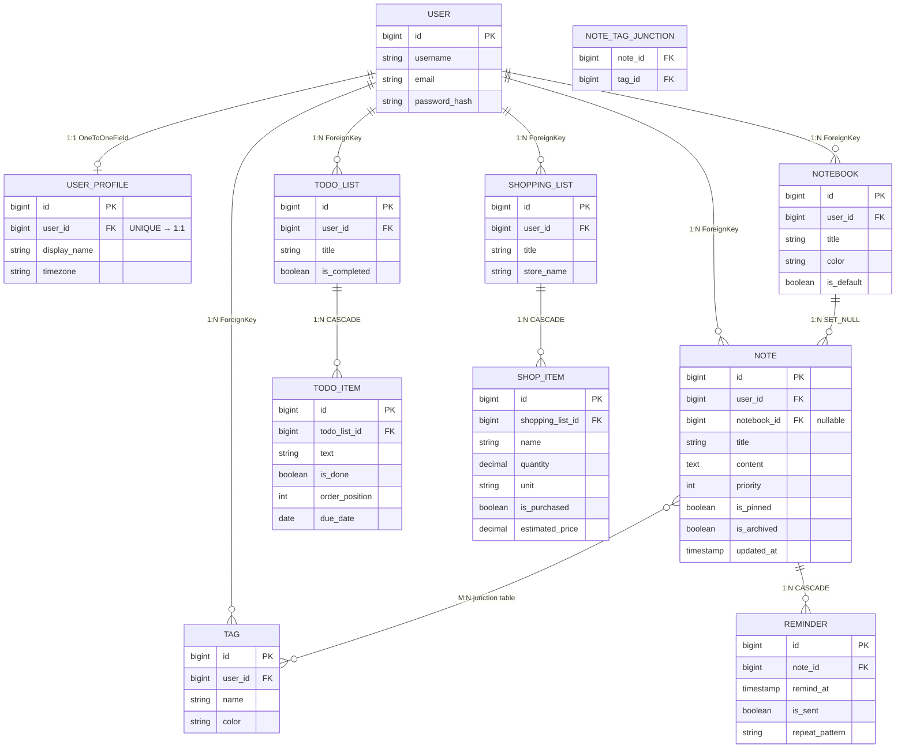
```mermaid
erDiagram
    USER ||--o| USER_PROFILE : "1:1 OneToOneField"
    USER ||--o{ NOTEBOOK : "1:N ForeignKey"
    USER ||--o{ NOTE : "1:N ForeignKey"
    USER ||--o{ TODO_LIST : "1:N ForeignKey"
    USER ||--o{ SHOPPING_LIST : "1:N ForeignKey"
    USER ||--o{ TAG : "1:N ForeignKey"

    NOTEBOOK ||--o{ NOTE : "1:N SET_NULL"
    NOTE }o--o{ TAG : "M:N junction table"
    NOTE ||--o{ REMINDER : "1:N CASCADE"

    TODO_LIST ||--o{ TODO_ITEM : "1:N CASCADE"
    SHOPPING_LIST ||--o{ SHOP_ITEM : "1:N CASCADE"

    USER {
        bigint id PK
        string username
        string email
        string password_hash
    }
    USER_PROFILE {
        bigint id PK
        bigint user_id FK "UNIQUE → 1:1"
        string display_name
        string timezone
    }
    NOTEBOOK {
        bigint id PK
        bigint user_id FK
        string title
        string color
        boolean is_default
    }
    NOTE {
        bigint id PK
        bigint user_id FK
        bigint notebook_id FK "nullable"
        string title
        text content
        int priority
        boolean is_pinned
        boolean is_archived
        timestamp updated_at
    }
    TAG {
        bigint id PK
        bigint user_id FK
        string name
        string color
    }
    NOTE_TAG_JUNCTION {
        bigint note_id FK
        bigint tag_id FK
    }
    REMINDER {
        bigint id PK
        bigint note_id FK
        timestamp remind_at
        boolean is_sent
        string repeat_pattern
    }
    TODO_LIST {
        bigint id PK
        bigint user_id FK
        string title
        boolean is_completed
    }
    TODO_ITEM {
        bigint id PK
        bigint todo_list_id FK
        string text
        boolean is_done
        int order_position
        date due_date
    }
    SHOPPING_LIST {
        bigint id PK
        bigint user_id FK
        string title
        string store_name
    }
    SHOP_ITEM {
        bigint id PK
        bigint shopping_list_id FK
        string name
        decimal quantity
        string unit
        boolean is_purchased
        decimal estimated_price
    }
```

---

## 2. Where the FK Lives — The "Many Side" Rule

> **What it shows:** A clear picture of where the Foreign Key is stored in 1:N and M:N relationships.
> The FK is always in the "Many" table (not in the "One"!).

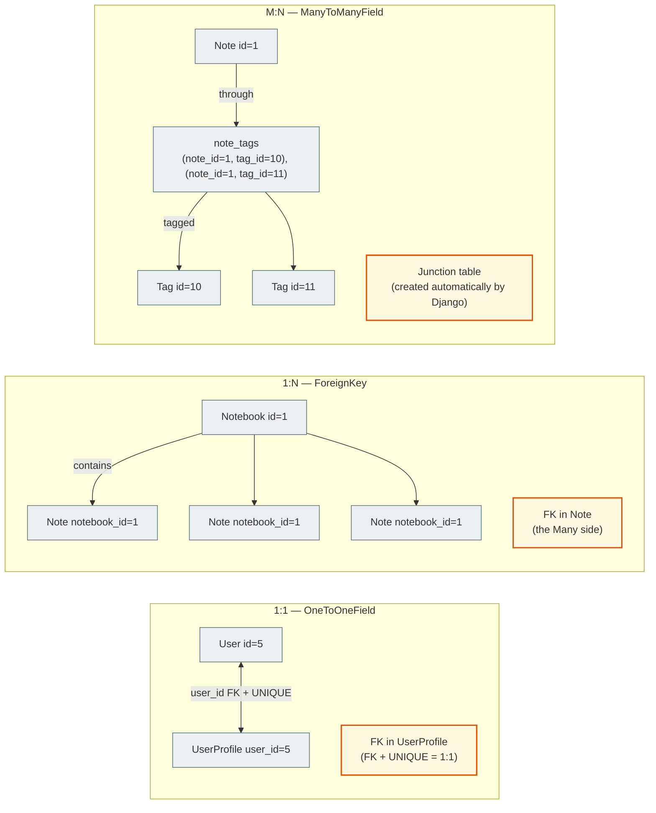
```mermaid
graph LR
    subgraph "1:1 — OneToOneField"
        U1[User id=5] <-->|user_id FK + UNIQUE| UP1[UserProfile user_id=5]
        N1["FK in UserProfile<br>(FK + UNIQUE = 1:1)"]
    end

    subgraph "1:N — ForeignKey"
        NB[Notebook id=1] -->|"contains"| NO1[Note notebook_id=1]
        NB --> NO2[Note notebook_id=1]
        NB --> NO3[Note notebook_id=1]
        N2["FK in Note<br>(the Many side)"]
    end

    subgraph "M:N — ManyToManyField"
        N[Note id=1] -->|through| JT["note_tags<br>(note_id=1, tag_id=10), (note_id=1, tag_id=11)"]
        JT -->|"tagged"| T1[Tag id=10]
        JT --> T2[Tag id=11]
        N3["Junction table<br>(created automatically by Django)"]
    end

    classDef step     fill:#eceff1,stroke:#546e7a,stroke-width:1px;
    classDef warning  fill:#fff8e1,stroke:#e65100,stroke-width:2px;

    class U1,UP1,NB,NO1,NO2,NO3,N,JT,T1,T2 step;
    class N1,N2,N3 warning;
```

---

## 3. ORM → SQL — The Query Lifecycle

> **What it shows:** The full path from Python code to SQL and back.
> The key point: a QuerySet is LAZY — SQL is executed only on evaluation.

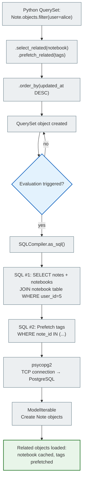
```mermaid
graph TD

    A["Python QuerySet:<br>Note.objects.filter(user=alice)"]

    A2[".select_related(notebook)<br>.prefetch_related(tags)"]

    A3[".order_by(updated_at DESC)"]

    B["QuerySet object created"]

    C{"Evaluation triggered?"}

    D["SQLCompiler.as_sql()"]

    E["SQL #1: SELECT notes + notebooks<br>JOIN notebook table WHERE user_id=5"]

    F["SQL #2: Prefetch tags<br>WHERE note_id IN (...)"]

    G["psycopg2<br>TCP connection → PostgreSQL"]

    H["ModelIterable<br>Create Note objects"]

    I["Related objects loaded:<br>notebook cached, tags prefetched"]

    A --> A2

    A2 --> A3

    A3 --> B

    B --> C

    C -->|"no"| B

    C -->|"yes"| D

    D --> E

    E --> F

    F --> G

    G --> H

    H --> I

    classDef step     fill:#eceff1,stroke:#546e7a,stroke-width:1px;
    classDef decision fill:#e3f2fd,stroke:#1565c0,stroke-width:2px;
    classDef success  fill:#e8f5e9,stroke:#2e7d32,stroke-width:2px;

    class A,A2,A3,B,D,E,F,G,H step;
    class C decision;
    class I success;
```

---

## 4. Lazy Evaluation — When SQL Is Executed

> **What it shows:** QuerySet methods that do NOT execute SQL (they return a QuerySet)
> vs methods that DO execute SQL (evaluation triggers).

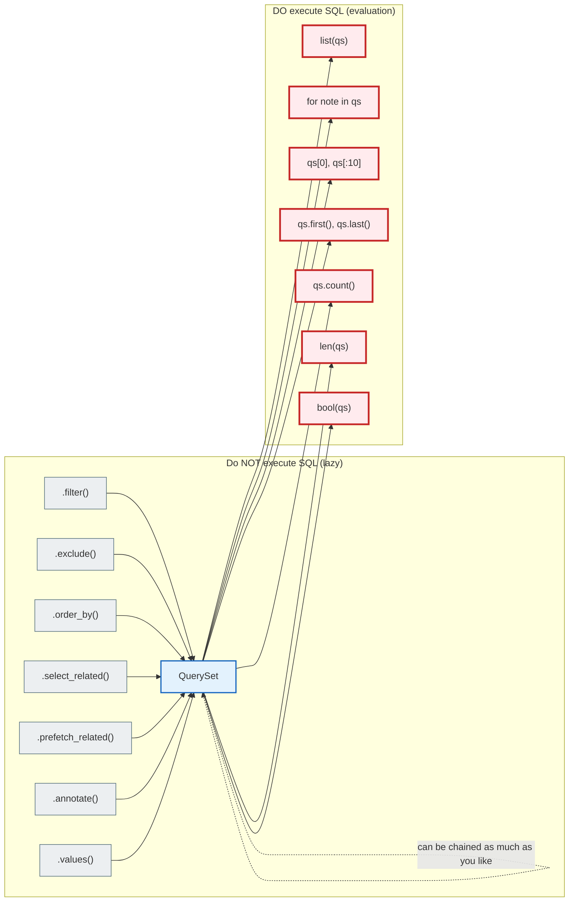
```mermaid
graph LR
    subgraph "Do NOT execute SQL (lazy)"
        L1[".filter()"] --> QS[QuerySet]
        L2[".exclude()"] --> QS
        L3[".order_by()"] --> QS
        L4[".select_related()"] --> QS
        L5[".prefetch_related()"] --> QS
        L6[".annotate()"] --> QS
        L7[".values()"] --> QS
        QS -.->|"can be chained as much as you like"| QS
    end

    subgraph "DO execute SQL (evaluation)"
        QS --> E1["list(qs)"]
        QS --> E2["for note in qs"]
        QS --> E3["qs[0], qs[:10]"]
        QS --> E4["qs.first(), qs.last()"]
        QS --> E5["qs.count()"]
        QS --> E6["len(qs)"]
        QS --> E7["bool(qs)"]
    end

    classDef step     fill:#eceff1,stroke:#546e7a,stroke-width:1px;
    classDef decision fill:#e3f2fd,stroke:#1565c0,stroke-width:2px;
    classDef error    fill:#ffebee,stroke:#c62828,stroke-width:3px;

    class L1,L2,L3,L4,L5,L6,L7 step;
    class QS decision;
    class E1,E2,E3,E4,E5,E6,E7 error;
```

---

## 5. N+1 Problem vs select_related

> **What it shows:** The difference in the number of SQL queries between N+1 and select_related.
> Without optimization: 1 + N queries. With select_related: 1 query.

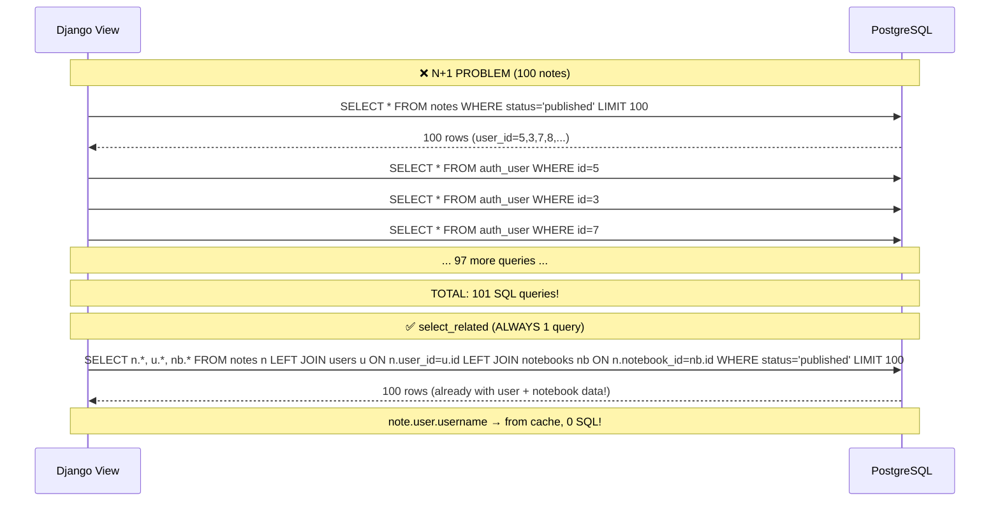
```mermaid
sequenceDiagram
    participant App as Django View
    participant DB as PostgreSQL

    Note over App,DB: ❌ N+1 PROBLEM (100 notes)
    App->>DB: SELECT * FROM notes WHERE status='published' LIMIT 100
    DB-->>App: 100 rows (user_id=5,3,7,8,...)
    App->>DB: SELECT * FROM auth_user WHERE id=5
    App->>DB: SELECT * FROM auth_user WHERE id=3
    App->>DB: SELECT * FROM auth_user WHERE id=7
    Note over App,DB: ... 97 more queries ...
    Note over App,DB: TOTAL: 101 SQL queries!

    Note over App,DB: ✅ select_related (ALWAYS 1 query)
    App->>DB: SELECT n.*, u.*, nb.* FROM notes n LEFT JOIN users u ON n.user_id=u.id LEFT JOIN notebooks nb ON n.notebook_id=nb.id WHERE status='published' LIMIT 100
    DB-->>App: 100 rows (already with user + notebook data!)
    Note over App,DB: note.user.username → from cache, 0 SQL!
```

---

## 6. select_related vs prefetch_related — Architecture

> **What it shows:** The mechanism of each method at the SQL level.
> select_related = SQL JOIN. prefetch_related = a separate query + a Python join.

```mermaid
graph TD
    subgraph "select_related → SQL JOIN"
        A1["Note.objects.select_related('user', 'notebook')"] --> B1[1 SQL query with JOIN]
        B1 --> C1["SELECT n.*, u.*, nb.*<br>FROM notes n"]
        C1 --> C1b["LEFT JOIN users u ON n.user_id=u.id<br>LEFT JOIN notebooks nb ON n.notebook_id=nb.id"]
        C1b --> D1["All the data in one result row"]
        D1 --> E1["✅ For FK and OneToOne"]
    end

    subgraph "prefetch_related → Python JOIN"
        A2["Note.objects.prefetch_related('tags')"] --> B2[SQL #1: Fetch Notes]
        B2 --> C2["SELECT * FROM notes"]
        A2 --> B3[SQL #2: Fetch Tags]
        B3 --> C3["SELECT t.*, nt.note_id<br>FROM tags t INNER JOIN note_tags nt"]
        C3 --> C3b["WHERE nt.note_id IN (1,2,3,...,100)"]
        C2 --> D2["Python: obj._prefetched_objects_cache<br>is filled with a dict note_id → [tags]"]
        C3b --> D2
        D2 --> E2["✅ For ManyToMany and reverse FK"]
    end

    classDef step     fill:#eceff1,stroke:#546e7a,stroke-width:1px;
    classDef success  fill:#e8f5e9,stroke:#2e7d32,stroke-width:2px;

    class A1,B1,C1,C1b,D1,A2,B2,C2,B3,C3,C3b,D2 step;
    class E1,E2 success;
```

---

## 7. Migration Lifecycle

> **What it shows:** The full migration cycle from a model change to an updated DB.
> The key fact: `makemigrations` does not change the DB, `migrate` does.

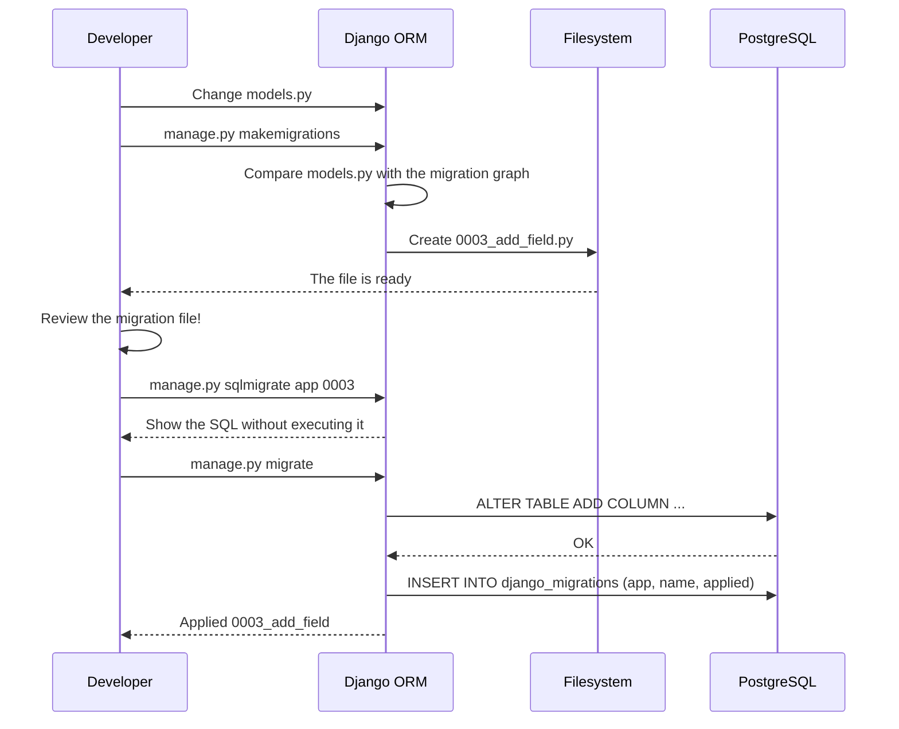
```mermaid
sequenceDiagram
    participant Dev as Developer
    participant Django as Django ORM
    participant FS as Filesystem
    participant DB as PostgreSQL

    Dev->>Django: Change models.py
    Dev->>Django: manage.py makemigrations
    Django->>Django: Compare models.py with the migration graph
    Django->>FS: Create 0003_add_field.py
    FS-->>Dev: The file is ready

    Dev->>Dev: Review the migration file!
    Dev->>Django: manage.py sqlmigrate app 0003
    Django-->>Dev: Show the SQL without executing it

    Dev->>Django: manage.py migrate
    Django->>DB: ALTER TABLE ADD COLUMN ...
    DB-->>Django: OK
    Django->>DB: INSERT INTO django_migrations (app, name, applied)
    Django-->>Dev: Applied 0003_add_field
```

---

## 8. Migration Dependency Graph

> **What it shows:** How migrations depend on each other.
> Django executes them in the correct dependency order (DAG).

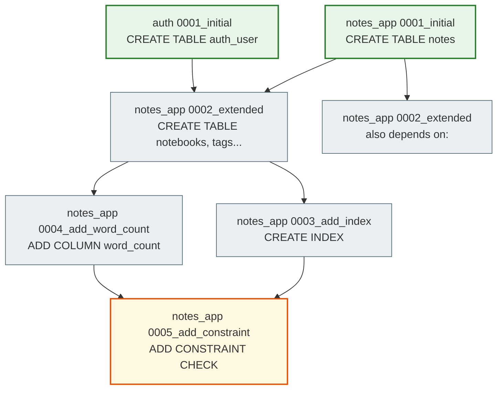
```mermaid
graph TD
    A["notes_app 0001_initial<br>CREATE TABLE notes"] --> B["notes_app 0002_extended<br>CREATE TABLE notebooks, tags..."]
    A --> C["notes_app 0002_extended<br>also depends on:"]
    D["auth 0001_initial<br>CREATE TABLE auth_user"] --> B
    B --> E["notes_app 0003_add_index<br>CREATE INDEX"]
    B --> F["notes_app 0004_add_word_count<br>ADD COLUMN word_count"]
    E --> G["notes_app 0005_add_constraint<br>ADD CONSTRAINT CHECK"]
    F --> G

    classDef step     fill:#eceff1,stroke:#546e7a,stroke-width:1px;
    classDef success  fill:#e8f5e9,stroke:#2e7d32,stroke-width:2px;
    classDef warning  fill:#fff8e1,stroke:#e65100,stroke-width:2px;

    class B,C,E,F step;
    class A,D success;
    class G warning;
```

---

## 9. Query Execution Lifecycle — 8 Phases

> **What it shows:** What happens to an SQL query inside PostgreSQL, from parsing to the result.

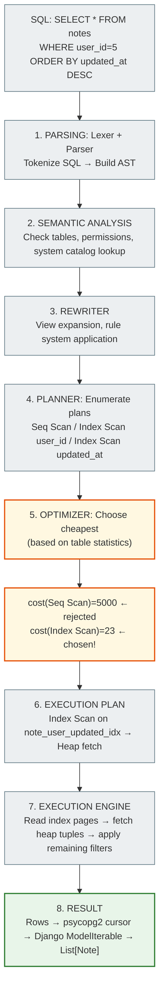
```mermaid
graph TD
    A["SQL: SELECT * FROM notes<br>WHERE user_id=5 ORDER BY updated_at DESC"] --> B

    B["1. PARSING: Lexer + Parser<br>Tokenize SQL → Build AST"] --> C

    C["2. SEMANTIC ANALYSIS<br>Check tables, permissions, system catalog lookup"] --> D

    D["3. REWRITER<br>View expansion, rule system application"] --> E

    E["4. PLANNER: Enumerate plans<br>Seq Scan / Index Scan user_id / Index Scan updated_at"] --> F

    F["5. OPTIMIZER: Choose cheapest<br>(based on table statistics)"] --> F2

    F2["cost(Seq Scan)=5000 ← rejected<br>cost(Index Scan)=23 ← chosen!"] --> G

    G["6. EXECUTION PLAN<br>Index Scan on note_user_updated_idx → Heap fetch"] --> H

    H["7. EXECUTION ENGINE<br>Read index pages → fetch heap tuples → apply remaining filters"] --> I

    I["8. RESULT<br>Rows → psycopg2 cursor → Django ModelIterable → List[Note]"]

    classDef step     fill:#eceff1,stroke:#546e7a,stroke-width:1px;
    classDef success  fill:#e8f5e9,stroke:#2e7d32,stroke-width:2px;
    classDef warning  fill:#fff8e1,stroke:#e65100,stroke-width:2px;

    class A,B,C,D,E,G,H step;
    class I success;
    class F,F2 warning;
```

---

## 10. B-Tree Index — Search Navigation

> **What it shows:** How a B-Tree index finds a record in O(log N) instead of O(N).
> Each level = one disk I/O. Depth: log₂(N) levels.

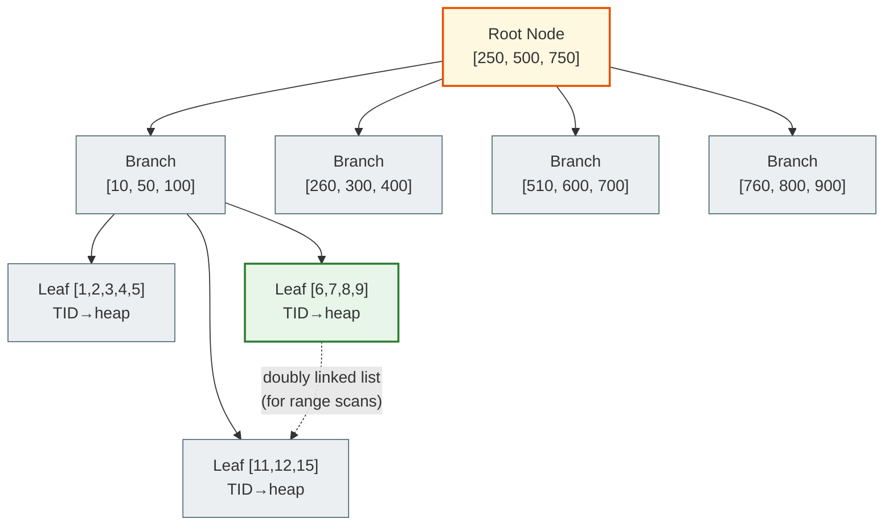
```mermaid
graph TD
    Root["Root Node<br>[250, 500, 750]"] --> B1["Branch<br>[10, 50, 100]"]
    Root --> B2["Branch<br>[260, 300, 400]"]
    Root --> B3["Branch<br>[510, 600, 700]"]
    Root --> B4["Branch<br>[760, 800, 900]"]

    B1 --> L1["Leaf [1,2,3,4,5]<br>TID→heap"]
    B1 --> L2["Leaf [6,7,8,9]<br>TID→heap"]
    B1 --> L3["Leaf [11,12,15]<br>TID→heap"]

    L2 -.->|"doubly linked list<br>(for range scans)"| L3

    classDef step     fill:#eceff1,stroke:#546e7a,stroke-width:1px;
    classDef success  fill:#e8f5e9,stroke:#2e7d32,stroke-width:2px;
    classDef warning  fill:#fff8e1,stroke:#e65100,stroke-width:2px;

    class B1,B2,B3,B4,L1,L3 step;
    class L2 success;
    class Root warning;
```

> **Searching for user_id=7:**
> Root: `7 < 250` → Branch[10,50,100] → `7 < 10` → Leaf[6,7,8,9] → TID found → heap fetch.
> **3-4 disk I/Os** for a billion rows.

---

## 11. transaction.atomic() — SQL Lifecycle

> **What it shows:** What happens in SQL with transaction.atomic() and when an exception occurs.

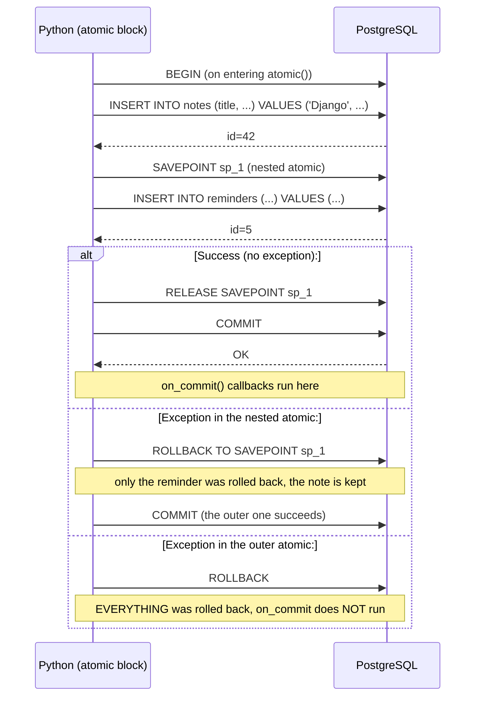
```mermaid
sequenceDiagram
    participant PY as Python (atomic block)
    participant PG as PostgreSQL

    PY->>PG: BEGIN (on entering atomic())
    PY->>PG: INSERT INTO notes (title, ...) VALUES ('Django', ...)
    PG-->>PY: id=42
    PY->>PG: SAVEPOINT sp_1 (nested atomic)
    PY->>PG: INSERT INTO reminders (...) VALUES (...)
    PG-->>PY: id=5

    alt Success (no exception):
        PY->>PG: RELEASE SAVEPOINT sp_1
        PY->>PG: COMMIT
        PG-->>PY: OK
        Note over PY,PG: on_commit() callbacks run here
    else Exception in the nested atomic:
        PY->>PG: ROLLBACK TO SAVEPOINT sp_1
        Note over PY,PG: only the reminder was rolled back, the note is kept
        PY->>PG: COMMIT (the outer one succeeds)
    else Exception in the outer atomic:
        PY->>PG: ROLLBACK
        Note over PY,PG: EVERYTHING was rolled back, on_commit does NOT run
    end
```

---

## 12. select_for_update() — Row Locking Timeline

> **What it shows:** How select_for_update() prevents a race condition under concurrent access.

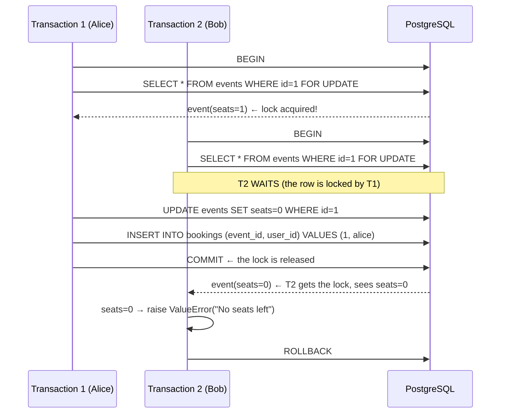
```mermaid
sequenceDiagram
    participant T1 as Transaction 1 (Alice)
    participant T2 as Transaction 2 (Bob)
    participant PG as PostgreSQL

    T1->>PG: BEGIN
    T1->>PG: SELECT * FROM events WHERE id=1 FOR UPDATE
    PG-->>T1: event(seats=1) ← lock acquired!

    T2->>PG: BEGIN
    T2->>PG: SELECT * FROM events WHERE id=1 FOR UPDATE
    Note over T2,PG: T2 WAITS (the row is locked by T1)

    T1->>PG: UPDATE events SET seats=0 WHERE id=1
    T1->>PG: INSERT INTO bookings (event_id, user_id) VALUES (1, alice)
    T1->>PG: COMMIT ← the lock is released

    PG-->>T2: event(seats=0) ← T2 gets the lock, sees seats=0
    T2->>T2: seats=0 → raise ValueError("No seats left")
    T2->>PG: ROLLBACK
```

---

## 13. Deadlock — Mutual Locking

> **What it shows:** How a deadlock arises when locks are taken in a different order.
> Solution: always lock in a stable order (by id ASC).

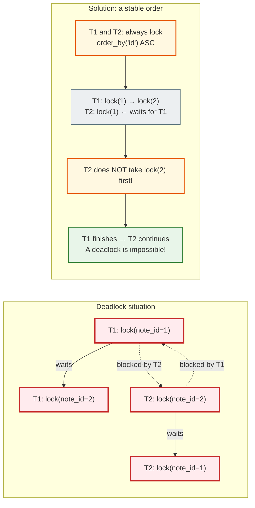
```mermaid
graph LR
    subgraph "Deadlock situation"
        T1A["T1: lock(note_id=1)"] -->|"waits"| T1B["T1: lock(note_id=2)"]
        T2B["T2: lock(note_id=2)"] -->|"waits"| T2A["T2: lock(note_id=1)"]
        T1A -.->|"blocked by T2"| T2B
        T2B -.->|"blocked by T1"| T1A
    end

    subgraph "Solution: a stable order"
        S1["T1 and T2: always lock<br>order_by('id') ASC"] --> S2["T1: lock(1) → lock(2)<br>T2: lock(1) ← waits for T1"]
        S2 --> S2b["T2 does NOT take lock(2) first!"]
        S2b --> S3["T1 finishes → T2 continues<br>A deadlock is impossible!"]
    end

    classDef step     fill:#eceff1,stroke:#546e7a,stroke-width:1px;
    classDef success  fill:#e8f5e9,stroke:#2e7d32,stroke-width:2px;
    classDef error    fill:#ffebee,stroke:#c62828,stroke-width:3px;
    classDef warning  fill:#fff8e1,stroke:#e65100,stroke-width:2px;

    class S2 step;
    class S3 success;
    class T1A,T1B,T2A,T2B error;
    class S1,S2b warning;
```

---

## 14. MVCC — Tuple Versioning

> **What it shows:** How PostgreSQL keeps several versions of a row for MVCC.
> xmin = the transaction that created it, xmax = the transaction that deleted/replaced it.

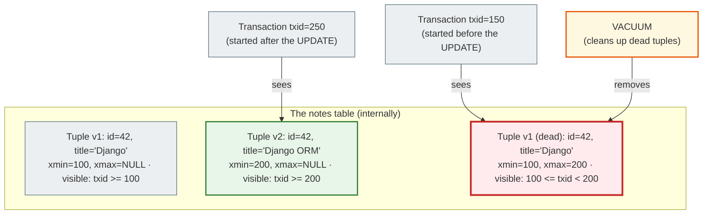
```mermaid
graph TD
    subgraph "The notes table (internally)"
        T1["Tuple v1: id=42, title='Django'<br>xmin=100, xmax=NULL · visible: txid >= 100"]
        T2["Tuple v2: id=42, title='Django ORM'<br>xmin=200, xmax=NULL · visible: txid >= 200"]
        T3["Tuple v1 (dead): id=42, title='Django'<br>xmin=100, xmax=200 · visible: 100 <= txid < 200"]
    end

    TX150["Transaction txid=150<br>(started before the UPDATE)"] -->|"sees"| T3
    TX250["Transaction txid=250<br>(started after the UPDATE)"] -->|"sees"| T2
    VACUUM["VACUUM<br>(cleans up dead tuples)"] -->|"removes"| T3

    classDef step     fill:#eceff1,stroke:#546e7a,stroke-width:1px;
    classDef success  fill:#e8f5e9,stroke:#2e7d32,stroke-width:2px;
    classDef error    fill:#ffebee,stroke:#c62828,stroke-width:3px;
    classDef warning  fill:#fff8e1,stroke:#e65100,stroke-width:2px;

    class T1,TX150,TX250 step;
    class T2 success;
    class T3 error;
    class VACUUM warning;
```

---

## 15. N+1 vs Optimized Queries — The Full Picture

> **What it shows:** The number of SQL queries for different strategies of loading 100 notes.

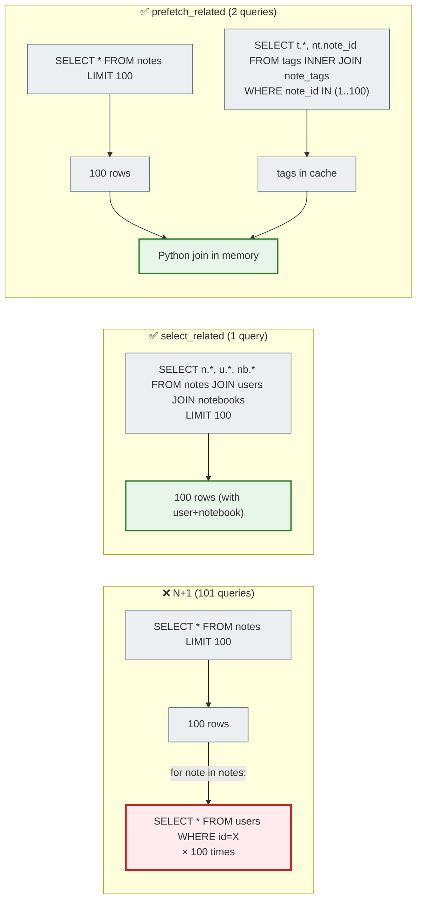
```mermaid
graph LR
    subgraph "❌ N+1 (101 queries)"
        Q1["SELECT * FROM notes LIMIT 100"] --> R1["100 rows"]
        R1 -->|"for note in notes:"| Q2["SELECT * FROM users WHERE id=X<br>× 100 times"]
    end

    subgraph "✅ select_related (1 query)"
        Q3["SELECT n.*, u.*, nb.* FROM notes JOIN users JOIN notebooks<br>LIMIT 100"] --> R3["100 rows (with user+notebook)"]
    end

    subgraph "✅ prefetch_related (2 queries)"
        Q4["SELECT * FROM notes LIMIT 100"] --> R4["100 rows"]
        Q5["SELECT t.*, nt.note_id FROM tags INNER JOIN note_tags<br>WHERE note_id IN (1..100)"] --> R5["tags in cache"]
        R4 --> R6["Python join in memory"]
        R5 --> R6
    end

    classDef step     fill:#eceff1,stroke:#546e7a,stroke-width:1px;
    classDef success  fill:#e8f5e9,stroke:#2e7d32,stroke-width:2px;
    classDef error    fill:#ffebee,stroke:#c62828,stroke-width:3px;

    class Q1,R1,Q3,Q4,Q5,R4,R5 step;
    class R3,R6 success;
    class Q2 error;
```

---

## 16. PostgreSQL System Architecture

> **What it shows:** How PostgreSQL handles a Django query at the system level.
> Shared Buffers = cache. WAL = the fault-tolerance log.

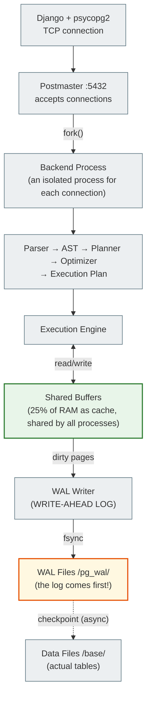
```mermaid
graph TD
    Client["Django + psycopg2<br>TCP connection"] --> PM["Postmaster :5432<br>accepts connections"]
    PM -->|"fork()"| BP["Backend Process<br>(an isolated process for each connection)"]
    BP --> QP["Parser → AST → Planner → Optimizer<br>→ Execution Plan"]
    QP --> EE["Execution Engine"]
    EE <-->|"read/write"| SB["Shared Buffers<br>(25% of RAM as cache, shared by all processes)"]
    SB -->|"dirty pages"| WW["WAL Writer<br>(WRITE-AHEAD LOG)"]
    WW -->|"fsync"| WAL["WAL Files /pg_wal/<br>(the log comes first!)"]
    WAL -.->|"checkpoint (async)"| DF["Data Files /base/<br>(actual tables)"]

    classDef step     fill:#eceff1,stroke:#546e7a,stroke-width:1px;
    classDef success  fill:#e8f5e9,stroke:#2e7d32,stroke-width:2px;
    classDef warning  fill:#fff8e1,stroke:#e65100,stroke-width:2px;

    class Client,PM,BP,QP,EE,WW,DF step;
    class SB success;
    class WAL warning;
```

---

## 17. Services/Selectors Architecture

> **What it shows:** The data flow through the layers of the Services/Selectors architecture.
> The view is thin. The logic is in services/selectors.

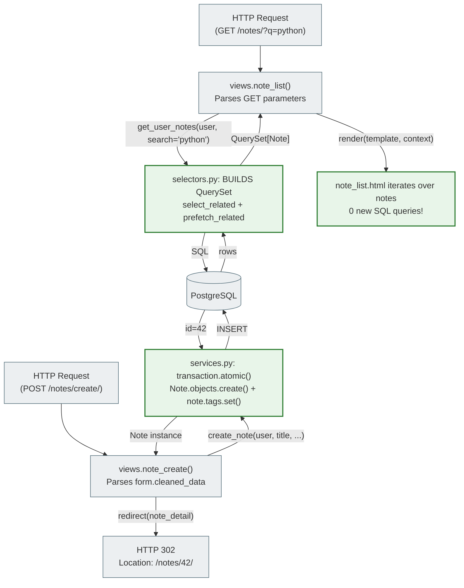
```mermaid
graph TD
    REQ["HTTP Request<br>(GET /notes/?q=python)"] --> VIEW["views.note_list()<br>Parses GET parameters"]
    VIEW -->|"get_user_notes(user, search='python')"| SEL["selectors.py: BUILDS QuerySet<br>select_related + prefetch_related"]
    SEL -->|"SQL"| DB[(PostgreSQL)]
    DB -->|"rows"| SEL
    SEL -->|"QuerySet[Note]"| VIEW
    VIEW -->|"render(template, context)"| TMPL["note_list.html iterates over notes<br>0 new SQL queries!"]

    REQ2["HTTP Request<br>(POST /notes/create/)"] --> VIEW2["views.note_create()<br>Parses form.cleaned_data"]
    VIEW2 -->|"create_note(user, title, ...)"| SVC["services.py: transaction.atomic()<br>Note.objects.create() + note.tags.set()"]
    SVC -->|"INSERT"| DB
    DB -->|"id=42"| SVC
    SVC -->|"Note instance"| VIEW2
    VIEW2 -->|"redirect(note_detail)"| RESP["HTTP 302<br>Location: /notes/42/"]

    classDef step     fill:#eceff1,stroke:#546e7a,stroke-width:1px;
    classDef success  fill:#e8f5e9,stroke:#2e7d32,stroke-width:2px;

    class REQ,VIEW,REQ2,VIEW2,DB,RESP step;
    class SEL,SVC,TMPL success;
```

---

## 18. Normalization — Before/After

> **What it shows:** Why duplication in a schema is a problem, and how normalization solves it.

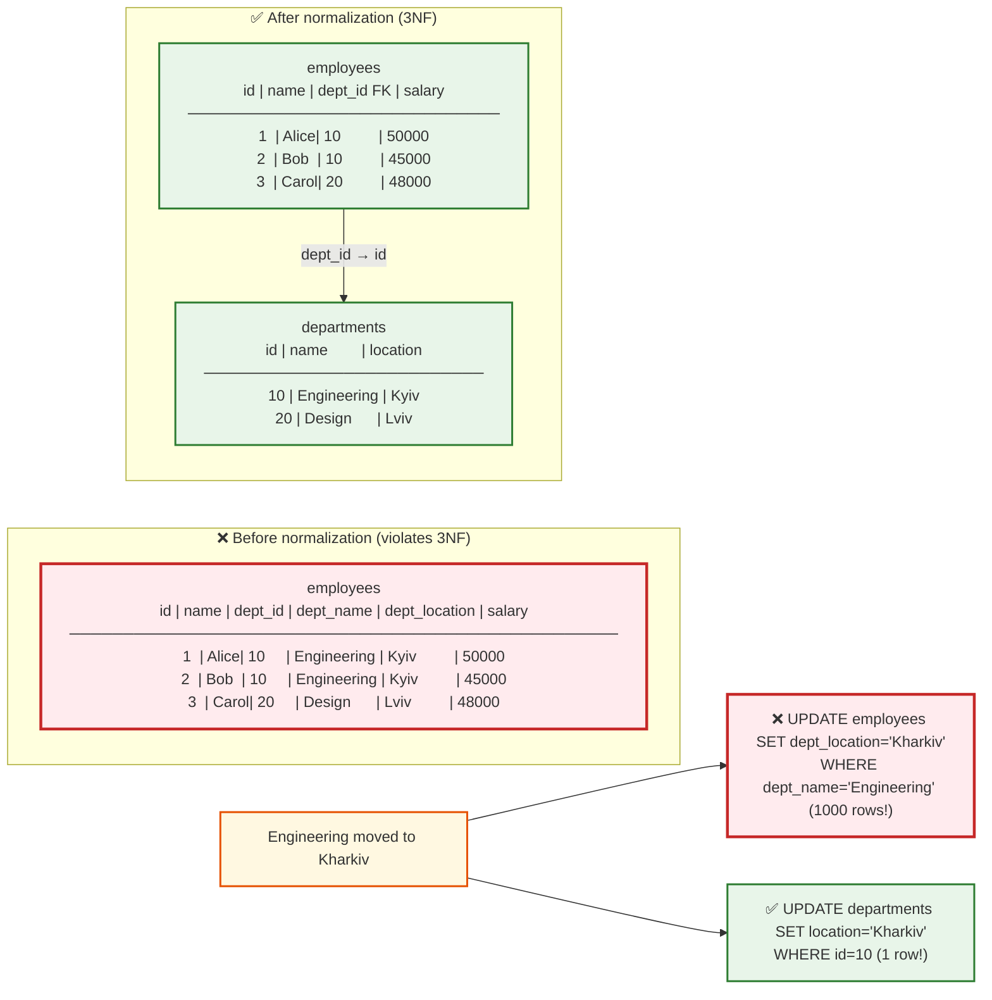
```mermaid
graph LR
    subgraph "❌ Before normalization (violates 3NF)"
        T1["employees<br>id | name | dept_id | dept_name | dept_location | salary<br>───────────────────────────────────────────────────<br>1  | Alice| 10     | Engineering | Kyiv         | 50000<br>2  | Bob  | 10     | Engineering | Kyiv         | 45000<br>3  | Carol| 20     | Design      | Lviv         | 48000"]
    end

    subgraph "✅ After normalization (3NF)"
        T2["employees<br>id | name | dept_id FK | salary<br>─────────────────────────────<br>1  | Alice| 10         | 50000<br>2  | Bob  | 10         | 45000<br>3  | Carol| 20         | 48000"]
        T3["departments<br>id | name        | location<br>──────────────────────────<br>10 | Engineering | Kyiv<br>20 | Design      | Lviv"]
        T2 -->|"dept_id → id"| T3
    end

    PROB["Engineering moved to Kharkiv"] --> PB1["❌ UPDATE employees SET dept_location='Kharkiv'<br>WHERE dept_name='Engineering' (1000 rows!)"]
    PROB --> PB2["✅ UPDATE departments SET location='Kharkiv'<br>WHERE id=10 (1 row!)"]

    classDef success  fill:#e8f5e9,stroke:#2e7d32,stroke-width:2px;
    classDef error    fill:#ffebee,stroke:#c62828,stroke-width:3px;
    classDef warning  fill:#fff8e1,stroke:#e65100,stroke-width:2px;

    class T2,T3,PB2 success;
    class T1,PB1 error;
    class PROB warning;
```

---

## 19. Relationship Types Map (The Full Map)

> **What it shows:** All Django relationship types + the SQL mechanism + the FK placement rule.

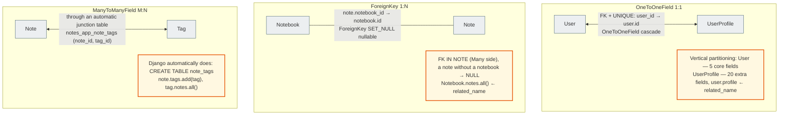
```mermaid
graph TD
    subgraph "OneToOneField 1:1"
        U[User] <-->|"FK + UNIQUE: user_id → user.id<br>OneToOneField cascade"| UP[UserProfile]
        NOTE1["Vertical partitioning: User — 5 core fields<br>UserProfile — 20 extra fields, user.profile ← related_name"]
    end

    subgraph "ForeignKey 1:N"
        NB[Notebook] <---|"note.notebook_id → notebook.id<br>ForeignKey SET_NULL nullable"| NT[Note]
        NOTE2["FK IN NOTE (Many side), a note without a notebook → NULL<br>Notebook.notes.all() ← related_name"]
    end

    subgraph "ManyToManyField M:N"
        N[Note] <-->|"through an automatic junction table<br>notes_app_note_tags (note_id, tag_id)"| T[Tag]
        NOTE3["Django automatically does: CREATE TABLE note_tags<br>note.tags.add(tag), tag.notes.all()"]
    end

    classDef step     fill:#eceff1,stroke:#546e7a,stroke-width:1px;
    classDef warning  fill:#fff8e1,stroke:#e65100,stroke-width:2px;

    class U,UP,NB,NT,N,T step;
    class NOTE1,NOTE2,NOTE3 warning;
```

---

## 20. F() Expression — Race Condition Prevention

> **What it shows:** The difference between an unsafe Python read-modify-write and an atomic F().

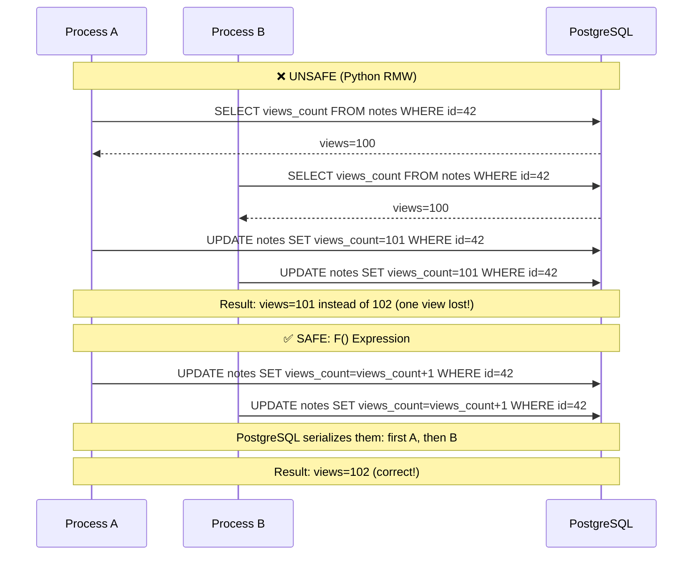
```mermaid
sequenceDiagram
    participant A as Process A
    participant B as Process B
    participant PG as PostgreSQL

    Note over A,PG: ❌ UNSAFE (Python RMW)
    A->>PG: SELECT views_count FROM notes WHERE id=42
    PG-->>A: views=100
    B->>PG: SELECT views_count FROM notes WHERE id=42
    PG-->>B: views=100
    A->>PG: UPDATE notes SET views_count=101 WHERE id=42
    B->>PG: UPDATE notes SET views_count=101 WHERE id=42
    Note over A,PG: Result: views=101 instead of 102 (one view lost!)

    Note over A,PG: ✅ SAFE: F() Expression
    A->>PG: UPDATE notes SET views_count=views_count+1 WHERE id=42
    B->>PG: UPDATE notes SET views_count=views_count+1 WHERE id=42
    Note over A,PG: PostgreSQL serializes them: first A, then B
    Note over A,PG: Result: views=102 (correct!)
```
