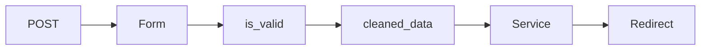

# Django Forms and Crispy Forms

> Django Form перевіряє дані, Crispy Forms описує Bootstrap layout без дублювання HTML.

## Що студент вивчить

- базову ментальну модель теми;
- як тема працює у Django;
- де її побачити у фінальному проєкті;
- як перевірити, що розуміння не лише теоретичне.

## Передумови

- Вміти відкрити репозиторій.
- Розуміти, що всі шляхи в документації відносні до кореня `notes_chat_app`.

## Pipeline

## У проєкті

`NoteForm` приймає `user`, щоб dropdown не показував чужі notebooks, tags і groups. Це security requirement, а не лише UI detail.

`TodoItemForm` і `ShopItemForm` використовують `form_tag=False`, бо вони вбудовані у template form.

## Де це знайти у фінальному проєкті

| Файл | Що подивитися |
| --- | --- |
| `notes_app/forms.py` | forms and FormHelper layouts |
| `notes_app/templates/notes_app/note_form.html` | crispy rendering |

## Практичне завдання

Додайте validation rule до форми і test, який перевіряє invalid input.

## Контрольні питання

- Що є входом у цей процес?
- Який результат очікується?
- Де найчастіше виникає помилка?
- Яка команда або test допомагає перевірити зміну?

## Далі

Далі: [Frontend and templates](../05_frontend_and_templates/README.md).
