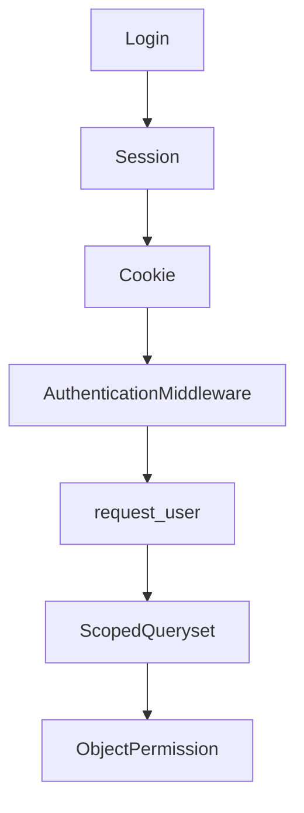

# Authentication, Sessions and Permissions

> Authentication відповідає на питання хто ти, authorization - що тобі дозволено.

## Що студент вивчить

- базову ментальну модель теми;
- як тема працює у Django;
- де її побачити у фінальному проєкті;
- як перевірити, що розуміння не лише теоретичне.

## Передумови

- Вміти відкрити репозиторій.
- Розуміти, що всі шляхи в документації відносні до кореня `notes_chat_app`.

## Flow

## IDOR

Не можна брати object лише за `pk`. Треба scope: owner, shared user або group membership.

## У проєкті

- Notes видно owner або members group.
- Редагувати чужу group note не дозволено.
- Chat consumer перевіряє membership при connect.

## Де це знайти у фінальному проєкті

| Файл | Що подивитися |
| --- | --- |
| `notes_app/views.py` | owner/group checks |
| `notes_app/selectors.py` | scoped querysets |
| `notes_app/consumers.py` | membership check |

## Практичне завдання

Напишіть test, який доводить, що user не бачить чужий object.

## Контрольні питання

- Що є входом у цей процес?
- Який результат очікується?
- Де найчастіше виникає помилка?
- Яка команда або test допомагає перевірити зміну?

## Далі

Далі: [Testing and quality](../08_testing_and_quality/README.md).
