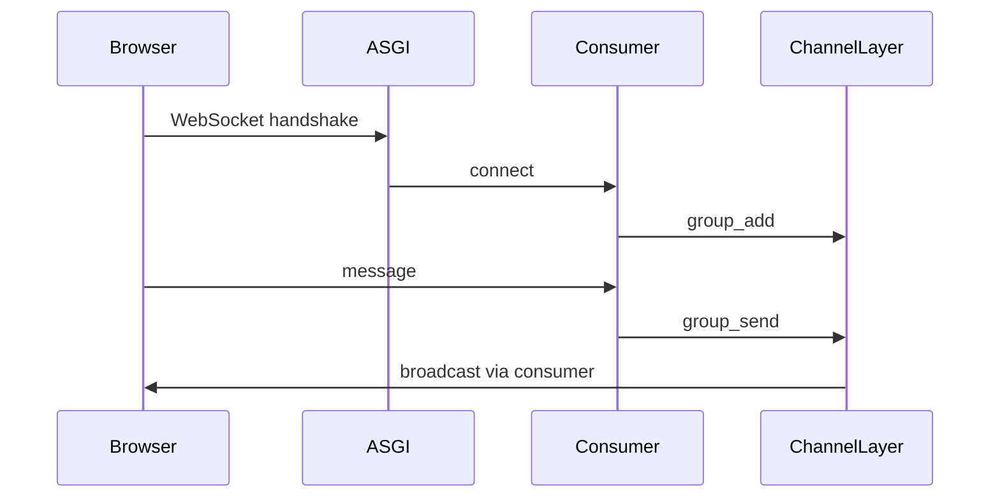

# Channels and WebSocket

> WebSocket connection живе довше, ніж HTTP request, тому його обробляє Consumer.

## Що студент вивчить

- базову ментальну модель теми;
- як тема працює у Django;
- де її побачити у фінальному проєкті;
- як перевірити, що розуміння не лише теоретичне.

## Передумови

- Вміти відкрити репозиторій.
- Розуміти, що всі шляхи в документації відносні до кореня `notes_chat_app`.

## Flow

## Channel layer

Якщо `REDIS_URL` задано, використовується Redis. Якщо ні - `InMemoryChannelLayer`, придатний лише для одного процесу.

## Де це знайти у фінальному проєкті

| Файл | Що подивитися |
| --- | --- |
| `notes_app/consumers.py` | connect, receive, disconnect |
| `notes_app/static/notes_app/js/group_chat.js` | browser WebSocket client |
| `notes_app/models.py` | ChatMessage |

## Практичне завдання

Створіть групу, відкрийте chat page у двох browser sessions і перевірте broadcast.

## Контрольні питання

- Що є входом у цей процес?
- Який результат очікується?
- Де найчастіше виникає помилка?
- Яка команда або test допомагає перевірити зміну?

## Далі

Далі: [Linux and DevOps](../10_linux_and_devops/README.md).
