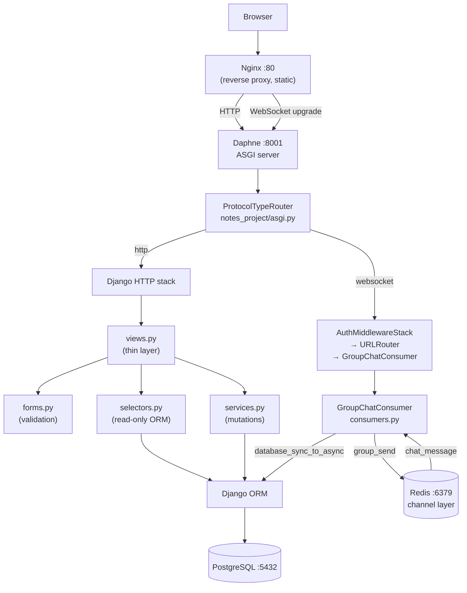
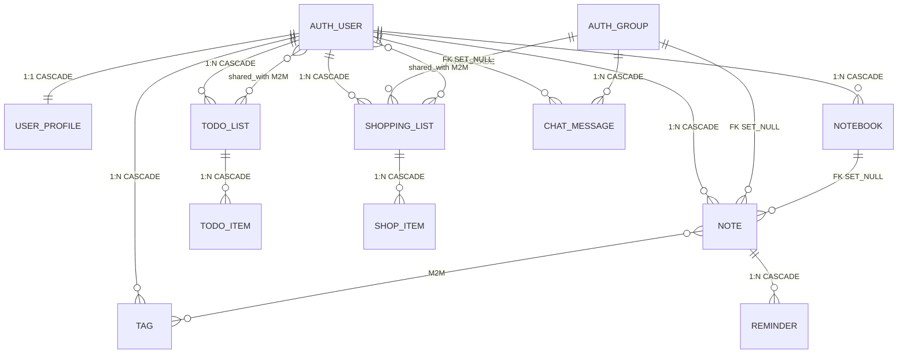

# Notes Chat App — Deep Dive

`notes_chat_app` — фінальний проєкт курсу на Django 5.2. Поєднує CRUD, групове ділення об'єктів, WebSocket-чат, повну тестову піраміду і Docker Compose в одному codebase.

---

## Навігація

| Документ | Призначення |
|----------|-------------|
| **[Project Overview](project_overview.md)** | ролі, стек, архітектурні патерни |
| **[Architecture](architecture.md)** | компоненти, ASGI routing, шари, Docker |
| **[Domain Model](domain_model.md)** | 9 моделей, ER-діаграма, поля, deletion behavior |
| **[Feature Map](feature_map.md)** | що реалізовано і де у коді |
| **[Request Flows](request_flows.md)** | HTTP CRUD, auth, WebSocket flows (Mermaid) |
| **[Security Model](security_model.md)** | IDOR, Q-filter, group sharing, WebSocket auth |
| **[Async and Chat](async_and_chat.md)** | ASGI, GroupChatConsumer, channel layer |
| **[Background Tasks](background_tasks.md)** | Celery Worker, Beat, email-нагадування, Browser Toast |
| **[Testing Strategy](testing_strategy.md)** | 6 test файлів, 205 тестів, TransactionTestCase |
| **[Setup](setup.md)** | запуск через Docker Compose |
| **[Deployment](deployment.md)** | Docker сервіси, production checklist |
| **[Student Tasks](student_tasks.md)** | практичні завдання 3 рівнів |

---

## Архітектура одним поглядом



---

## Файлова структура

```
notes_chat_app/
├── notes_project/           ← Django project package
│   ├── settings.py          ← apps, DB, Channels, Redis, static, auth
│   ├── urls.py              ← root URLs: admin, accounts, app include
│   ├── asgi.py              ← ProtocolTypeRouter (http + websocket)
│   └── routing.py           ← WebSocket URL: /ws/groups/<pk>/chat/
│
├── notes_app/               ← єдиний Django app
│   ├── models.py            ← 9 моделей + constraints
│   ├── urls.py              ← 35+ URL маршрутів
│   ├── views.py             ← FBV, @login_required, тонкий шар
│   ├── forms.py             ← NoteForm, GroupCreateForm, ...
│   ├── selectors.py         ← read-only QuerySets, access scoping
│   ├── services.py          ← мутації: create/update/delete
│   ├── consumers.py         ← GroupChatConsumer (AsyncWebsocketConsumer)
│   ├── tasks.py             ← @shared_task send_reminder_notifications (Celery)
│   ├── admin.py             ← реєстрація моделей
│   └── tests/
│       ├── test_models.py
│       ├── test_services.py
│       ├── test_forms.py
│       ├── test_views.py
│       ├── test_consumers.py
│       ├── test_tasks.py
│       └── test_selenium.py
│
├── templates/               ← project-level templates
│   ├── base.html            ← DOCTYPE, head, navbar, messages
│   └── layouts/
│       └── dashboard.html   ← sidebar, content block
│
├── notes_app/templates/notes_app/   ← app-level templates
├── notes_app/static/notes_app/js/
│   ├── group_chat.js        ← WebSocket JS-клієнт
│   └── reminders.js         ← HTTP polling + Bootstrap Toast
│
├── nginx/
│   └── nginx.conf           ← proxy_pass, WebSocket upgrade, static
├── docker-compose.yml       ← db, redis, web, nginx, ngrok, selenium, celery-worker, celery-beat
├── Dockerfile
└── entrypoint.sh            ← wait-for-db, migrate, collectstatic, seed
```

---

## Шар-модель

```
HTTP Request
  └─► notes_project/urls.py  (include notes_app.urls)
       └─► notes_app/urls.py  (@login_required, path)
            └─► views.py  (coordination only)
                 ├─► forms.py      (validation, clean_*)
                 ├─► selectors.py  (scoped QuerySet — read)
                 └─► services.py   (create/update/delete)
                      └─► models.py → PostgreSQL
```

Правило: `views.py` не містить ORM-запитів. `selectors.py` не містить мутацій. `services.py` не знає про HTTP.

---

## Domain Model



### Ключові моделі

| Модель | Особливості |
|--------|-------------|
| `Note` | `priority` 1–4 (`PositiveSmallIntegerField`, `CheckConstraint`), `group FK SET_NULL`, `notebook FK SET_NULL`, `tags M2M` |
| `TodoList` | `shared_with M2M(User)` — спільний доступ через прямий шерінг |
| `ShoppingList` | `shared_with M2M(User)` + `group FK SET_NULL` — два типи sharing |
| `ChatMessage` | `author FK CASCADE`, `group FK CASCADE` — без SET_NULL; при видаленні групи повідомлення видаляються |
| `Reminder` | `CASCADE` від `Note` — при видаленні нотатки нагадування видаляються |
| `UserProfile` | `OneToOneField(User, CASCADE)` — `display_name(100)`, `bio`, `avatar_url`, `timezone` |

### Deletion behavior

```text
User deleted       → всі його Note, Notebook, Tag, TodoList, ShoppingList, ChatMessage → CASCADE
Notebook deleted   → Note.notebook → SET_NULL  (нотатки не видаляються)
Note deleted       → Reminder → CASCADE
Group deleted      → Note.group → SET_NULL, ShoppingList.group → SET_NULL
                   → ChatMessage → CASCADE  (повідомлення видаляються!)
TodoList deleted   → TodoItem → CASCADE
ShoppingList deleted → ShopItem → CASCADE
```

---

## URL-маршрути

Усі маршрути визначені у `notes_app/urls.py`.

### Notes

| URL | Name | View |
|-----|------|------|
| `/notes/` | `note_list` | `note_list` |
| `/notes/new/` | `note_create` | `note_create` |
| `/notes/<pk>/` | `note_detail` | `note_detail` |
| `/notes/<pk>/edit/` | `note_edit` | `note_edit` |
| `/notes/<pk>/delete/` | `note_delete` | `note_delete` |

### Todo

| URL | Name | View |
|-----|------|------|
| `/todo/` | `todo_list` | `todo_list_list` |
| `/todo/new/` | `todo_create` | `todo_list_create` |
| `/todo/<pk>/` | `todo_detail` | `todo_list_detail` |
| `/todo/<pk>/share/` | `todo_share` | `todo_list_share` |
| `/todo/<pk>/items/add/` | `todo_item_add` | `todo_item_add` |
| `/todo/items/<pk>/toggle/` | `todo_item_toggle` | `todo_item_toggle` |

### Shopping

| URL | Name | View |
|-----|------|------|
| `/shopping/` | `shopping_list` | `shopping_list_list` |
| `/shopping/new/` | `shopping_create` | `shopping_list_create` |
| `/shopping/<pk>/share/` | `shopping_share` | `shopping_list_share` |
| `/shopping/<pk>/items/add/` | `shop_item_add` | `shop_item_add` |
| `/shopping/items/<pk>/toggle/` | `shop_item_toggle` | `shop_item_toggle_purchased` |

### Groups і Chat

| URL | Name | View |
|-----|------|------|
| `/groups/` | `group_list` | `group_list` |
| `/groups/new/` | `group_create` | `group_create` |
| `/groups/<pk>/` | `group_detail` | `group_detail` |
| `/groups/<pk>/delete/` | `group_delete` | `group_delete` |
| `/groups/<pk>/chat/` | `group_chat` | `group_chat` |

### WebSocket

```
ws://host/ws/groups/<pk>/chat/
```

Визначено у `notes_project/routing.py`.

---

## Selectors

`notes_app/selectors.py` — read-only ORM, завжди повертає матеріалізовані дані або `QuerySet` до рендеру.

| Функція | Що повертає |
|---------|-------------|
| `get_user_notes(user, *, archived, notebook, tag, search)` | `QuerySet[Note]` з `select_related('notebook')`, `prefetch_related('tags')` |
| `get_note_detail(user, note_id)` | `Note` або `None` (owner + group members) |
| `get_pinned_notes(user, limit=5)` | `QuerySet[Note]` |
| `get_user_notebooks(user)` | `QuerySet[Notebook]` |
| `get_user_tags(user)` | `QuerySet[Tag]` |
| `get_user_todo_lists(user)` | `QuerySet[TodoList]` (власні) |
| `get_shared_todo_lists(user)` | `QuerySet[TodoList]` (shared_with) |
| `get_todo_list_detail(user, pk)` | `TodoList` або `None` |
| `get_user_shopping_lists(user)` | власні shopping lists |
| `get_shared_shopping_lists(user)` | shared_with lists |
| `get_shopping_list_detail(user, pk)` | з group-access |
| `get_user_groups(user)` | `QuerySet[Group]` де user є членом |
| `get_group_with_members(group_id, user)` | group + prefetch members |
| `get_pending_reminders()` | нагадування з `remind_at <= now` |

**Правило доступу для shared objects:**

```python
# read: власник АБО член групи
Q(user=user) | Q(group__in=user.groups.all())

# write: тільки власник
Q(user=user)
```

---

## Services

`notes_app/services.py` — мутуючі операції, викликаються тільки після валідації форми.

### Notes

```python
create_note(*, user, title, content='', notebook=None, priority=1, group=None, tag_ids=None)
update_note(note, *, title=None, content=None, priority=None, notebook=None,
            is_pinned=None, group=..., tag_ids=None)
delete_note(note)
toggle_pin_note(note)   # flip is_pinned
archive_note(note)      # flip is_archived
```

`group=...` (Ellipsis) у `update_note` — sentinel "не змінювати". `group=None` — прибрати групу.

### Notebooks, Tags

```python
create_notebook(*, user, title, color='#4A90E2', is_default=False)
update_notebook(notebook, *, title, description='', color, is_default)
delete_notebook(notebook)
create_or_get_tag(*, user, name, color='#808080')   # get_or_create
```

### Todo

```python
create_todo_list(*, user, title, description='')
share_todo_list(todo_list, username)    # додає до shared_with
unshare_todo_list(todo_list, username)
add_todo_item(todo_list, *, text, due_date=None)
toggle_todo_item(item)
```

### Shopping

```python
create_shopping_list(*, user, title, store_name='', group=None)
share_shopping_list(shopping_list, username)
add_shop_item(shopping_list, *, name, quantity=1, unit='шт', estimated_price=None)
toggle_shop_item_purchased(item)
```

### Groups

```python
create_group(*, name, creator)    # створює Group + додає creator як member
add_user_to_group(group, username)
```

---

## GroupChatConsumer

`notes_app/consumers.py` — єдиний WebSocket consumer.

```python
class GroupChatConsumer(AsyncWebsocketConsumer):
    async def connect(self)          # перевірка auth + membership → accept або close
    async def disconnect(self, code) # group_discard
    async def receive(self, text_data) # JSON parse → save_message → group_send
    async def chat_message(self, event) # broadcast від channel layer → send до клієнта

    # sync helpers (викликаються через database_sync_to_async)
    def check_membership(self, group_pk, user)  → bool
    def load_history(self, group_pk)            → list[dict]  # 50 останніх
    def save_message(self, group_pk, user, content) → ChatMessage
```

**ASGI import order** (`asgi.py`):

```python
# ПРАВИЛЬНО: django.setup() → get_asgi_application() → імпорт consumers
os.environ.setdefault('DJANGO_SETTINGS_MODULE', 'notes_project.settings')
django_asgi_app = get_asgi_application()   # ← ПЕРЕД будь-яким імпортом notes_app
from notes_app.consumers import GroupChatConsumer  # ← тільки ПІСЛЯ
```

**database_sync_to_async + матеріалізація:**

```python
# ✅ правильно: list() матеріалізує до повернення з worker
history = await database_sync_to_async(self.load_history)(group_pk)

def load_history(self, group_pk):
    return list(
        ChatMessage.objects.filter(group_id=group_pk)
        .select_related('author')
        .order_by('-created_at')[:50]
        .values('content', 'author__username', 'created_at')
    )
```

---

## Безпека

### IDOR захист

Всі object-level запити використовують scoped queryset — ніколи просто `.get(pk=pk)`:

```python
# selectors.py
def get_note_detail(user, note_id):
    user_groups = user.groups.all()
    return Note.objects.filter(
        Q(user=user) | Q(group__in=user_groups),
        pk=note_id
    ).select_related('notebook', 'group').prefetch_related('tags').first()
```

Якщо `None` → view повертає `Http404`.

### Матриця дозволів

| Об'єкт | Read | Write (edit/delete) |
|--------|------|---------------------|
| Note | owner + group members | owner only |
| Notebook | owner | owner |
| Tag | owner | owner |
| TodoList | owner + `shared_with` | owner |
| ShoppingList | owner + `shared_with` + group | owner |
| ChatMessage | group members (WS) | — |

### WebSocket аутентифікація

`AuthMiddlewareStack` читає session cookie при WS handshake → `scope["user"]`.
Consumer перевіряє `user.is_authenticated` і `check_membership()` у `connect()`.
Неавторизований або не-член → `await self.close()`.

---

## Тестова піраміда

| Файл | Клас | Кількість | Що тестує |
|------|------|-----------|-----------|
| `test_models.py` | `TestCase` | ~30 | constraints, `__str__`, on_delete |
| `test_services.py` | `TestCase` | ~40 | return value + persistence |
| `test_forms.py` | `TestCase` | ~25 | valid/invalid data, `clean_*` |
| `test_views.py` | `TestCase` | ~70 | status codes, redirects, IDOR |
| `test_consumers.py` | **`TransactionTestCase`** | ~30 | WS connect, message, reject |
| `test_tasks.py` | `TestCase` | ~13 | Celery task, email, repeat, JSON view |
| `test_selenium.py` | `StaticLiveServerTestCase` | ~14 | E2E flow + Toast-нотифікації |
| **Всього** | | **~218** | |

**Чому `TransactionTestCase` для consumers:**

```text
TestCase огортає кожен тест у транзакцію → rollback після.
Async consumer читає БД з окремого worker-потоку —
  цей потік не бачить незакомічену транзакцію TestCase.
→ setUp-об'єкти "зникають" для consumer.
→ ЗАВЖДИ TransactionTestCase для WebSocket-тестів.
```

**Запуск:**

```bash
# unit + integration + consumer
docker compose run --rm web python manage.py test \
  notes_app.tests.test_models notes_app.tests.test_services \
  notes_app.tests.test_forms notes_app.tests.test_views \
  notes_app.tests.test_consumers -v 2

# Selenium (потрібен запущений стек)
docker compose up -d
docker compose exec web python manage.py test notes_app.tests.test_selenium -v 2
```

---

## Docker Compose

```yaml
services:
  db:             # postgres:16, volume pgdata
  redis:          # redis:7-alpine — DB 0: Channels, DB 1: Celery
  web:            # Django Daphne :8001, залежить від db + redis
  nginx:          # nginx:1.27, :80/:443, proxy_pass до web, роздає static
  ngrok:          # публічний HTTPS-тунель (розробка)
  selenium:       # Selenium Grid для E2E тестів
  celery-worker:  # виконує @shared_task, --concurrency=2
  celery-beat:    # планувальник (рівно 1 екземпляр), CELERY_BEAT_SCHEDULE
```

`entrypoint.sh` виконує при кожному старті:

```bash
wait_for_postgres
python manage.py migrate --noinput
python manage.py collectstatic --noinput
[optional] python manage.py seed_demo_data
daphne -b 0.0.0.0 -p 8001 notes_project.asgi:application
```

---

## Наскрізний сценарій: Create Note

```
Browser                    views.py           forms.py      services.py    PostgreSQL
   |                          |                  |               |              |
   |-- GET /notes/new/ ------>|                  |               |              |
   |<---- NoteForm (empty) ---|                  |               |              |
   |                          |                  |               |              |
   |-- POST /notes/new/ ----->|                  |               |              |
   |  (title, content, tags)  |-- NoteForm(data) ->             |              |
   |                          |<- cleaned_data --|               |              |
   |                          |-- create_note(user, **data) ---->|              |
   |                          |                  |  INSERT Note -|------------->|
   |                          |                  |  <-- Note pk -|-------------|
   |<-- redirect /notes/<pk>--|                  |               |              |
```

---

## Наскрізний сценарій: WebSocket Chat

```
Browser JS                 Nginx      Daphne    GroupChatConsumer    Redis
    |                        |           |              |               |
    |-- WS connect ---------->           |              |               |
    |  (Cookie: sessionid=...)            |              |               |
    |                        |-- upgrade ->             |               |
    |                        |           |-- connect() ->               |
    |                        |           |   check_membership()         |
    |                        |           |   load_history()             |
    |                        |           |   group_add(channel_name) -->|
    |<-- history JSON --------|-----------|<- send() ----|               |
    |                        |           |              |               |
    |-- send message -------->           |              |               |
    |  {"message": "Hello"}   |-- text -->              |               |
    |                        |           |-- receive() ->               |
    |                        |           |   save_message() → DB        |
    |                        |           |   group_send() ------------->|
    |                        |           |                              |
    |                        |           |<-- chat_message event -------|
    |<-- {"type":"chat", ...}-|-----------|<- send() ----|               |
```

---

## Типові підводні камені

| Ситуація | Помилка | Рішення |
|----------|---------|---------|
| Lazy QuerySet з async consumer | `SynchronousOnlyOperation` | `list()` у `database_sync_to_async` |
| `get_asgi_application()` після імпорту notes_app | `AppRegistryNotReady` | переставити імпорти у `asgi.py` |
| `TestCase` для consumer | setUp-об'єкти зникають | `TransactionTestCase` |
| Redis `socket_timeout` не `None` | `TimeoutError` на idle WS | `"socket_timeout": None` у `CONFIG` |
| `DebugExceptionMiddleware` без `if DEBUG:` | traceback у HTTP-відповіді у prod | обгорнути `if DEBUG:` у `settings.py` |
| `note.group = group_instance; note.save()` у selector | порушення шару (мутація) | перенести до `services.py` |
