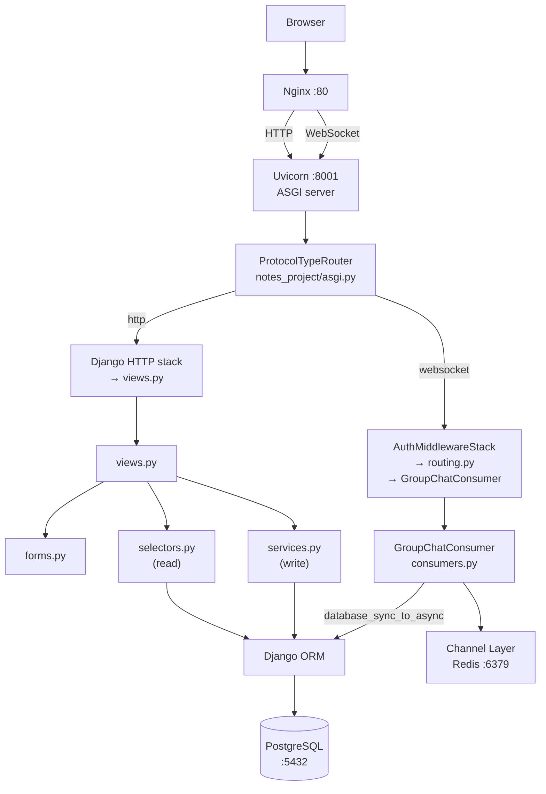
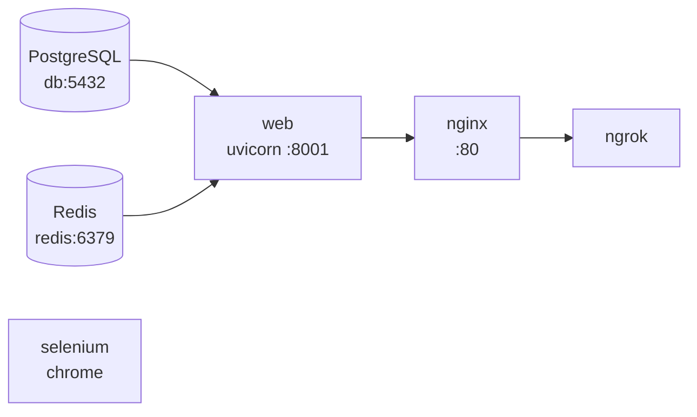

# Архітектура Notes Chat App

---

## Компоненти і відповідальність

| Компонент | Файл | Відповідальність |
|-----------|------|-----------------|
| Settings | `notes_project/settings.py` | apps, DB, Channels, static, auth |
| Root URLs | `notes_project/urls.py` | admin, accounts, app include |
| App URLs | `notes_app/urls.py` | HTTP routes |
| WebSocket routing | `notes_project/routing.py` | `/ws/groups/<pk>/chat/` |
| Models | `notes_app/models.py` | domain schema, constraints, indexes |
| Views | `notes_app/views.py` | HTTP request/response, thin layer |
| Forms | `notes_app/forms.py` | validation і Crispy layout |
| Selectors | `notes_app/selectors.py` | read-only ORM queries, access scoping |
| Services | `notes_app/services.py` | мутуючі операції (create/update/delete) |
| Consumer | `notes_app/consumers.py` | WebSocket: `GroupChatConsumer` |
| Templates | `templates/` + `notes_app/templates/` | HTML |
| Static | `notes_app/static/notes_app/js/group_chat.js` | WebSocket JS-клієнт |
| Tests | `notes_app/tests/` | 6 модулів |
| ASGI | `notes_project/asgi.py` | ProtocolTypeRouter |

---

## Шари застосунку



---

## ASGI і протоколи

`notes_project/asgi.py` розподіляє трафік за типом протоколу:

```python
application = ProtocolTypeRouter({
    "http":      get_asgi_application(),
    "websocket": AuthMiddlewareStack(
                     URLRouter(websocket_urlpatterns)
                 ),
})
```

HTTP обробляється Django стандартним чином.
WebSocket — через `AuthMiddlewareStack`, який читає сесійний cookie і наповнює `scope["user"]`.

WebSocket URL: `/ws/groups/<group_pk>/chat/` → `GroupChatConsumer`.

---

## Docker Compose



Залежності: `web` стартує лише після health check `db` і `redis`.

---

## Шаровий принцип (Views → thin)

```text
views.py         ← HTTP координація (тонкий шар)
  ↓ forms.py     ← валідація вхідних даних
  ↓ selectors.py ← read queries (повертає QuerySet або list)
  ↓ services.py  ← write operations (атомарні транзакції)
  ↓ models.py    ← domain schema
```

Бізнес-логіка не додається безпосередньо у view без документованої причини.

---

## Channel Layer

| Умова | Backend |
|-------|---------|
| `REDIS_URL` не встановлено | `InMemoryChannelLayer` (dev, один процес) |
| `REDIS_URL` встановлено | `RedisChannelLayer` (Docker, production) |

`socket_timeout=None` у `RedisChannelLayer CONFIG` є обов'язковим — запобігає `TimeoutError` при idle WebSocket з'єднаннях.
