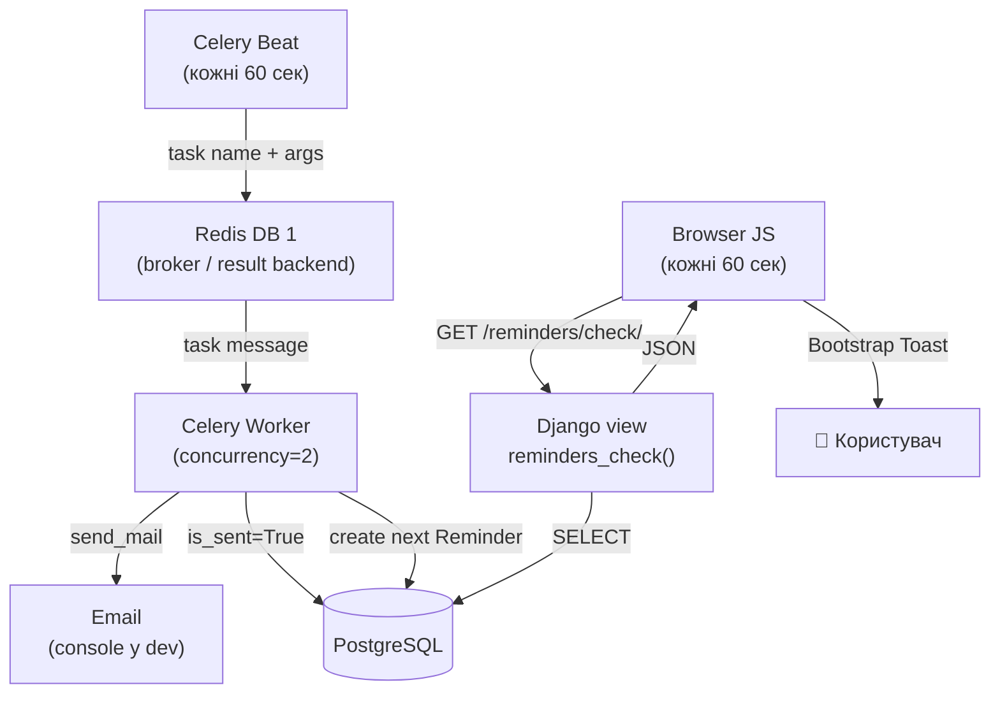

# Background Tasks та Browser Notifications

`notes_chat_app` реалізує систему нагадувань на двох рівнях: фоновий email-воркер (Celery) і browser-polling з Bootstrap Toast.

---

## Проблема і рішення

Django-view не може надіслати email рівно о запланованому часі — він виконується лише у відповідь на HTTP-запит. Якщо браузер не відкритий, нагадування не спрацює.

**Рішення:** Celery Worker — окремий процес, що завжди активний і виконує задачі незалежно від браузера.

---

## Архітектура



---

## Файли

| Файл | Роль |
|------|------|
| `notes_project/celery.py` | Ініціалізація Celery-додатку, autodiscover tasks |
| `notes_project/__init__.py` | Реєстрація `celery_app` при старті Django |
| `notes_project/settings.py` | `CELERY_BROKER_URL`, `CELERY_BEAT_SCHEDULE`, `CELERY_*` |
| `notes_app/tasks.py` | `@shared_task send_reminder_notifications()` |
| `notes_app/selectors.py` | `get_due_reminders_for_browser(user)` |
| `notes_app/views.py` | `reminders_check(request)` → `JsonResponse` |
| `notes_app/urls.py` | `path('reminders/check/', ...)` |
| `notes_app/static/notes_app/js/reminders.js` | fetch polling + Bootstrap Toast |
| `templates/base.html` | toast-container + `<script>` для авторизованих |
| `docker-compose.yml` | `celery-worker` і `celery-beat` сервіси |
| `notes_app/tests/test_tasks.py` | unit тести задачі і view |
| `notes_app/tests/test_selenium.py` | E2E тест появи Toast |

---

## Celery Flow

### 1. Ініціалізація

```python
# notes_project/celery.py
import os
from celery import Celery

os.environ.setdefault('DJANGO_SETTINGS_MODULE', 'notes_project.settings')
app = Celery('notes_project')
app.config_from_object('django.conf:settings', namespace='CELERY')
app.autodiscover_tasks()
```

```python
# notes_project/__init__.py
from .celery import app as celery_app
__all__ = ('celery_app',)
```

### 2. Задача

```python
# notes_app/tasks.py
@shared_task
def send_reminder_notifications():
    from .models import Reminder
    now = timezone.now()
    pending = (
        Reminder.objects
        .select_related('note__user')
        .filter(remind_at__lte=now, is_sent=False)
    )
    for reminder in pending:
        user = reminder.note.user
        if user.email:
            send_mail(...)
        reminder.is_sent = True
        reminder.save(update_fields=['is_sent'])
        _schedule_next(reminder)
```

### 3. Повторення нагадувань

```python
def _schedule_next(reminder):
    if reminder.repeat_pattern == 'none':
        return
    from dateutil.relativedelta import relativedelta
    delta_map = {
        'daily':   relativedelta(days=1),
        'weekly':  relativedelta(weeks=1),
        'monthly': relativedelta(months=1),  # зберігає правильну довжину місяця
    }
    delta = delta_map.get(reminder.repeat_pattern)
    if delta:
        Reminder.objects.create(
            note=reminder.note,
            remind_at=reminder.remind_at + delta,
            message=reminder.message,
            is_sent=False,
            repeat_pattern=reminder.repeat_pattern,
        )
```

`relativedelta` (з `python-dateutil`) правильно обробляє різну довжину місяців на відміну від `timedelta(days=30)`.

### 4. Розклад (Beat)

```python
# notes_project/settings.py
CELERY_BEAT_SCHEDULE = {
    "send-reminders-every-minute": {
        "task": "notes_app.tasks.send_reminder_notifications",
        "schedule": 60.0,
    },
}
```

### 5. Docker-сервіси

```yaml
celery-worker:
  build: .
  command: celery -A notes_project worker -l info --concurrency=2

celery-beat:
  build: .
  command: celery -A notes_project beat -l info
```

Beat завжди один екземпляр. Worker може масштабуватись горизонтально.

---

## Redis DB розподіл

| Сервіс | URL | Використання |
|--------|-----|-------------|
| Django Channels | `redis://redis:6379/0` | channel layer (WebSocket) |
| Celery | `redis://redis:6379/1` | broker + result backend |

```python
# settings.py
_CELERY_REDIS = _REDIS_URL.replace("/0", "/1") if _REDIS_URL else "redis://localhost:6379/1"
CELERY_BROKER_URL = _CELERY_REDIS
CELERY_RESULT_BACKEND = _CELERY_REDIS
```

Різні DB виключають конфлікти між Channels і Celery.

---

## Browser Notification Flow

### Selector

```python
# notes_app/selectors.py
def get_due_reminders_for_browser(user):
    now = timezone.now()
    return list(
        Reminder.objects
        .filter(
            note__user=user,
            remind_at__lte=now,
            remind_at__gte=now - timedelta(hours=1),   # вікно показу — 1 год
        )
        .select_related('note')
        .order_by('remind_at')
        .values('id', 'message', 'remind_at', 'note__title')
    )
```

Вікно 1 години: користувач, який відкрив браузер через 40 хвилин після нагадування, все одно побачить Toast.

### View

```python
# notes_app/views.py
@login_required
def reminders_check(request):
    data = selectors.get_due_reminders_for_browser(request.user)
    for item in data:
        item['remind_at'] = item['remind_at'].strftime('%d.%m.%Y %H:%M')
    return JsonResponse({'reminders': data})
```

### JS модуль

| Компонент | Призначення |
|-----------|-------------|
| `POLL_INTERVAL = 60_000` | перевірка кожну хвилину |
| `sessionStorage` | дедуплікація — Toast не повторюється у поточній сесії |
| `escapeHtml()` | XSS-захист перед вставкою у DOM |
| `checkReminders()` | async fetch → parse → showToast для нових |
| `DOMContentLoaded` | перша перевірка одразу при завантаженні |
| `bootstrap.Toast` | Bootstrap 5 API: `new bootstrap.Toast(el, {delay: 8000}).show()` |

---

## Порівняння WebSocket vs Polling

| Критерій | WebSocket (чат) | HTTP Polling (нагадування) |
|----------|-----------------|--------------------------|
| Постійне з'єднання | так | ні |
| Ідеально для | живий потік даних | рідкісні події (1/хв) |
| Складність | вища (ASGI, consumer) | нижча (один endpoint) |
| Навантаження на сервер | низьке (push) | залежить від інтервалу |
| Підходить для нагадувань | надлишково | так |

---

## Тестування

### Задача

```python
# test_tasks.py — ключові тести
@override_settings(EMAIL_BACKEND='django.core.mail.backends.locmem.EmailBackend')
def test_marks_due_reminder_as_sent(self):
    r = self._reminder(offset_minutes=-5)
    send_reminder_notifications()
    r.refresh_from_db()
    self.assertTrue(r.is_sent)

def test_ignores_future_reminders(self):
    r = self._reminder(offset_minutes=+10)
    send_reminder_notifications()
    r.refresh_from_db()
    self.assertFalse(r.is_sent)

def test_daily_repeat_creates_next_reminder(self):
    r = self._reminder(offset_minutes=-5, repeat='daily')
    original_at = r.remind_at
    send_reminder_notifications()
    next_r = Reminder.objects.filter(note=self.note, is_sent=False).first()
    diff = (next_r.remind_at - original_at).total_seconds()
    self.assertAlmostEqual(diff, 86400, delta=60)
```

`override_settings(EMAIL_BACKEND='...locmem...')` перехоплює email у `django.core.mail.outbox` без SMTP-сервера.

### Selenium E2E

```python
def test_toast_appears_for_due_reminder(self):
    Reminder.objects.create(
        note=self.note,
        remind_at=timezone.now() - timedelta(minutes=30),
        message='JS toast test',
    )
    self._login_via_cookie()
    self.driver.get(f'{self.live_server_url}/notes/')

    # JS викликає checkReminders() одразу на DOMContentLoaded
    toast = WebDriverWait(self.driver, 10).until(
        EC.presence_of_element_located((By.CSS_SELECTOR, '.toast.show'))
    )
    self.assertIn('Selenium Reminder Note', toast.text)
```

Тест не чекає 60 секунд — `checkReminders()` виконується одразу після завантаження DOM.

### Покриття

| Файл | Клас | Кількість | Що тестує |
|------|------|-----------|-----------|
| `test_tasks.py` | `SendReminderTaskTest` | 8 | задача, email, repeat_pattern |
| `test_tasks.py` | `RemindersCheckViewTest` | 5 | JSON endpoint, auth, ізоляція |
| `test_selenium.py` | `SeleniumReminderToastTest` | 4 | Toast появляється / не появляється |

**Запуск:**

```bash
# Unit
docker compose run --rm web python manage.py test notes_app.tests.test_tasks -v 2

# Selenium (потрібен запущений стек)
docker compose up -d
docker compose exec web python manage.py test \
  notes_app.tests.test_selenium.SeleniumReminderToastTest -v 2
```

---

## Типові підводні камені

| Ситуація | Помилка | Рішення |
|----------|---------|---------|
| Два екземпляри `celery-beat` | кожне нагадування надсилається двічі | Beat — рівно 1 процес |
| Celery і Channels у Redis DB 0 | конфлікт ключів | Celery → DB 1 |
| `timedelta(days=30)` для місяця | 31 + 30 = 1 березня (лютий пропущений) | `relativedelta(months=1)` |
| Lazy QuerySet у `get_due_reminders_for_browser` | `SynchronousOnlyOperation` якщо викликати з async | `list(queryset.values(...))` |
| Email у тестах іде на реальний сервер | неочікувані відправлення під час CI | `@override_settings(EMAIL_BACKEND='...locmem...')` |
| Toast з'являється кілька разів | інтервал спрацьовує до скриття | `sessionStorage` дедуплікація за `id` |

---

## Пов'язані розділи

- [Туторіал 09 — Celery та фонові задачі](../tutorials/09_celery.md)
- [Celery Tasks — теорія](../06_application_architecture/django_tasks_full.md)
- [Async та Chat](async_and_chat.md)
- [Testing Strategy](testing_strategy.md)
