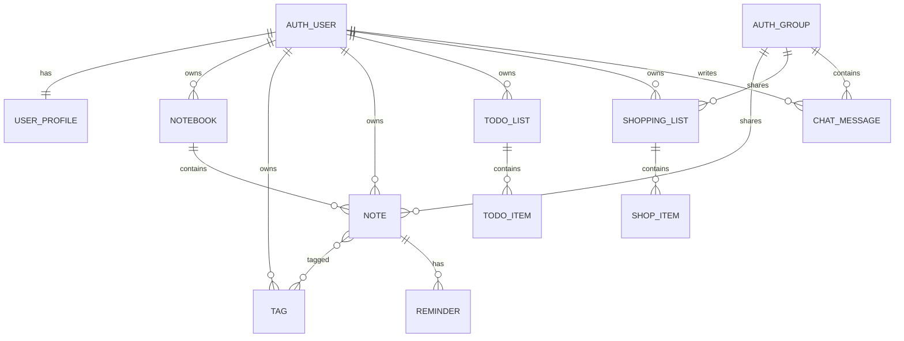

# Domain Model

```mermaid
erDiagram
    AUTH_USER ||--|| USER_PROFILE : has
    AUTH_USER ||--o{ NOTEBOOK : owns
    AUTH_USER ||--o{ TAG : owns
    AUTH_USER ||--o{ NOTE : owns
    AUTH_GROUP ||--o{ NOTE : shares
    NOTEBOOK ||--o{ NOTE : contains
    NOTE }o--o{ TAG : tagged
    NOTE ||--o{ REMINDER : has
    AUTH_USER ||--o{ TODO_LIST : owns
    TODO_LIST ||--o{ TODO_ITEM : contains
    AUTH_USER ||--o{ SHOPPING_LIST : owns
    AUTH_GROUP ||--o{ SHOPPING_LIST : shares
    SHOPPING_LIST ||--o{ SHOP_ITEM : contains
    AUTH_GROUP ||--o{ CHAT_MESSAGE : contains
    AUTH_USER ||--o{ CHAT_MESSAGE : writes
```

Models source: `notes_app/models.py`.
