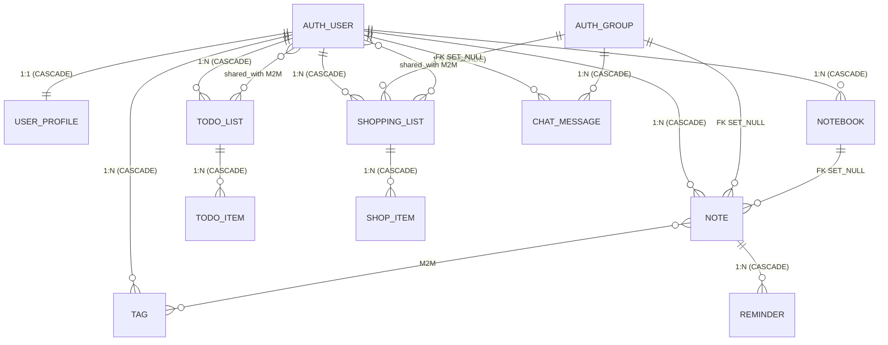

# Domain Model

Джерело: `notes_app/models.py`.

---

## ER-діаграма

---

## Моделі і ключові поля

### UserProfile

| Поле | Тип | Особливості |
|------|-----|-------------|
| `user` | `OneToOneField(User, CASCADE)` | прив'язаний профіль |
| `display_name` | `CharField(100, blank)` | |
| `avatar_url` | `URLField(blank)` | |
| `timezone` | `CharField(50)` | default `'UTC'` |
| `bio` | `TextField(blank)` | |

### Tag

| Поле | Тип | Особливості |
|------|-----|-------------|
| `user` | `ForeignKey(User, CASCADE)` | |
| `name` | `CharField(50)` | |
| `color` | `CharField(7)` | hex, default `'#808080'` |

`unique_together = [('user', 'name')]`

### Notebook

| Поле | Тип | Особливості |
|------|-----|-------------|
| `user` | `ForeignKey(User, CASCADE)` | |
| `title` | `CharField(100)` | |
| `description` | `TextField(blank)` | |
| `color` | `CharField(7)` | hex, default `'#4A90E2'` |
| `is_default` | `BooleanField` | default `False` |
| `created_at` | `DateTimeField(auto_now_add)` | |

### Note

| Поле | Тип | Особливості |
|------|-----|-------------|
| `user` | `ForeignKey(User, CASCADE)` | |
| `group` | `ForeignKey(Group, SET_NULL, null, blank)` | групове ділення |
| `notebook` | `ForeignKey(Notebook, SET_NULL, null, blank)` | може бути без notebook |
| `tags` | `ManyToManyField(Tag, blank)` | |
| `title` | `CharField(200)` | |
| `content` | `TextField(blank)` | |
| `priority` | `PositiveSmallIntegerField` | 1–4; CheckConstraint |
| `is_pinned` | `BooleanField` | default `False` |
| `is_archived` | `BooleanField` | default `False` |
| `created_at` | `DateTimeField(auto_now_add)` | |
| `updated_at` | `DateTimeField(auto_now)` | |

Пріоритети: `PRIORITY_LOW=1`, `PRIORITY_MEDIUM=2`, `PRIORITY_HIGH=3`, `PRIORITY_URGENT=4`.

Indexes: `(user, -updated_at)`, `(user, is_pinned)`.

### Reminder

| Поле | Тип | Особливості |
|------|-----|-------------|
| `note` | `ForeignKey(Note, CASCADE)` | видалення Note → видалення Reminder |
| `remind_at` | `DateTimeField` | |
| `message` | `CharField(500, blank)` | |
| `is_sent` | `BooleanField` | default `False` |
| `repeat_pattern` | `CharField(20)` | `none/daily/weekly/monthly` |

### TodoList

| Поле | Тип | Особливості |
|------|-----|-------------|
| `user` | `ForeignKey(User, CASCADE)` | |
| `title` | `CharField(200)` | |
| `description` | `TextField(blank)` | |
| `is_completed` | `BooleanField` | default `False` |
| `created_at` | `DateTimeField(auto_now_add)` | |
| `shared_with` | `ManyToManyField(User, blank)` | пряме ділення з користувачами |

### TodoItem

| Поле | Тип | Особливості |
|------|-----|-------------|
| `todo_list` | `ForeignKey(TodoList, CASCADE)` | |
| `text` | `CharField(500)` | |
| `is_done` | `BooleanField` | default `False` |
| `order_position` | `PositiveIntegerField` | default `0` |
| `due_date` | `DateField(null, blank)` | |

`ordering = ['order_position', 'id']`

### ShoppingList

| Поле | Тип | Особливості |
|------|-----|-------------|
| `user` | `ForeignKey(User, CASCADE)` | |
| `group` | `ForeignKey(Group, SET_NULL, null, blank)` | групове ділення |
| `title` | `CharField(200)` | |
| `store_name` | `CharField(100, blank)` | |
| `created_at` | `DateTimeField(auto_now_add)` | |
| `shared_with` | `ManyToManyField(User, blank)` | пряме ділення з користувачами |

### ShopItem

| Поле | Тип | Особливості |
|------|-----|-------------|
| `shopping_list` | `ForeignKey(ShoppingList, CASCADE)` | |
| `name` | `CharField(200)` | |
| `quantity` | `DecimalField(8, 2)` | default 1; MinValueValidator(0); CheckConstraint >0 |
| `unit` | `CharField(5)` | choices: шт/кг/л/г; default шт |
| `is_purchased` | `BooleanField` | default `False` |
| `estimated_price` | `DecimalField(10, 2, null, blank)` | |

### ChatMessage

| Поле | Тип | Особливості |
|------|-----|-------------|
| `group` | `ForeignKey(Group, CASCADE)` | видалення групи → всі повідомлення видалено |
| `author` | `ForeignKey(User, CASCADE)` | видалення user → всі його повідомлення видалено |
| `content` | `TextField` | |
| `timestamp` | `DateTimeField(auto_now_add)` | |

Index: `(group, timestamp)` — `chat_group_ts_idx`.

---

## Поведінка при видаленні

| Об'єкт | Що видаляється разом |
|--------|---------------------|
| `User` видалений | усі Notebook, Note, Tag, TodoList, ShoppingList, ChatMessage (CASCADE) |
| `Group` видалений | усі ChatMessage (CASCADE); Note.group і ShoppingList.group → NULL (SET_NULL) |
| `Notebook` видалений | Note.notebook → NULL (SET_NULL); нотатки залишаються |
| `Note` видалений | усі Reminder (CASCADE) |
| `TodoList` видалений | усі TodoItem (CASCADE) |
| `ShoppingList` видалений | усі ShopItem (CASCADE) |

---

## Доступ через sharing

| Об'єкт | Механізм ділення |
|--------|-----------------|
| `Note` | через `group` FK (Group members бачать) |
| `ShoppingList` | через `group` FK **і** через `shared_with` M2M (прямо з користувачами) |
| `TodoList` | через `shared_with` M2M (прямо з користувачами) |
| `ChatMessage` | через групу (`Group` membership) |
