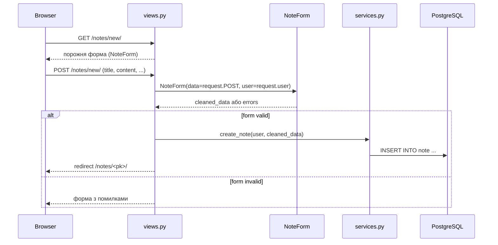
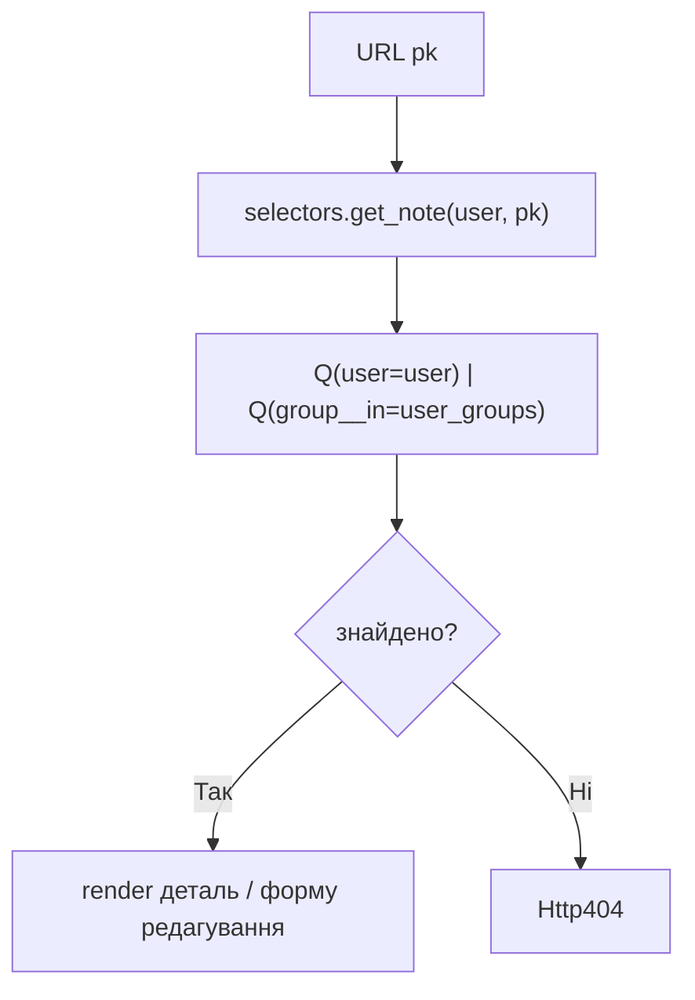
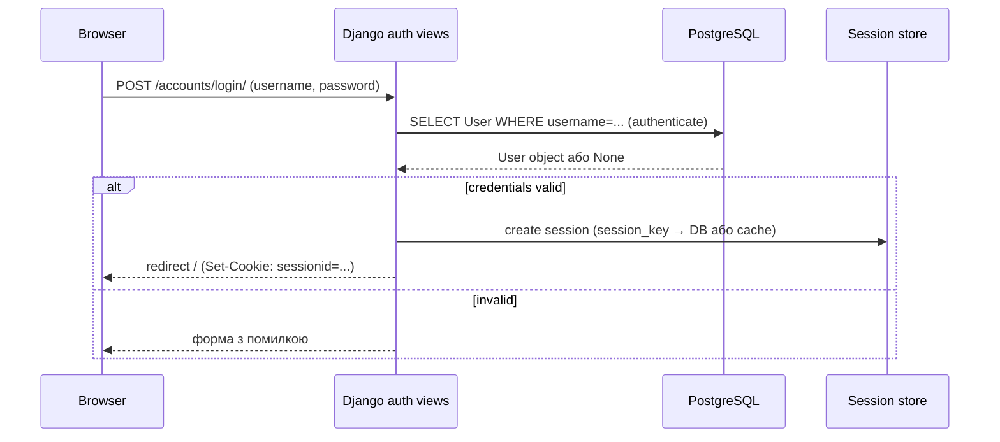
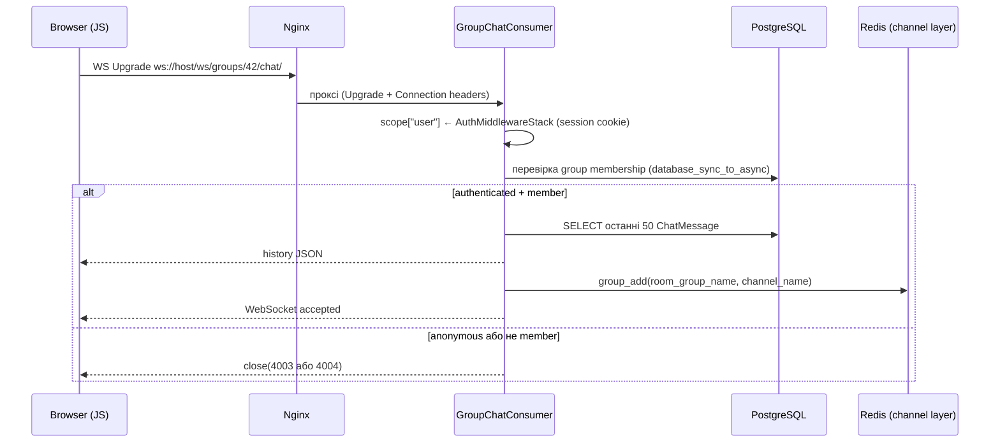
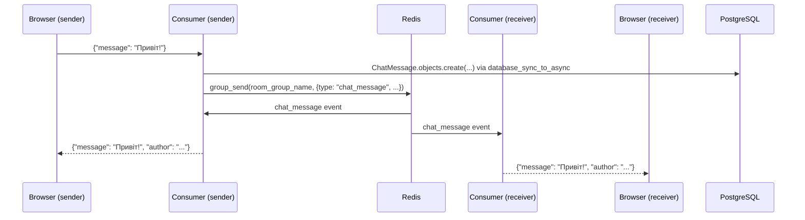

# Request Flows

Наскрізні сценарії: від браузера до БД і назад.

---

## Створення нотатки (HTTP POST)



---

## Перевірка доступу до об'єкта (IDOR захист)



Mutable операції (edit/delete) — тільки власник (`Q(user=user)`).
Read — власник **або** члени групи (`Q(group__in=user_groups)`).

---

## Вхід / сесія



---

## WebSocket — підключення до чату



---

## WebSocket — надсилання повідомлення



---

## Docker startup

```text
Docker Compose up
  ↓ db healthcheck (pg_isready)
  ↓ redis healthcheck
  ↓ web: entrypoint.sh
      → manage.py migrate
      → manage.py collectstatic
      → manage.py seed_demo_data  (якщо SEED_DEMO_DATA=1)
      → exec uvicorn notes_project.asgi:application --host 0.0.0.0 --port 8001 --reload
  ↓ nginx: forward :80 → web:8001
  ↓ ngrok (dev тунель)
  ↓ selenium (E2E тести)
```
