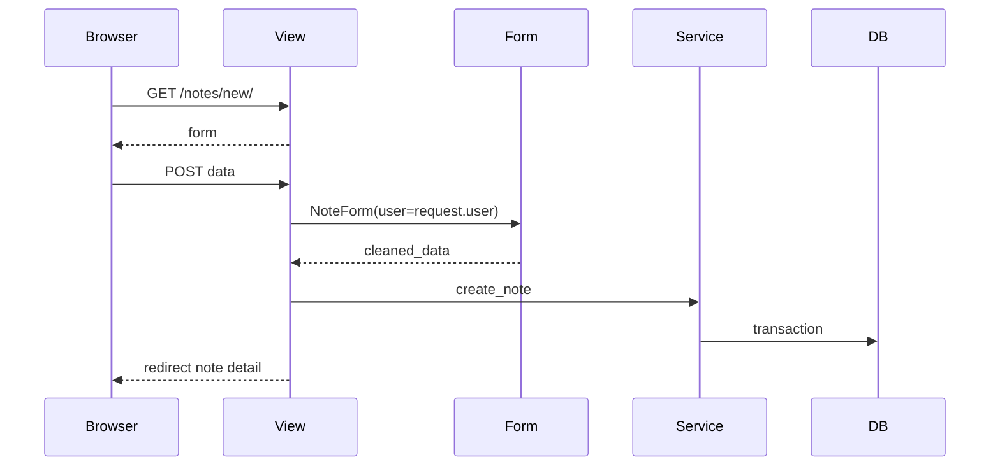
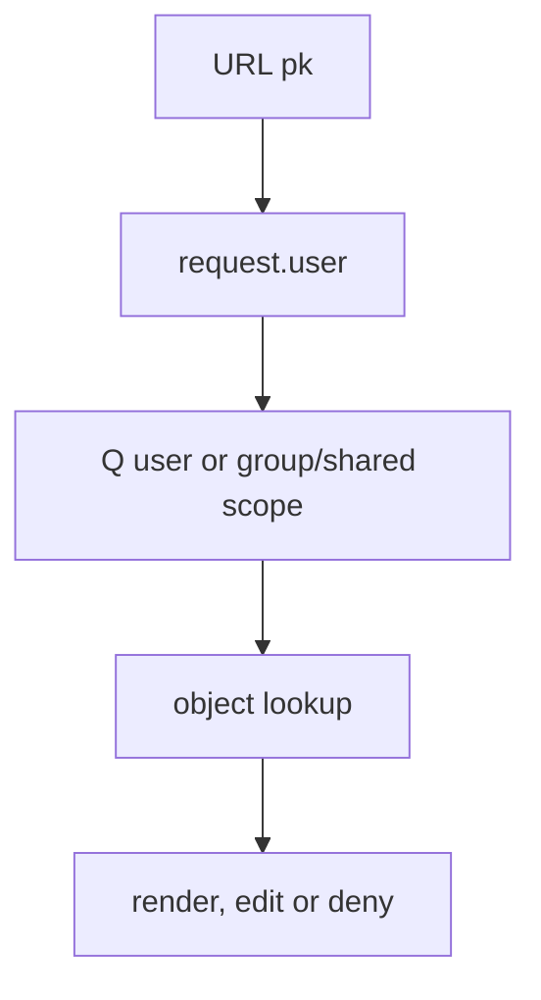

# Request Flows

## Note create

```mermaid
sequenceDiagram
Browser->>View: GET /notes/new/
View-->>Browser: form
Browser->>View: POST data
View->>Form: NoteForm(user=request.user)
Form-->>View: cleaned_data
View->>Service: create_note
Service->>DB: transaction
View-->>Browser: redirect note detail
```

## Object permission

```mermaid
flowchart TD
pk["URL pk"] --> user["request.user"]
user --> qs["Q user or group/shared scope"]
qs --> object["object lookup"]
object --> allowed["render, edit or deny"]
```
