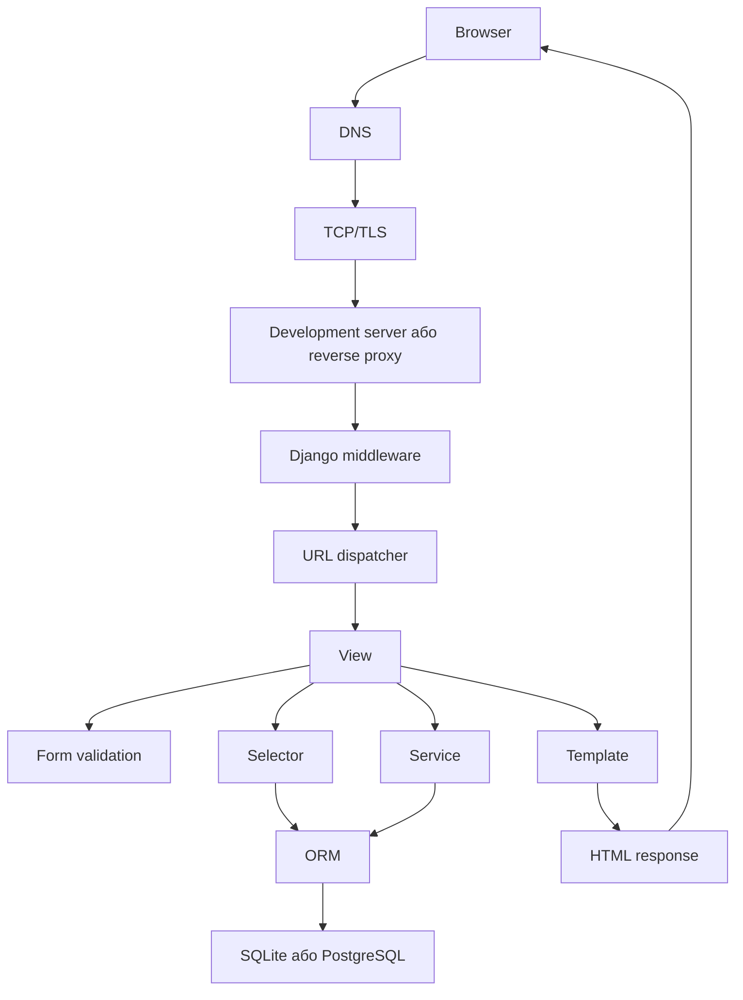
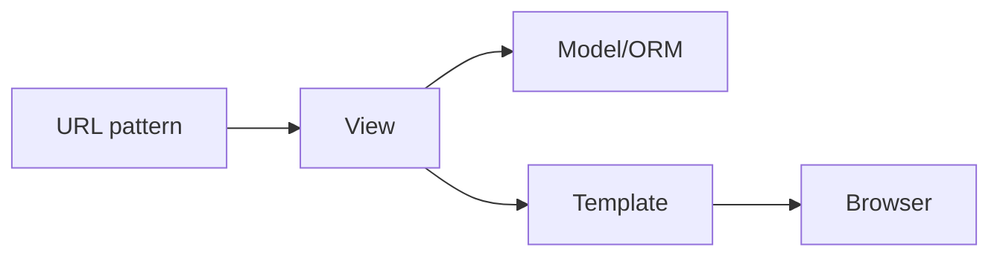
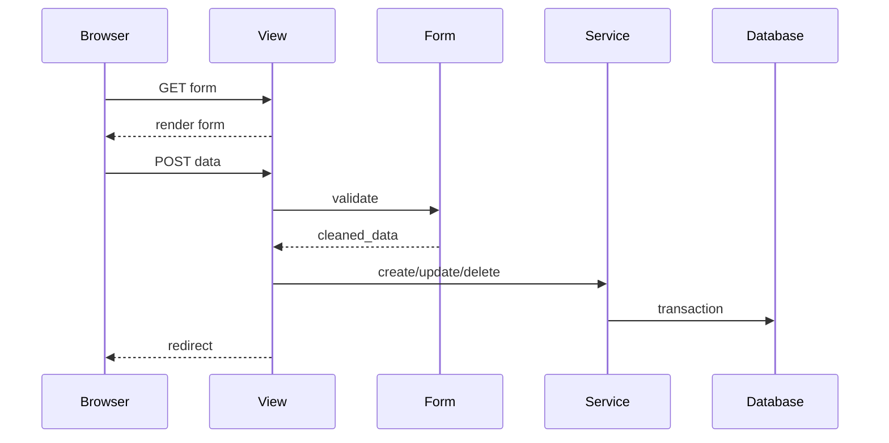
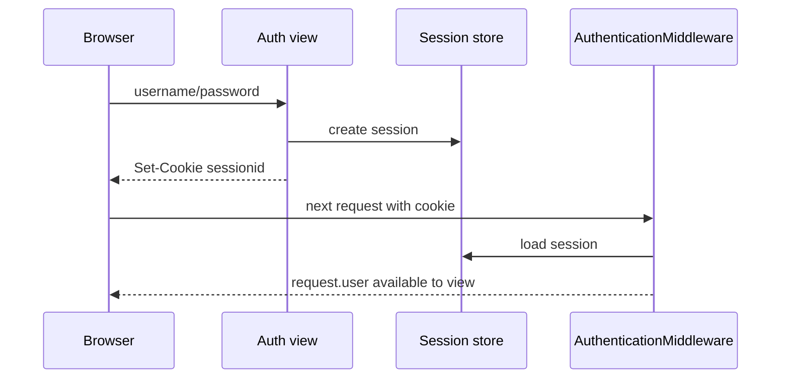
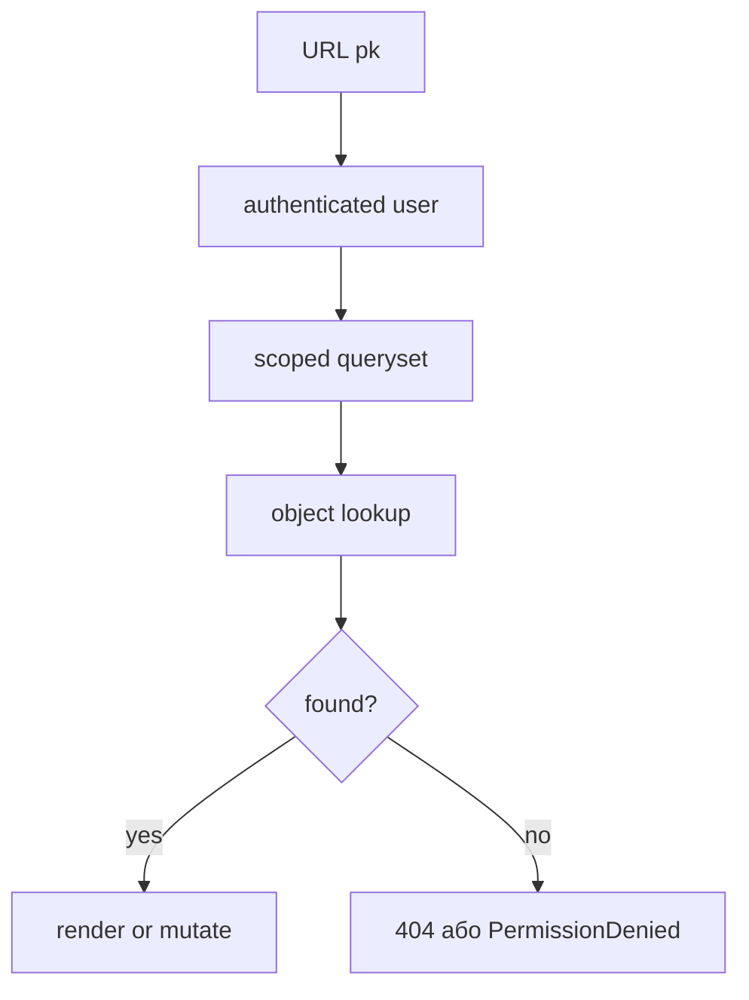
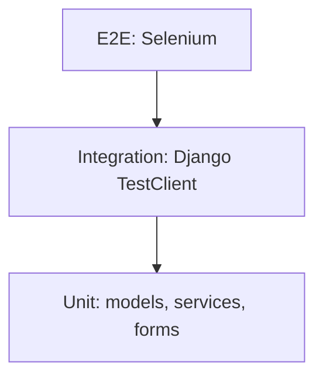
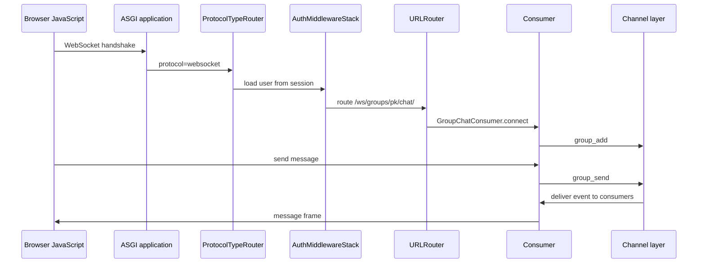
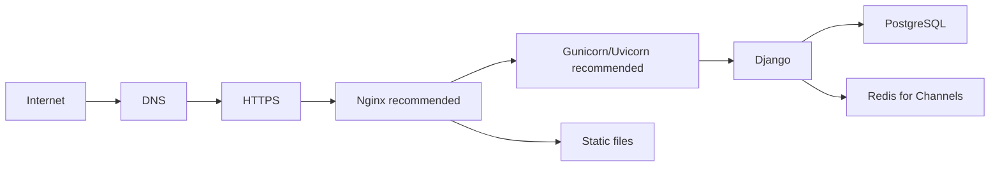

# Architecture

Цей документ містить наскрізні карти, які зв'язують теорію з фінальним кодом.

## HTTP request lifecycle

## Django MVT

## CRUD flow

## Authentication flow

## Object permission flow

## Testing pyramid

## Async і WebSocket flow

## Production deployment

Компоненти Nginx, Gunicorn/Uvicorn, PostgreSQL і Redis є рекомендованим production stack. Поточний Docker setup ще потребує виправлення перед використанням як готового deployment.
