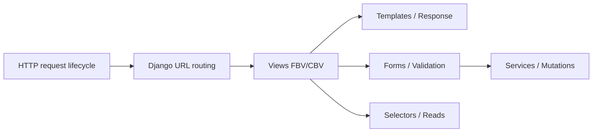
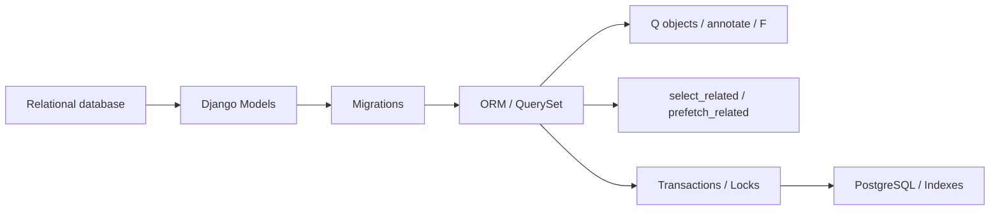
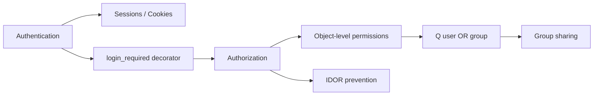
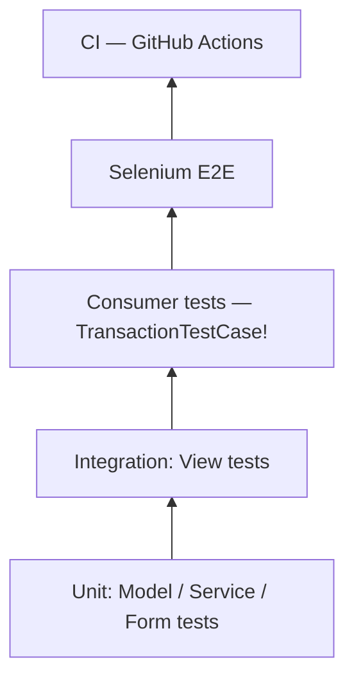
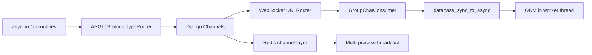
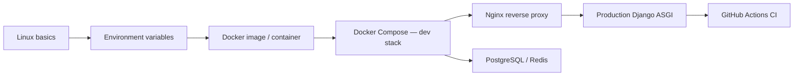

# Book Architecture Plan

Phase 2 — Architecture Planning
Створено: 2026-06-14

---

## 1. Мета книги

### Цільова аудиторія

Студенти, які вже вміють писати Python-код, але ще не розуміють web-розробку через Django.

Початковий рівень: базовий Python (функції, класи, списки, словники), елементарний HTML.

Кінцевий рівень: здатні самостійно спроєктувати, побудувати, протестувати та задеплоїти production-ready Django-застосунок з PostgreSQL, Redis, WebSocket-чатом, CI та Docker.

### Очікувані результати

Студент, який пройшов книгу повністю, може:

- пояснити life-cycle HTTP-запиту від браузера до response;
- реалізувати CRUD, auth, object-level permissions, group sharing;
- написати tests для моделей, сервісів, форм, view і WebSocket consumer;
- рефакторити fat view у thin view + selector + service;
- розгорнути застосунок у Docker Compose з Nginx, PostgreSQL, Redis;
- налаштувати GitHub Actions CI.

### Межі книги

Книга **не** охоплює: REST API / DRF, GraphQL, Celery background tasks (лише теоретичне ознайомлення), Kubernetes (лише огляд), мобільну розробку.

### Роль Notes Chat App

Notes Chat App є єдиним наскрізним проєктом всієї книги. Він з'являється в:

- Zero to Hero — як мета побудови;
- Project Deep Dive — як детальний архітектурний розбір;
- Knowledge Book — як джерело реальних прикладів до кожної теми.

### Навчальний код vs production

Туторіали 01–04 використовують навмисно спрощені standalone-проєкти (hello_project, bootstrap_notes, crispy_notes, notes_project). Ці проєкти не є частинами Notes Chat App — вони є педагогічними попередниками, які демонструють еволюцію підходів. Книга явно позначає ці переходи.

---

## 2. Верхньорівнева структура книги

```text
Головна
├── Як користуватися книгою
├── Книга Django (Knowledge Book)
│   ├── Частина I.  Web Foundation
│   ├── Частина II. Django Core
│   ├── Частина III. Models, Database та ORM
│   ├── Частина IV. Forms і Validation
│   ├── Частина V.  Templates і Frontend
│   ├── Частина VI. Архітектура застосунку
│   ├── Частина VII. Authentication і Security
│   ├── Частина VIII. Testing і Quality
│   ├── Частина IX. Async і Real-Time
│   └── Частина X.  Linux, DevOps і Deployment
├── Django Zero to Hero (покроковий маршрут)
│   ├── Крок 0.  Налаштування середовища
│   ├── Крок 1.  Перша Django-сторінка (hello_project)
│   ├── Крок 2.  Перша модель і міграція (bootstrap_notes)
│   ├── Крок 3.  CRUD і ORM (notes_project)
│   ├── Крок 4.  Форми і Bootstrap (crispy_notes)
│   ├── Крок 5.  Auth і безпека (notes_chat_app)
│   ├── Крок 6.  Тестування (notes_chat_app)
│   ├── Крок 7.  Async і WebSocket (notes_chat_app)
│   └── Крок 8.  Deployment і CI (notes_chat_app)
├── Notes Chat App Deep Dive (архітектурний розбір)
│   └── 35 глав (детально — PROJECT_DEEP_DIVE_PLAN.md)
├── Практика
│   ├── Лабораторні роботи (ORM, Forms, Testing, Async)
│   └── Завдання студентів
├── Довідник
│   ├── Команди
│   ├── ORM Cheatsheet
│   ├── Testing Cheatsheet
│   ├── Git Cheatsheet
│   ├── Deployment Cheatsheet
│   ├── Settings Reference
│   ├── Глосарій
│   └── Troubleshooting
└── Викладачу
    ├── Teaching Guide
    └── Learning Path
```

---

## 3. Knowledge Book — деталізація частин

### Частина I. Web Foundation

| Поле | Зміст |
|------|-------|
| Мета | Пояснити, як браузер і сервер спілкуються до того, як з'являється Django |
| Рівень | Foundation |
| Передумови | Базова Python (для подальшої роботи) |
| Канонічні глави | 1. Мережевий фундамент (network_foundation_full.md) · 2. HTTP та HTTPS (http_https.md) · 3. HTTP Requests: архітектура (http_requests_docs.md) · 4. Браузер ↔ сервер (browser_server_lifecycle.md) · 5. Web сервери та ядро (server.md) · 6. Мережеві діаграми (network_mermaid_full.md) |
| Практика | Відкрити DevTools → Network, переглянути GET-запит |
| Zero to Hero links | Крок 1 (hello_project) |
| Project links | Request flows у Notes Chat App |
| Наступна частина | Django Core — де Python зустрічається з HTTP |

---

### Частина II. Django Core

| Поле | Зміст |
|------|-------|
| Мета | Сформувати ментальну модель Django як конвеєра middleware → URL → view → response |
| Рівень | Beginner |
| Передумови | Частина I |
| Канонічні глави | 1. Архітектура Django / MTV (django_architecture_full.md) · 2. URL routing (url_routing_full.md) · 3. Views FBV/CBV (views_full.md) · 4. Request lifecycle (request_lifecycle.md) · 5. WSGI vs ASGI (wsgi_vs_asgi.md) · 6. Структура проєкту (project_structure_full.md) · 7. Management commands (management_commands_full.md) · 8. Діаграми (django_mermaid_full.md) |
| Практика | Додати простий view і URL, трейсити запит у debugger |
| Zero to Hero links | Крок 1, Крок 3 |
| Project links | notes_project/urls.py, notes_app/views.py |
| Наступна частина | Models — де дані зберігаються |

---

### Частина III. Models, Database та ORM

| Поле | Зміст |
|------|-------|
| Мета | Зрозуміти реляційні БД, Django models як схему домену, ORM як abstraction layer |
| Рівень | Beginner → Intermediate |
| Передумови | Частина II |
| Канонічні глави | 1. Реляційні БД (relational_db_foundations_full.md) · 2. Django Models (django_models.md → або django_orm_full.md) · 3. ORM основи (django_orm_full.md) · 4. ORM поглиблено / Q, F, annotate (django_orm_deep_full.md) · 5. Міграції (django_migrations_full.md) · 6. PostgreSQL advanced (postgresql_advanced_full.md) · 7. Індекси (indexing_deep_full.md) · 8. Транзакції (transactions_concurrency_full.md) · 9. ORM Mermaid (orm_mermaid_full.md) |
| Практика | ORM Lab (labs/orm_lab.md) |
| Zero to Hero links | Крок 2 (перша модель), Крок 3 (ORM у CRUD) |
| Project links | notes_app/models.py — повна схема доменних моделей |
| Наступна частина | Forms — як дані потрапляють від користувача |

---

### Частина IV. Forms і Validation

| Поле | Зміст |
|------|-------|
| Мета | Зрозуміти trust boundary, validation pipeline, PRG-паттерн, Crispy Forms |
| Рівень | Intermediate |
| Передумови | Частина III |
| Канонічні глави | 1. Django Forms повний (django_forms_full.md) · 2. Crispy Forms (crispy_forms_full.md) |
| Практика | Forms Lab (labs/forms_lab.md) |
| Zero to Hero links | Крок 4 (crispy_notes форми) |
| Project links | notes_app/forms.py — NoteForm, GroupCreateForm |
| Наступна частина | Templates — як відповідь рендериться |

---

### Частина V. Templates і Frontend

| Поле | Зміст |
|------|-------|
| Мета | Система шаблонів Django, наслідування, Bootstrap 5, static files |
| Рівень | Beginner → Intermediate |
| Передумови | Частина II |
| Канонічні глави | 1. HTML основи (html_basics_full.md) · 2. CSS основи (css_basics_full.md) · 3. Django Templates (django_templates_full.md) · 4. Advanced Templates (advanced_templates_full.md) · 5. Bootstrap 5 (bootstrap_5_full.md) · 6. Django Admin (django_admin_full.md) · 7. Design foundations (design_foundations_full.md) |
| Практика | Змінити template, додати Bootstrap компонент |
| Zero to Hero links | Крок 4 (crispy_notes SaaS dashboard) |
| Project links | templates/, notes_app/static/ |
| Наступна частина | Application Architecture — як розділити відповідальність |

---

### Частина VI. Архітектура застосунку

| Поле | Зміст |
|------|-------|
| Мета | Відділити HTTP, читання даних і зміну даних. Тонкі view, selectors, services |
| Рівень | Intermediate |
| Передумови | Частини II–IV |
| Канонічні глави | 1. Services та Selectors — повний (services_selectors_full.md) · 2. Services окремо (django_services_full.md) · 3. Selectors окремо (django_selectors_full.md) · 4. Serializers (django_serializers_full.md) · 5. Celery/Tasks огляд (django_tasks_full.md) |
| Практика | Рефакторити fat view у selector + service |
| Zero to Hero links | Крок 3 (vinести query), Крок 5 (auth + permissions у services) |
| Project links | notes_app/services.py, notes_app/selectors.py |
| Наступна частина | Auth — хто і що може робити |

---

### Частина VII. Authentication і Security

| Поле | Зміст |
|------|-------|
| Мета | Відрізнити AuthN від AuthZ, зрозуміти сесії, IDOR, object-level permissions, OWASP |
| Рівень | Intermediate → Advanced |
| Передумови | Частини II, VI |
| Канонічні глави | 1. Auth basics (auth_basics_full.md) · 2. Sessions (sessions_flow_full.md) · 3. Permissions (permissions_full.md) · 4. Django security architecture (django_security_architecture_full.md) · 5. Security foundations (security_foundations_full.md) · 6. Security misconceptions (security_misconceptions_full.md) · 7. OWASP Top 10 (owasp_top_10_full.md) · 8. Zero Trust (zero_trust_full.md) |
| Практика | Написати IDOR bug і тест, що його ловить |
| Zero to Hero links | Крок 5 (auth у notes_chat_app) |
| Project links | notes_app/views.py (permission checks), notes_app/selectors.py (Q filter) |
| Наступна частина | Testing — як довести, що все правильно |

---

### Частина VIII. Testing і Quality

| Поле | Зміст |
|------|-------|
| Мета | Model tests, service tests, form tests, view tests, consumer tests (TransactionTestCase!), Selenium E2E, CI |
| Рівень | Intermediate → Advanced |
| Передумови | Частини II–VII |
| Канонічні глави | 1. Testing foundations (testing_foundations_full.md) · 2. unittest (unittest_basics_full.md) · 3. pytest (pytest_basics_full.md) · 4. Django Testing (django_testing_full.md) · 5. Mocking (mocking_and_patching_full.md) · 6. Test data/fixtures (test_data_and_fixtures_full.md) · 7. Selenium (selenium_full.md) · 8. CI/CD (ci_cd_full.md) · 9. Testing practice project (testing_practice_project_full.md) |
| Практика | Testing Lab (labs/testing_lab.md) |
| Zero to Hero links | Крок 6 (тестування notes_chat_app) |
| Project links | notes_app/tests/ — test_models, test_services, test_forms, test_views, test_consumers, test_selenium |
| Наступна частина | Async — реальний час і WebSocket |

---

### Частина IX. Async і Real-Time

| Поле | Зміст |
|------|-------|
| Мета | asyncio, ASGI, Django Channels, WebSocket, Redis channel layer, database_sync_to_async, TransactionTestCase |
| Рівень | Advanced |
| Передумови | Частини II, III, VIII |
| Канонічні глави | 1. Sync vs Async (async_01_sync_vs_async_full.md) · 2. asyncio (async_02_asyncio_full.md) · 3. asyncio: Event Loop архітектура (lesson_34_documentation.md) · 4. ASGI (async_03_asgi_full.md) · 5. Django Async Views (async_04_django_async_views_full.md) · 6. Async ORM (async_05_async_orm_full.md) · 7. sync_to_async (async_06_sync_to_async_full.md) · 8. WebSocket та Channels (channels_websocket.md) · 9. Async use cases (async_09_async_use_cases_full.md) |
| Практика | Async Lab (labs/async_lab.md) |
| Zero to Hero links | Крок 7 (WebSocket у notes_chat_app) |
| Project links | notes_app/consumers.py, notes_project/asgi.py, notes_project/routing.py |
| Наступна частина | DevOps — як запустити в production |

---

### Частина X. Linux, DevOps і Deployment

| Поле | Зміст |
|------|-------|
| Мета | Linux основи, Docker, Docker Compose, Nginx, CI, deployment checklist |
| Рівень | Intermediate → Production |
| Передумови | Загальне розуміння проєкту |
| Канонічні глави | 1. Linux ментальна модель (linux_01_mental_model_full.md) · 2–10. Linux 02-10 series · 11. Docker та Runtime (docker_and_runtime.md) · 12. Docker: повний посібник (docker_guide.md) · 13. Docker basics (deploy_14_docker_basics_full.md) · 14. Docker Compose (deploy_15_docker_compose_full.md) · 15. Django на Linux (deploy_11_django_on_linux_full.md) · 16. Nginx+Gunicorn/Uvicorn (deploy_12_nginx_gunicorn_uvicorn_full.md) · 17. Логи та моніторинг (deploy_13_logs_monitoring_debugging_full.md) · 18. DevOps workflow (deploy_16_devops_workflow_full.md) · 19. Kubernetes огляд (deploy_17_kubernetes_overview_full.md) · 20. Roadmap (deploy_18_roadmap_next_steps_full.md) |
| Практика | Deployment checklist, CI налаштування |
| Zero to Hero links | Крок 8 (deployment notes_chat_app) |
| Project links | docker-compose.yml, Dockerfile, .github/workflows/, nginx/ |
| Наступна частина | Notes Chat App Deep Dive — фінальний розбір |

---

## 4. Dependency Graph — Mermaid

### Граф 1: HTTP → Django pipeline



### Граф 2: Data layer



### Граф 3: Auth і Permissions



### Граф 4: Testing pyramid



### Граф 5: Async і Real-time



### Граф 6: DevOps pipeline



---

## 5. Відкриті питання (перенесені до плану)

### DebugExceptionMiddleware

`notes_project/middleware.py` — повертає traceback браузеру без перевірки `DEBUG`.
Класифікація: Security/production issue.
Де пояснити у книзі:
- Knowledge Book Part VII: middleware/security (небезпечний middleware у prod);
- Project Deep Dive Ch.4 або Ch.32: поточний middleware;
- Reference / Troubleshooting / Production checklist.
Рішення: code fix — окрема задача, не Phase 2.

### Legacy paths README_7

Застарілі шляхи (`module_5/...`) у tutorials/README_7.md.
Класифікація: low-priority cleanup.
Виправити у Batch H (Zero to Hero content).

### MkDocs validation

`mkdocs build --strict` заблоковано (MkDocs недоступний у поточному середовищі).
Усі навігаційні рішення повинні пройти validation під час Phase 4.

---

## 6. Педагогічні принципи

### 6.1 Скафолдинг — послідовність без пропусків

Кожна нова тема спирається на вже пройдений матеріал. Заборонено вводити нові поняття без опертя на попередні.

```text
HTTP request lifecycle
  → Django URL routing (Частина II)
    → Views (II) → Forms (IV) → Services (VI)
      → Tests для кожного шару (VIII)

Models (III) → ORM (III) → Selectors (VI)
  → Q-filter + prefetch (III) → N+1 tests (VIII)

Auth (VII) → IDOR (VII) → Q-scoped queryset (III+VI)
  → Permission tests (VIII)

asyncio (IX) → ASGI (IX) → Channels (IX)
  → database_sync_to_async (IX) → TransactionTestCase (VIII)

Docker (X) → docker-compose.yml (X) → Nginx (X)
  → CI (VIII+X) → Production checklist (X)
```

### 6.2 Pattern: overview → detail → practice

Кожна тема вводиться у три кроки:

| Крок | Що | Де |
|------|----|----|
| Overview | Навіщо це потрібно, ментальна модель | Knowledge Book розділ |
| Detail | Як це працює у Notes Chat App | Project Deep Dive або Zero to Hero |
| Practice | Студент робить сам | Lab або Student Task |

### 6.3 Еволюція підходів (deliberate pedagogy)

Книга навмисно показує еволюцію — починаючи з "неправильного" підходу, щоб студент відчув проблему:

| Еволюція | Де показано |
|----------|------------|
| ORM у view → fat view → selector + service | ZH Кроки 3–5 |
| FBV → CBV → повернення до FBV в Notes Chat App | ZH Кроки 3–4 + PD |
| HTTP polling → обмеження → WebSocket | ZH Кроки 7 + KB IX |
| SQLite → обмеження → PostgreSQL | ZH Крок 5 + KB III |
| `TestCase` consumer → фейл → `TransactionTestCase` | KB VIII + ZH Крок 6 |

### 6.4 Standalone-проєкти vs Notes Chat App

Студент будує 5 окремих проєктів-попередників, потім переходить до Notes Chat App:

```text
hello_project         → ZH Крок 1 (перший view, URL)
bootstrap_notes       → ZH Крок 2 (перша модель)
crispy_notes_project  → ZH Кроки 3-4 (CRUD, форми)
notes_project         → ZH Крок 4-5 (auth, права)
notes_chat_app        → ZH Кроки 5-8 + весь Project Deep Dive
```

Кожен перехід — **новий репозиторій**, не гілка. Книга явно маркує ці переходи адмоніціями.

### 6.5 Правило трьох прив'язок

Кожна концепція у Knowledge Book має три прив'язки:

1. **Теоретична** — пояснення чому і як (у самій главі)
2. **Практична** — де це реалізовано у Notes Chat App (з реальним файлом і рядком)
3. **Тестова** — як це перевіряється у tests/ (конкретний тест)

---

## 7. Три шари — зв'язок (приклади)

Для кожної ключової теми показано де вона з'являється у всіх трьох шарах.

| Тема | Knowledge Book | Zero to Hero | Project Deep Dive |
|------|---------------|-------------|-------------------|
| HTTP request | Частина I (http_https.md) | Крок 1 — hello_project першый view | PD Ch.6 — URL routing Notes Chat App |
| ForeignKey + CASCADE | Частина III (django_orm_full.md) | Крок 2 — перша модель з FK | PD Ch.8 — ChatMessage.group CASCADE |
| Q-filter scoped queryset | Частина III (orm_deep) + VI (selectors) | Крок 5 — Q(user=user)\|Q(group__in=...) | PD Ch.11 — selectors.get_user_notes() |
| NoteForm queryset scope | Частина IV (forms) | Крок 4 — форма з user= | PD Ch.10 — NoteForm.__init__ |
| login_required | Частина VII (auth) | Крок 5 — декоратор на views | PD Ch.16 — views.py decorator pattern |
| IDOR | Частина VII (security) | Крок 5 — IDOR тест | PD Ch.32 — security model |
| TransactionTestCase | Частина VIII (testing) | Крок 6 — consumer test | PD Ch.29 — test_consumers.py |
| asyncio event loop | Частина IX (async_02 + lesson_34) | Крок 7 — async у consumer | PD Ch.23 — GroupChatConsumer |
| database_sync_to_async | Частина IX (sync_to_async) | Крок 7 — ORM у consumer | PD Ch.25 — consumers.py @database_sync_to_async |
| Redis channel layer | Частина IX (channels) | Крок 7 — socket_timeout=None | PD Ch.28 — settings.py CHANNEL_LAYERS |
| docker-compose.yml | Частина X (docker_guide) | Крок 8 — запуск стека | PD Ch.30 — Notes Chat App stack |
| GitHub Actions CI | Частина X (ci_cd_full) | Крок 8 — .github/workflows/ | PD Ch.31 — django-tests.yml paths |

---

## 8. Журнал змін (після Phase 2)

### 2026-06-14 — Batch H

Виправлено точність туторіалів:

| Файл | Зміна |
|------|-------|
| `tutorials/08_deployment.md` | Замінено `dj_database_url` + SQLite fallback → regex parsing + Exception |
| `tutorials/06_testing.md` | `TestCase` → `TransactionTestCase` у секції consumer tests |
| `tutorials/README_7.md` | Додано 2 admonitions про legacy monorepo paths |

### 2026-06-14 — Batch I

Розширено 12 stub-файлів `docs/12_final_project/`:

- `setup.md` — критично виправлено (локальний запуск без Docker неможливий)
- `domain_model.md` — повні таблиці полів, виправлений ER (TodoList.shared_with, ShoppingList.shared_with)
- `architecture.md`, `async_and_chat.md`, `request_flows.md`, `security_model.md`, `testing_strategy.md`, `deployment.md`, `feature_map.md`, `project_overview.md`, `student_tasks.md`, `README.md`

### 2026-06-14 — Batch J

Розширено labs і GLOSSARY:

- `labs/orm_lab.md`, `labs/forms_lab.md`, `labs/testing_lab.md`, `labs/async_lab.md` — з stub до повних завдань
- `docs/GLOSSARY.md` — 23 → 55+ термінів, A–W за абеткою

### 2026-06-14 — Навігація (mkdocs.yml)

Додано до навігації:

| Файл | Розділ | Мітка |
|------|--------|-------|
| `10_linux_and_devops/docker_guide.md` | 10. Linux та DevOps | Docker: повний посібник |
| `01_web_foundations/http_requests_docs.md` | 01. Основи Web | HTTP Requests: архітектура |
| `01_web_foundations/server.md` | 01. Основи Web | Web сервери та ядро |
| `09_async_and_realtime/lesson_34_documentation.md` | 09. Async і Real-Time | asyncio: Event Loop |

### Канонічні глави — оновлення

- **Частина I** доповнена: `http_requests_docs.md` (Layer 7 HTTP internals) і `server.md` (Framework ≠ Server, kernel networking)
- **Частина IX** доповнена: `lesson_34_documentation.md` (Event Loop архітектура, cooperative multitasking, coroutine lifecycle)
- **Частина X** доповнена: `docker_guide.md` (повний практичний посібник: commands, Compose, volumes, networks, best practices, офіційні образи)
