# Notes Chat App — Курс Django

Навчальний проєкт: від HTTP до production-ready Django застосунку з WebSocket чатом.

---

## Архітектура курсу

```mermaid
graph LR
    A["01 Web Foundations"] --> B["02 Django Core"]
    B --> C["03 DB & ORM"]
    C --> D["04 Forms"]
    D --> E["05 Frontend"]
    E --> F["06 Architecture"]
    F --> G["07 Auth & Security"]
    G --> H["08 Testing"]
    H --> I["09 Async & Realtime"]
    I --> J["10 Linux & DevOps"]
    J --> K["11 Deployment"]
    K --> L["12 Final Project"]
```

---

## З чого почати?

| Тип | Маршрут |
|-----|---------|
| Новачок | [00. Початок роботи](00_getting_started/README.md) → Книга (01–11) → [Проєкт](12_final_project/README.md) |
| Хочу практику | [Туторіали](tutorials/README.md) або [Labs](labs/README.md) |
| Потрібна довідка | [Довідник](reference/README.md) · [Глосарій](GLOSSARY.md) · [Troubleshooting](TROUBLESHOOTING.md) |

---

## Що ти навчишся будувати

Notes Chat App — повноцінний Django-застосунок із:

- **Нотатками** — CRUD, теги, пріоритети, нагадування
- **Груповим чатом** — WebSocket через Django Channels + Daphne (ASGI)
- **Автентифікацією** — реєстрація, логін, сесії, права
- **Тестами** — unit, integration, consumer (WebSocket), Selenium E2E
- **CI/CD** — GitHub Actions, Docker Compose, PostgreSQL

---

## Структура курсу

| Розділ | Теми |
|--------|------|
| [Книга](00_getting_started/README.md) | 12 послідовних модулів від основ Web до деплойменту |
| [Notes Chat App](12_final_project/README.md) | Архітектура, моделі, тести, деплоймент фінального проєкту |
| [Практика](tutorials/README.md) | Туторіали та labs з практичними завданнями |
| [Довідник](reference/README.md) | Cheatsheets, глосарій, troubleshooting |
| [Викладачу](TEACHING_GUIDE.md) | Маршрути викладання, навчальний path |
