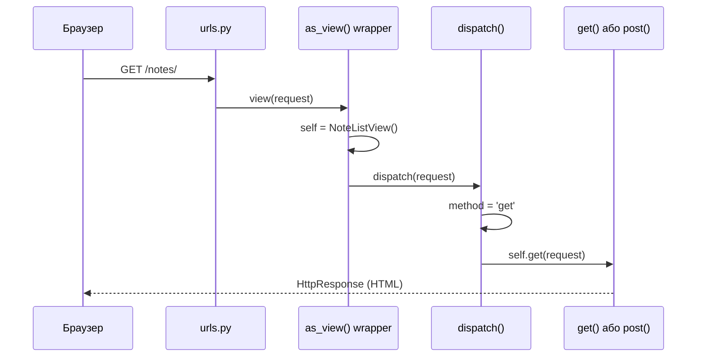
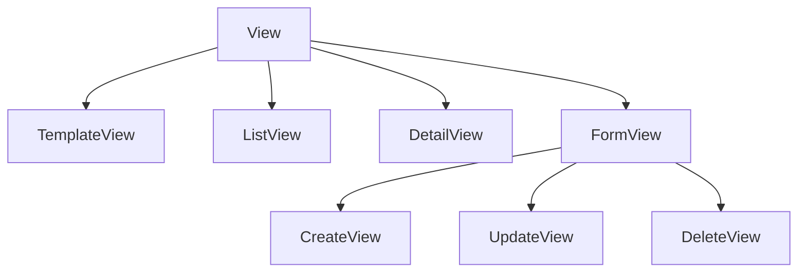
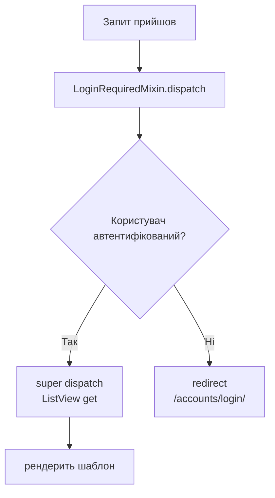

# Class-Based Views (CBV)

> **Структура глави:** спочатку повний робочий FBV (функціональні view) для CRUD нотаток.
> Потім — як з'являється дублювання при додаванні Notebook views.
> Потім — CBV як апгрейд: той самий результат, менше коду.
>
> **Що змінюється при переході:** тільки `views.py` та `urls.py`.
> models, forms, selectors, services, templates — без жодних змін.

---

## Частина 1 — Повний FBV код (working code)

Ось реальний working код views для нотаток. Читай його як "відправна точка" — тут все працює.

```python
# notes_app/views.py — Function-Based Views для нотаток
from django.shortcuts import render, redirect, get_object_or_404
from django.contrib.auth.decorators import login_required
from django.contrib import messages
from django.http import Http404
from django.db.models import Q

from . import forms, services, selectors
from .models import Note, Notebook, Tag


@login_required
def note_list(request):
    # Парсимо GET параметри для фільтрації
    search = request.GET.get('q', '').strip()
    tag_id = request.GET.get('tag')
    notebook_id = request.GET.get('notebook')

    # Валідуємо id — перевіряємо права доступу
    tag = None
    if tag_id:
        try:
            tag = Tag.objects.get(id=int(tag_id), user=request.user)  # user=! чужі теги відхиляємо
        except (Tag.DoesNotExist, ValueError):
            pass

    notebook = None
    if notebook_id:
        try:
            notebook = Notebook.objects.get(id=int(notebook_id), user=request.user)
        except (Notebook.DoesNotExist, ValueError):
            pass

    # Делегуємо читання у selector
    notes = selectors.get_user_notes(request.user, search=search or None, tag=tag, notebook=notebook)
    notebooks = selectors.get_user_notebooks(request.user)
    tags = selectors.get_user_tags(request.user)

    return render(request, 'notes_app/note_list.html', {
        'notes': notes,
        'notebooks': notebooks,
        'tags': tags,
        'search': search,
        'active_tag': tag,
        'active_notebook': notebook,
    })


@login_required
def note_detail(request, pk):
    try:
        note = selectors.get_note_detail(request.user, pk)
    except Note.DoesNotExist:
        raise Http404("Нотатку не знайдено")

    return render(request, 'notes_app/note_detail.html', {'note': note})


@login_required
def note_create(request):
    if request.method == 'POST':
        form = forms.NoteForm(request.POST, user=request.user)
        if form.is_valid():
            tags = form.cleaned_data.get('tags')
            tag_ids = [t.id for t in tags] if tags else None
            note = services.create_note(
                user=request.user,
                title=form.cleaned_data['title'],
                content=form.cleaned_data.get('content', ''),
                priority=form.cleaned_data.get('priority', 1),
                notebook=form.cleaned_data.get('notebook'),
                tag_ids=tag_ids,
            )
            messages.success(request, f'Нотатку "{note.title}" створено!')
            return redirect('notes_app:note_detail', pk=note.pk)
    else:
        form = forms.NoteForm(user=request.user)

    return render(request, 'notes_app/note_form.html', {
        'form': form,
        'title': 'Нова нотатка',
        'action': 'Створити',
    })


@login_required
def note_edit(request, pk):
    # get_object_or_404 — отримати нотатку або 404 (Alice не бачить нотатки Bob'а)
    note = get_object_or_404(Note, pk=pk, user=request.user)

    if request.method == 'POST':
        form = forms.NoteForm(request.POST, instance=note, user=request.user)
        if form.is_valid():
            tags = form.cleaned_data.get('tags')
            tag_ids = [t.id for t in tags] if tags else []
            services.update_note(
                note,
                title=form.cleaned_data['title'],
                content=form.cleaned_data.get('content', ''),
                priority=form.cleaned_data.get('priority', note.priority),
                notebook=form.cleaned_data.get('notebook'),
                is_pinned=form.cleaned_data.get('is_pinned', note.is_pinned),
                tag_ids=tag_ids,
            )
            messages.success(request, f'Нотатку "{note.title}" оновлено!')
            return redirect('notes_app:note_detail', pk=note.pk)
    else:
        form = forms.NoteForm(instance=note, user=request.user)

    return render(request, 'notes_app/note_form.html', {
        'form': form,
        'note': note,
        'title': f'Редагувати: {note.title}',
        'action': 'Зберегти зміни',
    })


@login_required
def note_delete(request, pk):
    note = get_object_or_404(Note, pk=pk, user=request.user)

    if request.method == 'POST':
        title = note.title
        services.delete_note(note)
        messages.warning(request, f'Нотатку "{title}" видалено.')
        return redirect('notes_app:note_list')

    return render(request, 'notes_app/note_confirm_delete.html', {'note': note})
```

```python
# notes_app/urls.py — FBV url config
from django.urls import path
from . import views

app_name = 'notes_app'

urlpatterns = [
    path('notes/', views.note_list, name='note_list'),
    path('notes/new/', views.note_create, name='note_create'),
    path('notes/<int:pk>/', views.note_detail, name='note_detail'),
    path('notes/<int:pk>/edit/', views.note_edit, name='note_edit'),
    path('notes/<int:pk>/delete/', views.note_delete, name='note_delete'),
]
```

**Цей код повністю робочий.** Для багатьох проєктів — він достатній. Коли ж виникає потреба в CBV?

---

## Частина 2 — Проблема: дублювання при додаванні Notebook views

Додаємо CRUD для записників. Порівняй код:

```python
# Notebook views — той самий шаблон, знову і знову:

@login_required
def notebook_list(request):
    notebooks = selectors.get_user_notebooks(request.user)
    return render(request, 'notes_app/notebook_list.html', {'notebooks': notebooks})


@login_required
def notebook_create(request):
    if request.method == 'POST':          # ← той самий if POST/else
        form = NotebookForm(request.POST)
        if form.is_valid():               # ← та сама is_valid() перевірка
            notebook = services.create_notebook(
                user=request.user,
                title=form.cleaned_data['title'],
                color=form.cleaned_data.get('color', '#4A90E2'),
            )
            messages.success(request, f'Записник "{notebook.title}" створено!')
            return redirect('notes_app:notebook_list')
    else:
        form = NotebookForm()

    return render(request, 'notes_app/notebook_form.html', {'form': form})


@login_required
def notebook_edit(request, pk):
    notebook = get_object_or_404(Notebook, pk=pk, user=request.user)  # ← та сама auth перевірка!
    if request.method == 'POST':
        form = NotebookForm(request.POST, instance=notebook)
        if form.is_valid():
            services.update_notebook(notebook, **form.cleaned_data)
            messages.success(request, f'Записник "{notebook.title}" оновлено!')
            return redirect('notes_app:notebook_list')
    else:
        form = NotebookForm(instance=notebook)
    return render(request, 'notes_app/notebook_form.html', {'form': form, 'notebook': notebook})


@login_required
def notebook_delete(request, pk):
    notebook = get_object_or_404(Notebook, pk=pk, user=request.user)  # ← знову те саме!
    if request.method == 'POST':
        services.delete_notebook(notebook)
        messages.warning(request, f'Записник "{notebook.title}" видалено.')
        return redirect('notes_app:notebook_list')
    return render(request, 'notes_app/notebook_confirm_delete.html', {'notebook': notebook})
```

**Таблиця повторень:**

```
Note views        Notebook views    Tag views
─────────────     ──────────────    ─────────
@login_required   @login_required   @login_required   ← 3 рази
if method POST    if method POST    if method POST    ← 3 рази
is_valid()        is_valid()        is_valid()        ← 3 рази
get_object_or_404 get_object_or_404 (пропустили!)    ← дірка в безпеці

Якщо забути get_object_or_404(Notebook, user=request.user) у одному place →
  Alice бачить/редагує записники Bob'а.
```

> **Проблема не в кількості рядків, а в безпеці.** Патерн `get_object_or_404(Model, pk=pk, user=request.user)` — це перевірка прав доступу. Якщо повторювати вручну 12 разів (5 Note + 5 Notebook + Tag + ...) — ризик забути в одному місці.

**Рішення: CBV з `UserQuerySetMixin`** — перевірку прав описуємо один раз.

---

## Частина 3 — CBV як апгрейд: менше коду, той самий результат

### Що таке CBV і навіщо

**FBV (Function-Based Views)** — view як функція:

```python
def note_list(request):
    notes = Note.objects.filter(user=request.user)
    return render(request, 'note_list.html', {'notes': notes})
```

**CBV (Class-Based Views)** — view як клас:

```python
class NoteListView(LoginRequiredMixin, ListView):
    model = Note
    template_name = 'hello_app/note_list.html'
    context_object_name = 'notes'
```

### Навіщо CBV?

| Проблема у FBV | Рішення у CBV |
|----------------|---------------|
| `@login_required` треба ставити на _кожну_ функцію | `LoginRequiredMixin` один раз у класі |
| `Note.objects.filter(user=request.user)` повторюється в 5 місцях | `UserQuerySetMixin.get_queryset()` — один раз |
| `if request.method == 'POST': form = ...; if form.is_valid(): ...` — шаблонний код | `CreateView`/`UpdateView` роблять це автоматично |
| Немає стандартного способу розширити логіку | Перевизначаємо хуки: `get_queryset()`, `form_valid()`, `get_context_data()` |

> **Важливо:** CBV не замінюють архітектуру. Selectors/Services залишились там само — тільки виклики перенесли з функцій у методи класів.

---

## Крок 1 — Контракт CBV: `as_view()` та `dispatch()`

### Чому клас не можна поставити прямо у `urls.py`

Django router очікує **callable** (функцію):

```python
# ❌ НЕ ПРАЦЮЄ — NoteListView це клас, не callable
path('notes/', views.NoteListView, name='note_list')

# ✅ ПРАВИЛЬНО — .as_view() повертає callable функцію-обгортку
path('notes/', views.NoteListView.as_view(), name='note_list')
```

### Що робить `as_view()`

`as_view()` — це **classmethod** який Django викликає один раз при старті сервера. Він повертає звичайну функцію-обгортку `view`. Щоразу при HTTP запиті ця функція:

1. Створює **новий instance** класу (щоразу новий — thread-safe!)
2. Копіює `request`, `args`, `kwargs` на instance
3. Викликає `instance.dispatch(request, *args, **kwargs)`

```python
# Спрощений псевдокод того що робить as_view() всередині Django:
@classmethod
def as_view(cls, **initkwargs):
    def view(request, *args, **kwargs):
        self = cls(**initkwargs)          # 1. новий instance
        self.request = request            # 2. копіюємо request
        self.args = args
        self.kwargs = kwargs
        return self.dispatch(request, *args, **kwargs)  # 3. dispatch
    return view
```

### Що робить `dispatch()`

`dispatch()` — **головний роутер** CBV. Він дивиться на HTTP метод запиту і делегує виклик відповідному методу класу:

```python
# Псевдокод dispatch() з базового View:
def dispatch(self, request, *args, **kwargs):
    method = request.method.lower()          # 'get', 'post', 'put', ...
    handler = getattr(self, method, None)    # self.get, self.post, ...
    if handler:
        return handler(request, *args, **kwargs)
    return HttpResponseNotAllowed(...)       # 405 Method Not Allowed
```

### Sequence diagram: запит від браузера до методу



---

## Крок 2 — Generic Views: ієрархія

Django постачає готові CBV для типових CRUD операцій — **Generic Views**.

### Ієрархія класів



### Що кожна Generic View робить автоматично

| Generic View | GET | POST | Ключові атрибути |
|---|---|---|---|
| `TemplateView` | рендерить шаблон | — | `template_name` |
| `ListView` | отримує список через `get_queryset()`, рендерить | — | `model`, `template_name`, `context_object_name` |
| `DetailView` | отримує один об'єкт через `get_object()`, рендерить | — | `model`, `template_name`, `context_object_name` |
| `CreateView` | рендерить порожню форму | валідує → `form_valid()` або `form_invalid()` | `model`, `form_class`, `template_name` |
| `UpdateView` | рендерить форму з `instance=object` | валідує → `form_valid()` або `form_invalid()` | те саме + завантажує `get_object()` |
| `DeleteView` | рендерить підтвердження | видаляє → `success_url` | `model`, `template_name`, `success_url` |

### Class attributes замість аргументів

У FBV параметри передавались у функцію або hardcode всередині. У CBV — оголошуємо як **атрибути класу**:

```python
class NoteListView(LoginRequiredMixin, ListView):
    model = Note                              # ← яку модель використовувати
    template_name = 'hello_app/note_list.html'  # ← який шаблон рендерити
    context_object_name = 'notes'            # ← як назвати список у шаблоні
                                             #   (замість дефолтного 'object_list')
```

---

## Крок 3 — `LoginRequiredMixin` та MRO

### FBV: декоратор `@login_required`

```python
from django.contrib.auth.decorators import login_required

@login_required
def note_list(request):
    ...
```

### CBV: `LoginRequiredMixin` — перший у списку базових класів

```python
from django.contrib.auth.mixins import LoginRequiredMixin

class NoteListView(LoginRequiredMixin, ListView):
    ...
```

### Чому порядок у дужках критично важливий

Python визначає порядок пошуку методів через **MRO (Method Resolution Order)**. Коли Django викликає `dispatch()`, Python шукає його по MRO зліва направо:

```
NoteListView → LoginRequiredMixin → ListView → View
```

`LoginRequiredMixin.dispatch()` перевіряє автентифікацію **першим** — до того як `ListView.dispatch()` взагалі щось зробить.

```python
# ✅ ПРАВИЛЬНО: LoginRequiredMixin першим → перевірка auth ПЕРША
class NoteListView(LoginRequiredMixin, UserQuerySetMixin, ListView):
    ...

# ❌ НЕПРАВИЛЬНО: ListView першим → auth перевірка ПІСЛЯ завантаження даних
class NoteListView(UserQuerySetMixin, ListView, LoginRequiredMixin):
    ...
```

### Flowchart: перевірка автентифікації



> За замовчуванням редірект — `/accounts/login/?next=/notes/`. Можна змінити через `login_url` і `redirect_field_name` на класі.

---

## Крок 4 — `UserQuerySetMixin`: DRY ізоляція даних

### Проблема: дублювання фільтра по user

Без міксина у кожному `Detail`, `Update`, `Delete` view потрібно повторювати:

```python
# У NoteDetailView:
queryset = Note.objects.filter(user=self.request.user)

# У NoteUpdateView:
queryset = Note.objects.filter(user=self.request.user)

# У NoteDeleteView:
queryset = Note.objects.filter(user=self.request.user)
```

Це не просто повторення коду — **це дірка в безпеці**: якщо забути в одному місці, Alice побачить нотатки Bob'а.

### Рішення: кастомний міксин

```python
class UserQuerySetMixin:
    """
    Міксин для автоматичної фільтрації QuerySet по поточному юзеру.
    """
    def get_queryset(self):
        # super().get_queryset() → повертає model.objects.all()
        # .filter(user=...) → обмежуємо тільки об'єктами цього юзера
        return super().get_queryset().filter(user=self.request.user)
```

### Як Django використовує `get_queryset()` для захисту

`DetailView`, `UpdateView`, `DeleteView` завантажують об'єкт через `get_object()`:

```python
# Псевдокод get_object() у DetailView:
def get_object(self, queryset=None):
    queryset = self.get_queryset()        # ← наш відфільтрований queryset!
    pk = self.kwargs.get('pk')
    return queryset.get(pk=pk)           # SQL: WHERE id=pk AND user_id=current_user
```

Якщо Alice намагається відкрити нотатку Bob'а (`/notes/42/`):
- `get_queryset()` повертає `Note.objects.filter(user=Alice)`
- `get_object()` робить `.get(pk=42)` на цьому queryset
- SQL: `SELECT * FROM note WHERE id=42 AND user_id=<Alice_id>` → нічого не знайдено
- Django кидає `Note.DoesNotExist` → `Http404`

**Alice бачить 404, а не дані Bob'а.**

### MRO з UserQuerySetMixin

```python
class NoteDetailView(LoginRequiredMixin, UserQuerySetMixin, DetailView):
    ...

# Python MRO:
# NoteDetailView → LoginRequiredMixin → UserQuerySetMixin → DetailView → View
#
# При виклику get_queryset():
#   1. Знаходить UserQuerySetMixin.get_queryset()
#   2. super().get_queryset() → іде далі → DetailView.get_queryset()
#   3. DetailView.get_queryset() → повертає Note.objects.all()
#   4. UserQuerySetMixin додає .filter(user=self.request.user)
#   Результат: Note.objects.all().filter(user=self.request.user)
```

---

## Крок 5 — `ListView`: список нотаток із фільтрами

```python
class NoteListView(LoginRequiredMixin, ListView):
    model = Note
    template_name = 'hello_app/note_list.html'
    context_object_name = 'notes'   # замість дефолтного 'object_list'
```

### `get_queryset()` — яку колекцію повернути

У FBV читали GET параметри прямо у функції. У CBV — у `get_queryset()` через `self.request.GET`:

```python
def get_queryset(self):
    self._get_filters()       # парсимо GET params один раз (cache у self)
    return selectors.get_user_notes(
        self.request.user,
        search=self.search or None,
        tag=self.active_tag,
        notebook=self.active_notebook,
    )
```

> Архітектура збережена: selector виконує всю ORM логіку. `get_queryset()` — лише делегування.

### `get_context_data()` — які дані передати у шаблон

`ListView` автоматично додає у контекст:
- `notes` (або `object_list`) — результат `get_queryset()`
- `page_obj` — якщо є пагінація
- `is_paginated` — boolean

Ми **розширюємо** контекст через `super()`:

```python
def get_context_data(self, **kwargs):
    self._get_filters()
    ctx = super().get_context_data(**kwargs)   # ← містить 'notes' вже!
    ctx['notebooks'] = selectors.get_user_notebooks(self.request.user)
    ctx['tags'] = selectors.get_user_tags(self.request.user)
    ctx['search'] = self.search
    ctx['active_tag'] = self.active_tag
    ctx['active_notebook'] = self.active_notebook
    return ctx
```

**Завжди** викликай `super().get_context_data(**kwargs)` і доповнюй словник — не заміняй.

### `_get_filters()` — приватний хелпер для DRY

Обидва методи (`get_queryset` і `get_context_data`) потребують одних і тих самих GET параметрів. Щоб не парсити двічі — приватний хелпер з кешуванням у `self`:

```python
def _get_filters(self):
    if hasattr(self, '_filters_parsed'):   # вже розпарсили раніше
        return
    self._filters_parsed = True

    self.search = self.request.GET.get('q', '').strip()

    tag_id = self.request.GET.get('tag')
    self.active_tag = None
    if tag_id:
        try:
            # перевіряємо права! user=request.user
            self.active_tag = Tag.objects.get(id=int(tag_id), user=self.request.user)
        except (Tag.DoesNotExist, ValueError):
            pass   # некоректний id → просто ігноруємо
```

---

## Крок 6 — `DetailView`: деталь об'єкта

```python
class NoteDetailView(LoginRequiredMixin, UserQuerySetMixin, DetailView):
    model = Note
    template_name = 'hello_app/note_detail.html'
    context_object_name = 'note'
```

### Що `DetailView` робить автоматично

1. Читає `pk` з `self.kwargs['pk']` (з URL pattern `<int:pk>`)
2. Викликає `get_object()` → `get_queryset().get(pk=pk)`
3. Передає об'єкт у шаблон як `'note'` (наш `context_object_name`)
4. Рендерить `template_name`
5. Якщо не знайдено → 404 автоматично

### Перевизначення `get_object()` для Prefetch

У нашому проекті selector завантажує нотатку з `Prefetch(to_attr='upcoming_reminders')`. Тому перевизначаємо `get_object()` щоб використати selector замість стандартного `queryset.get(pk=pk)`:

```python
def get_object(self, queryset=None):
    try:
        return selectors.get_note_detail(self.request.user, self.kwargs['pk'])
    except Note.DoesNotExist:
        raise Http404("Нотатку не знайдено")
```

### `get_context_data()` — додаємо reminders

```python
def get_context_data(self, **kwargs):
    ctx = super().get_context_data(**kwargs)
    # upcoming_reminders встановлений через Prefetch(to_attr=) у selector
    ctx['reminders'] = getattr(self.object, 'upcoming_reminders', [])
    return ctx
```

`self.object` — завантажений об'єкт (завжди доступний після `get_object()`).

---

## Крок 7 — `CreateView` та `get_form_kwargs()`

```python
class NoteCreateView(LoginRequiredMixin, CreateView):
    model = Note
    form_class = NoteForm
    template_name = 'hello_app/note_form.html'
```

### Що `CreateView` робить автоматично

**GET запит:**
1. `get_form()` → `form_class(**get_form_kwargs())` → порожня форма
2. `get_context_data()` → додає `{'form': form}`
3. Рендерить шаблон

**POST запит:**
1. `get_form()` → форма з `data=request.POST`
2. `form.is_valid()`:
   - `True` → викликає `form_valid(form)`
   - `False` → викликає `form_invalid(form)` → рендерить шаблон з помилками

### Проблема: як передати `user=` у форму

`NoteForm.__init__` потребує `user=` щоб фільтрувати QuerySet для полів `notebook` і `tags`.

### Рішення: `get_form_kwargs()`

```python
def get_form_kwargs(self):
    kwargs = super().get_form_kwargs()
    # super() повертає: {'data': request.POST, 'files': request.FILES, ...}
    kwargs['user'] = self.request.user   # ← додаємо user=
    return kwargs
    # Результат: NoteForm(data=POST, files=FILES, user=request.user)
```

### `get_initial()` — початкові значення для форми

У `TagCreateView` підтримується `?name=python` — попередньо заповнює поле:

```python
def get_initial(self):
    initial = super().get_initial()
    name = self.request.GET.get('name')
    if name:
        initial['name'] = name
    return initial
```

`get_initial()` повертає словник початкових значень. `CreateView` передає їх у форму як `initial=`.

---

## Крок 8 — `UpdateView`: редагування з instance

```python
class NoteUpdateView(LoginRequiredMixin, UserQuerySetMixin, UpdateView):
    model = Note
    form_class = NoteForm
    template_name = 'hello_app/note_form.html'
```

### Що `UpdateView` робить автоматично (порівняно з `CreateView`)

`UpdateView` робить все те саме що `CreateView`, плюс:

- Перед рендером GET: завантажує існуючий об'єкт через `get_object()`
- Передає `instance=object` у форму → автозаповнення всіх полів
- `UserQuerySetMixin.get_queryset()` → 404 якщо чужий об'єкт

### `get_form_kwargs()` — передаємо `user=`

```python
def get_form_kwargs(self):
    kwargs = super().get_form_kwargs()
    kwargs['user'] = self.request.user
    return kwargs
    # Результат: NoteForm(data=POST, instance=note, user=request.user)
```

### `get_context_data()` — breadcrumbs

```python
def get_context_data(self, **kwargs):
    ctx = super().get_context_data(**kwargs)
    ctx['note'] = self.object           # для breadcrumbs у шаблоні
    ctx['action'] = 'Зберегти зміни'
    ctx['title'] = f'Редагувати: {self.object.title}'
    return ctx
```

---

## Крок 9 — `DeleteView`: безпечне видалення тільки через POST

```python
class NoteDeleteView(LoginRequiredMixin, UserQuerySetMixin, DeleteView):
    model = Note
    template_name = 'hello_app/note_confirm_delete.html'
    success_url = reverse_lazy('hello_app:note_list')
    context_object_name = 'note'
```

### Чому DELETE тільки через POST?

**GET видалення — порушення HTTP семантики:**

```
GET /notes/42/delete/   ← Небезпечно!
```

- Браузер може **prefetch** ці URL — видалить без кліку!
- Пошуковий бот обходить посилання — видалить всі записи!
- `` у листі — видалить при відкритті!

**`DeleteView` автоматично вимагає POST для фактичного видалення:**
- `GET` → рендерить сторінку підтвердження ("Ви впевнені?")
- `POST` → видаляє і редіректить

### `form_valid()` — хук POST підтвердження

```python
def form_valid(self, form):
    note = self.get_object()
    title = note.title    # зберігаємо ДО видалення!
    services.delete_note(note)
    messages.warning(self.request, f'Нотатку "{title}" видалено.')
    return redirect(self.success_url)
```

> Зберігаємо `title` до `services.delete_note()` — після видалення `note.title` може бути недоступним.

---

## Крок 10 — `get_success_url()` та `reverse_lazy`

### Варіант 1: `success_url` — статична URL

```python
class NoteDeleteView(..., DeleteView):
    success_url = reverse_lazy('hello_app:note_list')
```

**Чому `reverse_lazy` а не `reverse()`?**

`success_url = reverse('hello_app:note_list')` — виконується **при завантаженні класу** (при старті Django), ще до того як URL patterns зареєстровані. Це призводить до `NoReverseMatch`.

`reverse_lazy('hello_app:note_list')` — виконується **ліниво**, тільки коли атрибут реально потрібен (при запиті). URL patterns вже зареєстровані.

### Варіант 2: `get_success_url()` — динамічна URL

```python
# У TagCreateView: підтримуємо ?next= параметр
def get_success_url(self):
    return self._get_next_url()

def _get_next_url(self):
    return (
        self.request.GET.get('next')     # ?next= у GET
        or self.request.POST.get('next') # next у POST формі
        or 'hello_app:note_create'       # дефолт якщо немає
    )
```

### Порівняння

| | `success_url` | `get_success_url()` |
|---|---|---|
| Коли | статична URL відома заздалегідь | URL залежить від об'єкта або запиту |
| Приклад | список записників | деталь щойно створеної нотатки |
| `reverse_lazy` | обов'язково | не потрібно (викликається при запиті) |

---

## Крок 11 — Services архітектура в CBV

### `form_valid()` замість `form.save()`

**Ключове правило:** якщо у вас є `services.py`, **ніколи** не викликайте `super().form_valid()` у `CreateView`/`UpdateView` — там всередині `form.save()`, який обходить вашу бізнес-логіку.

```python
class NoteCreateView(LoginRequiredMixin, CreateView):
    ...

    def form_valid(self, form):
        # ❌ НЕ РОБИМО: super().form_valid(form) → там form.save()!

        # ✅ ДЕЛЕГУЄМО у service — там transaction.atomic(), бізнес-правила
        tags = form.cleaned_data.get('tags')
        tag_ids = [t.id for t in tags] if tags else None

        note = services.create_note(
            user=self.request.user,
            title=form.cleaned_data['title'],
            content=form.cleaned_data.get('content', ''),
            priority=form.cleaned_data.get('priority', 1),
            notebook=form.cleaned_data.get('notebook'),
            tag_ids=tag_ids,
        )
        messages.success(self.request, f'Нотатку "{note.title}" створено!')
        return redirect('hello_app:note_detail', pk=note.pk)
```

### Повна таблиця хуків

| Хук | Де перевизначаємо | Для чого |
|---|---|---|
| `get_queryset()` | `ListView`, `UserQuerySetMixin` | яку колекцію повернути |
| `get_object()` | `NoteDetailView` | завантаження з Prefetch через selector |
| `get_context_data()` | всі | додаткові дані у шаблон |
| `get_form_kwargs()` | `NoteCreateView`, `NoteUpdateView` | передати `user=` у форму |
| `get_initial()` | `TagCreateView` | початкові значення полів |
| `form_valid()` | всі `Create`/`Update`/`Delete` | викликати service замість `form.save()` |
| `get_success_url()` | `TagCreateView` | динамічний redirect після збереження |

---

## Крок 12 — CBV у `urls.py`

```python
# hello_app/urls.py
from django.urls import path
from . import views

app_name = "hello_app"

urlpatterns = [
    path('', views.IndexView.as_view(), name='index'),

    # Notes
    path('notes/', views.NoteListView.as_view(), name='note_list'),
    path('notes/new/', views.NoteCreateView.as_view(), name='note_create'),
    path('notes/<int:pk>/', views.NoteDetailView.as_view(), name='note_detail'),
    path('notes/<int:pk>/edit/', views.NoteUpdateView.as_view(), name='note_edit'),
    path('notes/<int:pk>/delete/', views.NoteDeleteView.as_view(), name='note_delete'),

    # Notebooks
    path('notebooks/', views.NotebookListView.as_view(), name='notebook_list'),
    path('notebooks/new/', views.NotebookCreateView.as_view(), name='notebook_create'),
    path('notebooks/<int:pk>/edit/', views.NotebookUpdateView.as_view(), name='notebook_edit'),
    path('notebooks/<int:pk>/delete/', views.NotebookDeleteView.as_view(), name='notebook_delete'),

    # Tags
    path('tags/new/', views.TagCreateView.as_view(), name='tag_create'),
]
```

### `IndexView` — базовий `View` без Generic

```python
class IndexView(View):
    """Найпростіший CBV — базовий View."""
    def get(self, request):
        return HttpResponse("Hello, Django ORM!")
```

Базовий `View` не рендерить шаблон автоматично — потрібно реалізувати `get()` та `post()` вручну. Підходить для простих сторінок або API endpoints.

---

## FBV → CBV швидке порівняння

### Список (List)

```python
# FBV
@login_required
def note_list(request):
    search = request.GET.get('q', '').strip()
    tag_id = request.GET.get('tag')
    tag = None
    if tag_id:
        try:
            tag = Tag.objects.get(id=int(tag_id), user=request.user)
        except (Tag.DoesNotExist, ValueError):
            pass
    notes = selectors.get_user_notes(request.user, search=search or None, tag=tag)
    notebooks = selectors.get_user_notebooks(request.user)
    tags = selectors.get_user_tags(request.user)
    return render(request, 'notes_app/note_list.html', {
        'notes': notes, 'notebooks': notebooks, 'tags': tags, 'search': search,
    })

# CBV — зберігає ту саму логіку, але структурована
class NoteListView(LoginRequiredMixin, ListView):
    model = Note
    template_name = 'notes_app/note_list.html'
    context_object_name = 'notes'

    def _get_filters(self):
        if hasattr(self, '_filters_parsed'):
            return
        self._filters_parsed = True
        self.search = self.request.GET.get('q', '').strip()
        tag_id = self.request.GET.get('tag')
        self.active_tag = None
        if tag_id:
            try:
                self.active_tag = Tag.objects.get(id=int(tag_id), user=self.request.user)
            except (Tag.DoesNotExist, ValueError):
                pass

    def get_queryset(self):
        self._get_filters()
        return selectors.get_user_notes(self.request.user, search=self.search or None, tag=self.active_tag)

    def get_context_data(self, **kwargs):
        self._get_filters()
        ctx = super().get_context_data(**kwargs)
        ctx['notebooks'] = selectors.get_user_notebooks(self.request.user)
        ctx['tags'] = selectors.get_user_tags(self.request.user)
        ctx['search'] = self.search
        ctx['active_tag'] = self.active_tag
        return ctx
```

### Створення (Create)

```python
# FBV — 14 рядків
@login_required
def note_create(request):
    if request.method == 'POST':
        form = NoteForm(request.POST, user=request.user)
        if form.is_valid():
            tags = form.cleaned_data.get('tags')
            tag_ids = [t.id for t in tags] if tags else None
            note = services.create_note(
                user=request.user,
                title=form.cleaned_data['title'],
                content=form.cleaned_data.get('content', ''),
                priority=form.cleaned_data.get('priority', 1),
                notebook=form.cleaned_data.get('notebook'),
                tag_ids=tag_ids,
            )
            messages.success(request, f'Нотатку "{note.title}" створено!')
            return redirect('notes_app:note_detail', pk=note.pk)
    else:
        form = NoteForm(user=request.user)
    return render(request, 'notes_app/note_form.html', {'form': form, 'title': 'Нова нотатка'})

# CBV — та сама логіка, через хуки
class NoteCreateView(LoginRequiredMixin, CreateView):
    model = Note
    form_class = NoteForm
    template_name = 'notes_app/note_form.html'

    def get_form_kwargs(self):
        kwargs = super().get_form_kwargs()
        kwargs['user'] = self.request.user
        return kwargs

    def form_valid(self, form):
        tags = form.cleaned_data.get('tags')
        tag_ids = [t.id for t in tags] if tags else None
        note = services.create_note(
            user=self.request.user,
            title=form.cleaned_data['title'],
            content=form.cleaned_data.get('content', ''),
            priority=form.cleaned_data.get('priority', 1),
            notebook=form.cleaned_data.get('notebook'),
            tag_ids=tag_ids,
        )
        messages.success(self.request, f'Нотатку "{note.title}" створено!')
        return redirect('notes_app:note_detail', pk=note.pk)

    def get_context_data(self, **kwargs):
        ctx = super().get_context_data(**kwargs)
        ctx['title'] = 'Нова нотатка'
        ctx['action'] = 'Створити'
        return ctx
```

### Редагування (Update)

```python
# FBV — 16 рядків
@login_required
def note_edit(request, pk):
    note = get_object_or_404(Note, pk=pk, user=request.user)
    if request.method == 'POST':
        form = NoteForm(request.POST, instance=note, user=request.user)
        if form.is_valid():
            tags = form.cleaned_data.get('tags')
            tag_ids = [t.id for t in tags] if tags else []
            services.update_note(
                note,
                title=form.cleaned_data['title'],
                content=form.cleaned_data.get('content', ''),
                priority=form.cleaned_data.get('priority', note.priority),
                notebook=form.cleaned_data.get('notebook'),
                is_pinned=form.cleaned_data.get('is_pinned', note.is_pinned),
                tag_ids=tag_ids,
            )
            messages.success(request, f'Нотатку "{note.title}" оновлено!')
            return redirect('notes_app:note_detail', pk=note.pk)
    else:
        form = NoteForm(instance=note, user=request.user)
    return render(request, 'notes_app/note_form.html', {'form': form, 'note': note})

# CBV — UserQuerySetMixin забезпечує 404 для чужих нотаток автоматично
class NoteUpdateView(LoginRequiredMixin, UserQuerySetMixin, UpdateView):
    model = Note
    form_class = NoteForm
    template_name = 'notes_app/note_form.html'

    def get_form_kwargs(self):
        kwargs = super().get_form_kwargs()
        kwargs['user'] = self.request.user
        return kwargs

    def form_valid(self, form):
        note = self.get_object()
        tags = form.cleaned_data.get('tags')
        tag_ids = [t.id for t in tags] if tags else []
        services.update_note(
            note,
            title=form.cleaned_data['title'],
            content=form.cleaned_data.get('content', ''),
            priority=form.cleaned_data.get('priority', note.priority),
            notebook=form.cleaned_data.get('notebook'),
            is_pinned=form.cleaned_data.get('is_pinned', note.is_pinned),
            tag_ids=tag_ids,
        )
        messages.success(self.request, f'Нотатку "{note.title}" оновлено!')
        return redirect('notes_app:note_detail', pk=note.pk)

    def get_context_data(self, **kwargs):
        ctx = super().get_context_data(**kwargs)
        ctx['title'] = f'Редагувати: {self.object.title}'
        ctx['action'] = 'Зберегти зміни'
        return ctx
```

### Видалення (Delete)

```python
# FBV
@login_required
def note_delete(request, pk):
    note = get_object_or_404(Note, pk=pk, user=request.user)
    if request.method == 'POST':
        title = note.title
        services.delete_note(note)
        messages.warning(request, f'Нотатку "{title}" видалено.')
        return redirect('notes_app:note_list')
    return render(request, 'notes_app/note_confirm_delete.html', {'note': note})

# CBV
class NoteDeleteView(LoginRequiredMixin, UserQuerySetMixin, DeleteView):
    model = Note
    template_name = 'notes_app/note_confirm_delete.html'
    success_url = reverse_lazy('notes_app:note_list')  # reverse_lazy! (не reverse)
    context_object_name = 'note'

    def form_valid(self, form):
        note = self.get_object()
        title = note.title    # зберегти ДО видалення!
        services.delete_note(note)
        messages.warning(self.request, f'Нотатку "{title}" видалено.')
        return redirect(self.success_url)
```

---

## Порівняння підходів

| | FBV | CBV |
|-|-----|-----|
| Зрозумілість | Читаєш зверху вниз — очевидно | Потрібно знати хуки і MRO |
| Дублювання `@login_required` | Повторюється на кожній функції | `LoginRequiredMixin` у базовому класі |
| Перевірка прав `get_object_or_404(Model, user=...)` | Повторюється у кожному edit/delete | `UserQuerySetMixin.get_queryset()` — один раз |
| Тестування | `client.get('/notes/')` — просто | Те саме (URL не змінюється) |
| Коли обирати | Прості view, 1-2 операції | Коли є 10+ схожих CRUD views |

> **Коли переходити на CBV:** не при першій нотатці. При 3-4 схожих CRUD-наборах, коли `get_object_or_404(..., user=request.user)` повторюється скрізь і є ризик забути в одному місці.

---

## У книзі

- [Частина III. База даних і ORM](../../03_database_and_orm/README.md) — QuerySet, `get_object_or_404`, `select_related`
- [Частина VI. Архітектура застосунку](../../06_application_architecture/README.md) — services/selectors, thin views, MixIn patterns

---

## Офіційна документація

- [Django: Class-based views intro](https://docs.djangoproject.com/en/5.2/topics/class-based-views/intro/) — as_view(), dispatch(), Generic Views
- [Django: Generic display views](https://docs.djangoproject.com/en/5.2/ref/class-based-views/generic-display/) — ListView, DetailView
- [Django: Generic editing views](https://docs.djangoproject.com/en/5.2/ref/class-based-views/generic-editing/) — CreateView, UpdateView, DeleteView
- [Django: Mixins](https://docs.djangoproject.com/en/5.2/topics/class-based-views/mixins/) — LoginRequiredMixin, UserPassesTestMixin
- [Django: Method Resolution Order](https://docs.djangoproject.com/en/5.2/topics/class-based-views/mixins/#mixin-classes-and-python-s-method-resolution-order) — MRO і порядок Mixins

---

## Навігація

- Попередня: [PostgreSQL](postgresql.md)
- Наступна: [Чекпоінт](checkpoint.md)
