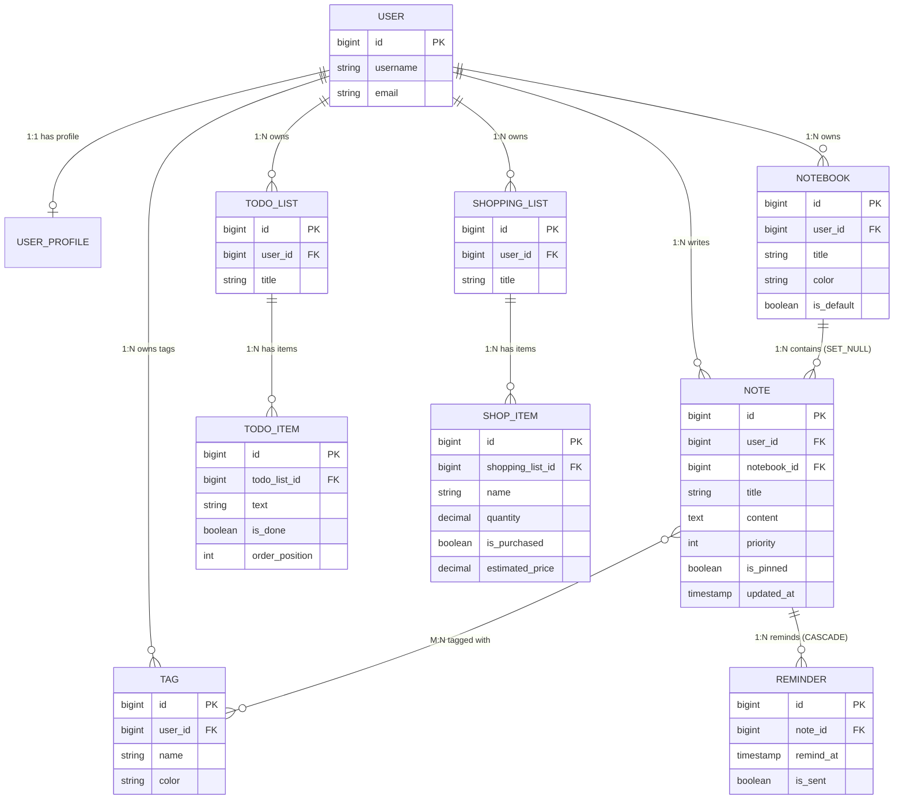
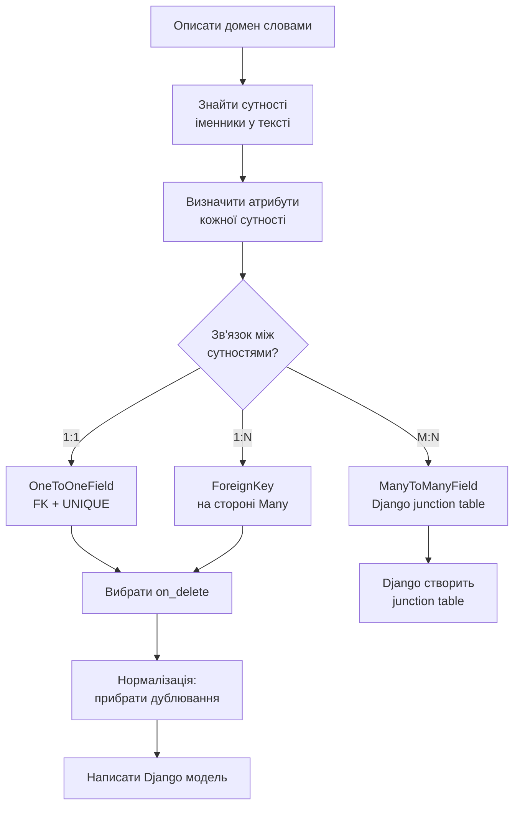

# ER-діаграми та типи зв'язків

> Три типи зв'язків між таблицями. Питання «де живе FK?» — це не технічне, це **архітектурне**.

---

## Типи зв'язків

### 1:1 — OneToOneField

> **FK + UNIQUE** · "user has exactly one profile"

```
USER                          USER_PROFILE
┌──────────────┬──────────┐   ┌────────────────┬──────────────────┐
│ id  bigint PK│          │──►│ id    bigint PK│                  │
│ username     │          │   │ user_id bigint │ UNIQUE FK        │
└──────────────┴──────────┘   │ display varchar│                  │
                              │ timezone       │                  │
                              └────────────────┴──────────────────┘
```

```python
class UserProfile(models.Model):
    user = models.OneToOneField(
        User,
        on_delete=models.CASCADE,
        related_name='profile',
    )
    display_name = models.CharField(max_length=60, blank=True)
    timezone     = models.CharField(max_length=40, default='UTC')
    avatar_url   = models.URLField(blank=True)

    def __str__(self):
        return f'Profile({self.user.username})'
```

**SQL що генерує Django:**
```sql
CREATE TABLE "hello_app_userprofile" (
    "id"           bigint NOT NULL PRIMARY KEY GENERATED BY DEFAULT AS IDENTITY,
    "user_id"      bigint NOT NULL UNIQUE REFERENCES "auth_user" ("id") ON DELETE CASCADE,
    "display_name" varchar(60) NOT NULL DEFAULT '',
    "timezone"     varchar(40) NOT NULL DEFAULT 'UTC',
    "avatar_url"   varchar(200) NOT NULL DEFAULT ''
);
```

**Реверс — доступ з User:**
```python
user = User.objects.get(username='alice')
user.profile              # → UserProfile (не QuerySet! UNIQUE FK → один об'єкт)
user.profile.timezone     # → 'Europe/Kyiv'
```

> **Чому це 1:1?** Звичайний `FK` + `UNIQUE` на колонці.
> Реверс — **атрибут** (не QuerySet): `user.profile`.
> Корисно для **вертикального партиціонування**: 5 базових полів у User, 20 опціональних у Profile — не забруднюємо головну таблицю.

**Коли використовувати 1:1?**
- "Вертикальне партиціонування": 5 базових полів у User, 20 опціональних у Profile
- Різний доступ: User змінюється часто, Profile рідко → окремий QuerySet
- Різні права: `view_user` без `view_userprofile`

---

### 1:N — ForeignKey

> **FK на "Many" стороні** · "notebook has many notes"

```
NOTEBOOK                    NOTE              NOTE              NOTE
┌──────────┬──────────┐     ┌───────────────────────┐
│ id       │ bigint PK│──┬─►│ id          bigint PK │
│ title    │ varchar  │  │  │ notebook_id bigint FK │← FK тут!
└──────────┴──────────┘  ├─►│ title       varchar   │
                         │  └───────────────────────┘
                         ├─► (ще одна нотатка)
                         └─► (ще одна нотатка)
```

```python
class Note(models.Model):
    notebook = models.ForeignKey(
        'Notebook',                  # ← рядок уникає кругових імпортів
        on_delete=models.SET_NULL,   # Видалення записника → NULL (не CASCADE!)
        null=True,                   # NULL обов'язковий при SET_NULL
        blank=True,                  # Форма: поле необов'язкове
        related_name='notes',        # notebook.notes.all() → QuerySet нотаток
    )
```

> **Де живе FK?** Завжди на **Many**-стороні.
> `Notebook` **не зберігає** список нотаток — `Note` зберігає `notebook_id`.
> Це фізика SQL: один стовпець = одне значення.

```
ПОМИЛКА думати так:          ПРАВИЛЬНО думати так:
Notebook має список notes    Note belongs to Notebook
→ Notebook.notes = [...]    → Note.notebook_id = FK
→ JOIN відбуватиметься       → Notebook.notes.all() = реверс

Notebook НЕ зберігає список Note IDs!
Це б порушило нормальну форму і ускладнило JOIN.
```

**Реверс — доступ з «One» сторони:**
```python
notebook = Notebook.objects.get(id=1)
notebook.notes.all()                    # ← related_name='notes' → QuerySet
notebook.notes.filter(is_pinned=True)   # Фільтруємо
notebook.notes.count()                  # Кількість

note = Note.objects.get(id=1)
note.notebook                           # ← FK attr → Notebook об'єкт (або None)
note.notebook_id                        # ← raw integer FK без JOIN
note.notebook.title                     # ← JOIN: SELECT ... WHERE notebook_id=...
```

---

### M:N — ManyToManyField

> **Через junction table** · Django створює автоматично

```
NOTE                  NOTE_TAGS (junction)    TAG
┌──────────┬──────┐   ┌──────────┬──────────┐  ┌──────────┬──────────┐
│ id       │  PK  │──►│ note_id  │ bigint FK│  │ id       │  PK      │
│ title    │      │   │ tag_id   │ bigint FK│─►│ name     │ varchar  │
└──────────┴──────┘   └──────────┴──────────┘  └──────────┴──────────┘
                       UNIQUE(note_id, tag_id)
                       Django: hello_app_note_tags
```

```python
class Note(models.Model):
    tags = models.ManyToManyField(
        'Tag',
        blank=True,              # Нотатка може бути без тегів
        related_name='notes',    # tag.notes.all() → нотатки з цим тегом
    )
    # Django автоматично створює junction таблицю: hello_app_note_tags
```

**Операції з M:N:**
```python
note = Note.objects.get(id=1)
tag_py = Tag.objects.get(name='python')
tag_dj = Tag.objects.get(name='django')

# Додати теги
note.tags.add(tag_py, tag_dj)     # INSERT INTO note_tags (note_id, tag_id)

# Повний список
note.tags.all()                    # SELECT * FROM tags JOIN note_tags ...

# Видалити конкретний тег
note.tags.remove(tag_py)           # DELETE FROM note_tags WHERE ...

# Замінити всі теги
note.tags.set([tag_dj])           # DELETE старих + INSERT нових

# Очистити всі
note.tags.clear()                  # DELETE FROM note_tags WHERE note_id=...

# Реверс — нотатки з тегом:
tag_py.notes.all()                 # SELECT * FROM notes JOIN note_tags WHERE tag_id=...
```

> **Junction = окрема таблиця.** Тут немає чарів — це звичайна таблиця з двома FK.
> Хочеш додати `added_at` або `role` до зв'язку? Передай `through=` і опиши свою junction модель.

---

## on_delete — що відбувається при видаленні батька?

> **Помилка:** дефолт CASCADE для всього → одне видалення користувача може стерти сотні рядків.
> Завжди **свідомо** вибирай стратегію. Це бізнес-рішення, не технічне.

```python
# CASCADE — видалити дочірні записи разом з батьком
class Reminder(models.Model):
    note = models.ForeignKey(Note, on_delete=models.CASCADE, related_name='reminders')
    # Видалення Note → видаляються всі Reminder цієї Note
    # Логіка: Reminder без Note безглузде → CASCADE правильний вибір

# SET_NULL — FK стає NULL, дочірній запис залишається
class Note(models.Model):
    notebook = models.ForeignKey(
        Notebook, on_delete=models.SET_NULL,
        null=True, blank=True,  # ← null=True ОБОВ'ЯЗКОВИЙ при SET_NULL
    )
    # Видалення Notebook → Note.notebook = NULL
    # Логіка: нотатка має бути збережена! Тільки записник видаляється.

# PROTECT — забороняє видалення якщо є дочірні записи
class Note(models.Model):
    tag = models.ForeignKey(Tag, on_delete=models.PROTECT)
    # Видалення Tag → ProtectedError (виняток)
    # Логіка: не дай видалити тег поки він використовується

# RESTRICT — схоже на PROTECT але дозволяє каскад з вищого рівня
# Складні ієрархії, рідко використовується

# SET_DEFAULT — FK стає default значенням
class Note(models.Model):
    notebook = models.ForeignKey(
        Notebook, on_delete=models.SET_DEFAULT,
        default=1,  # ← pk дефолтного записника
    )

# DO_NOTHING — залишає orphan запис (FK вказує на неіснуючий id)
# УНИКАЙ: призводить до IntegrityError або брудних даних
```

### Матриця вибору on_delete

| Стратегія | Що робить | Коли вибирати |
|-----------|-----------|---------------|
| `CASCADE` | Видалити дочірні автоматично | `Reminder → Note`: нагадування без нотатки не має сенсу |
| `SET_NULL` | FK → NULL, дочірні живуть далі | `Note → Notebook`: нотатка існує без записника. Поле має бути `null=True` |
| `SET_DEFAULT` | FK → значення `default` | `Note → Notebook`: перенести в «Default» записник |
| `PROTECT` | `ProtectedError`, видалення заборонене | `Tag`: не дозволити видаляти тег поки він використовується |
| `RESTRICT` | Заборонити, але дозволити каскад з вищого рівня | Складні домени з кількома рівнями власності |
| `DO_NOTHING` | БД сама вирішує (часто = orphan) | Майже ніколи. Тільки якщо керуєш consistency вручну (triggers) |

**Конкретно для Notes Platform:**

| Якщо видалити... | Що хочемо з дочірніми? | on_delete |
|------------------|------------------------|-----------|
| Note | Видалити Reminder (не мають сенсу без Note) | CASCADE |
| Notebook | Зберегти Note (нотатка важливіша за записник) | SET_NULL |
| User | Видалити всі Note (контент belongs to user) | CASCADE |
| Tag | Заборонити видалення (тег використовується) | PROTECT |

---

## Повна схема: 11 таблиць Notes Platform

```
schema_v1 · 11 tables · 1 junction table · postgres-ready
─────────────────────────────────────────────────────────

USER (auth_user)                    USER_PROFILE  ←── 1:1 OneToOne
┌──────────────┬─────────────┐      ┌────────────────┬──────────────────┐
│ id           │ bigint PK   │──┐   │ id             │ bigint PK        │
│ username     │ varchar(150)│  └──►│ user_id        │ bigint UNIQUE FK │
│ email        │ varchar(254)│      │ display_name   │ varchar(60)      │
│ password     │ varchar(128)│      │ timezone       │ varchar(40)      │
│ date_joined  │ timestamp   │      │ avatar_url     │ text             │
└──────────────┴─────────────┘      └────────────────┴──────────────────┘
       │ owns 1:N              │ writes 1:N          │ owns tags 1:N
       ▼                       ▼                     ▼
NOTEBOOK                      NOTE (центральна)     TAG
┌─────────────┬──────────┐    ┌───────────────┬──────────────────┐    ┌──────────┬───────────────────┐
│ id          │ bigint PK│    │ id            │ bigint PK        │    │ id       │ bigint PK         │
│ user_id     │ bigint FK│    │ user_id       │ bigint FK        │    │ user_id  │ bigint FK         │
│ title       │ varchar  │    │ notebook_id   │ bigint NULL FK   │    │ name     │ varchar(50)       │
│ color       │ varchar  │    │ title         │ varchar(200)     │    │ color    │ varchar(7)        │
│ is_default  │ boolean  │    │ content       │ text             │    └──────────┴───────────────────┘
└─────────────┴──────────┘    │ priority      │ smallint         │     unique_together(user_id, name)
       │ contains 1:N         │ is_pinned     │ boolean          │
       └─────────────────────►│ is_archived   │ boolean          │◄──── M:N через NOTE_TAGS
                              │ created_at    │ timestamp        │
                              │ updated_at    │ timestamp        │
                              │ views_count   │ integer          │
                              └───────────────┴──────────────────┘
                                     │ reminds 1:N
                                     ▼
                              REMINDER                         NOTE_TAGS (junction)
                              ┌───────────┬──────────────┐     ┌──────────┬────────────┐
                              │ id        │ bigint PK    │     │ note_id  │ bigint FK  │
                              │ note_id   │ bigint FK    │     │ tag_id   │ bigint FK  │
                              │ remind_at │ timestamp    │     └──────────┴────────────┘
                              │ is_sent   │ boolean      │     UNIQUE(note_id, tag_id)
                              │ repeat    │ varchar(20)  │     Django створює авто
                              └───────────┴──────────────┘

TODO_LIST                     TODO_ITEM
┌─────────────┬──────────┐    ┌────────────────┬──────────────┐
│ id          │ bigint PK│    │ id             │ bigint PK    │
│ user_id     │ bigint FK│───►│ todo_list_id   │ bigint FK    │
│ title       │ varchar  │    │ text           │ varchar(500) │
│ is_completed│ boolean  │    │ is_done        │ boolean      │
└─────────────┴──────────┘    │ order_position │ integer      │
                              │ due_date       │ date NULL    │
                              └────────────────┴──────────────┘

SHOPPING_LIST                 SHOP_ITEM
┌─────────────┬──────────┐    ┌──────────────────┬──────────────────┐
│ id          │ bigint PK│    │ id               │ bigint PK        │
│ user_id     │ bigint FK│───►│ shopping_list_id │ bigint FK        │
│ title       │ varchar  │    │ name             │ varchar(120)     │
│ store_name  │ varchar  │    │ quantity         │ decimal(8,2)     │
└─────────────┴──────────┘    │ unit             │ varchar(20)      │
                              │ is_purchased     │ boolean          │
                              │ estimated_price  │ decimal(10,2)    │
                              └──────────────────┴──────────────────┘
                              ⚠️ DecimalField для грошей — не FloatField!
```

---

## Mermaid ER-діаграма



---

## Flowchart: процес проектування моделей



---

## Навігація

- Попередня: [Проектування домену](domain_design.md)
- Наступна: [Django моделі](models.md)
