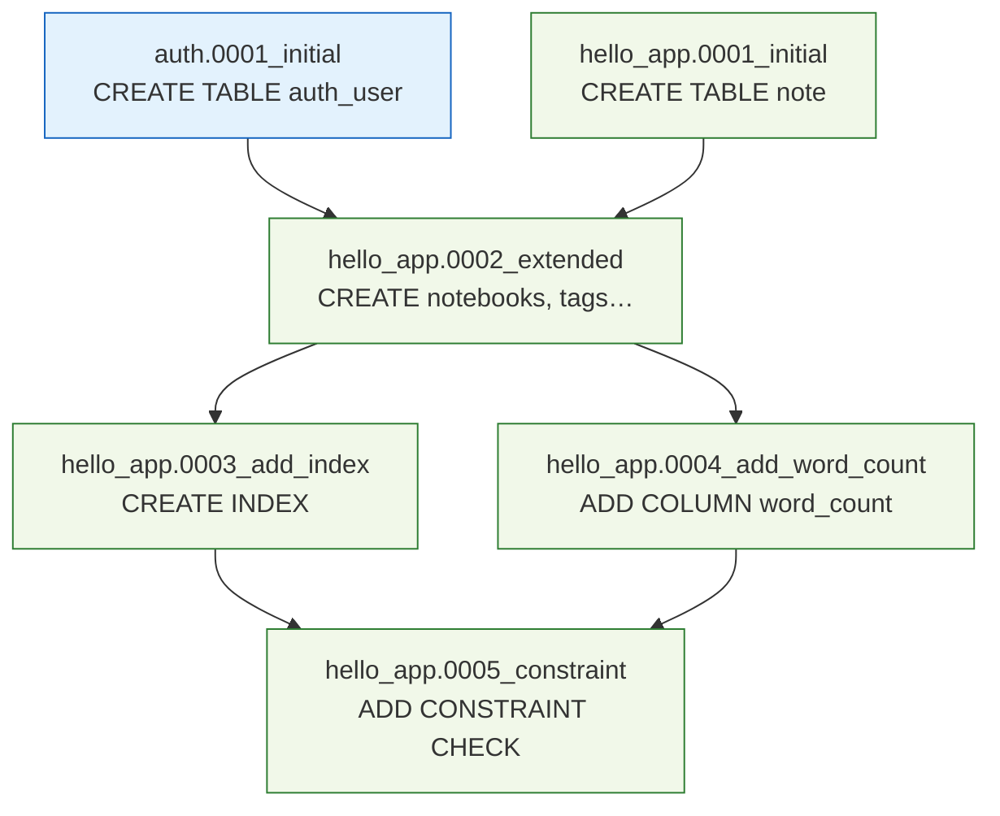
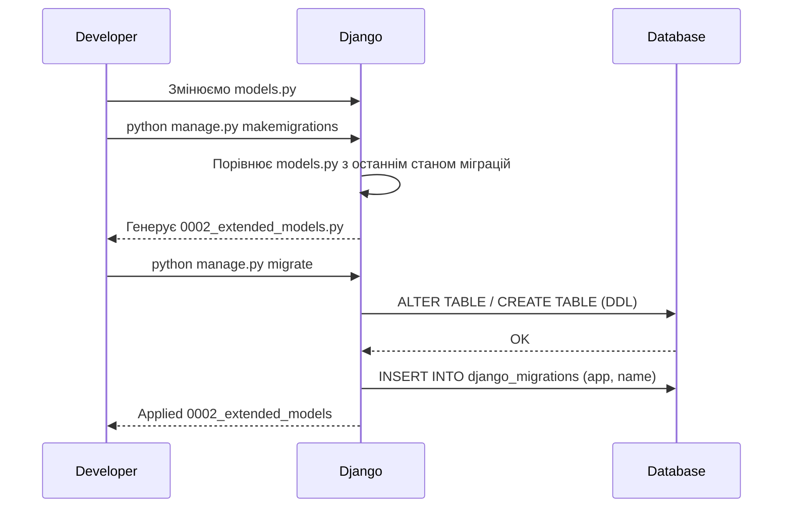

# Міграції

> **"Git для схеми бази даних."**
> Кожна міграція — коміт що описує зміни схеми. Django відстежує які вже виконані у `django_migrations`.

---

## Migration Lifecycle — від зміни моделі до ALTER TABLE

```
┌─────────────┐    ┌─────────────────────────────────┐    ┌──────────────────┐
│  Developer  │    │         Django ORM              │    │   PostgreSQL     │
└──────┬──────┘    └──────────────┬──────────────────┘    └────────┬─────────┘
       │                         │                                  │
  1. Зміни в models.py           │                                  │
       │                         │                                  │
  2. $ makemigrations ──────────►│                                  │
       │              Порівнює   │                                  │
       │              models.py  │                                  │
       │              з останнім │                                  │
       │◄─────────────────────── │                                  │
  3. Отримує 0003_add_field.py   │                                  │
       │                         │                                  │
  4. $ sqlmigrate (перевірка)    │                                  │
       │                         │                                  │
  5. $ migrate ─────────────────►│                                  │
       │                         │  ALTER TABLE notes_note ────────►│
       │                         │  ADD COLUMN word_count integer;  │
       │                         │◄──────────────────────────────── │
       │                         │  INSERT INTO django_migrations   │
       │◄─────────────────────── │  (app, name, applied)            │
  6. ✓ Applied 0003_add_field    │                                  │
```

---

## Migration Dependency Graph (DAG)



> **`django_migrations`** — спеціальна таблиця-журнал. `migrate` застосовує тільки ті вузли,
> яких там ще немає, у **топологічному порядку** залежностей.

---

## Ключові команди

```bash
# Генерувати міграцію з описовою назвою
python manage.py makemigrations --name add_word_count_to_note

# Переглянути SQL до виконання (завжди робити перед migrate!)
python manage.py sqlmigrate hello_app 0003

# Застосувати всі нові міграції
python manage.py migrate

# Показати стан усіх міграцій (✓ виконано, □ ще ні)
python manage.py showmigrations

# Відкотити до конкретної міграції
python manage.py migrate hello_app 0002
```

---

## Правила міграцій

| Правило | Чому |
|---------|------|
| ✅ Нове поле: завжди `default=` або `null=True` | Без дефолту — що записати в існуючі рядки? |
| ✅ Описова назва `--name add_word_count` | `0003_add_word_count` читабельніше за `0003_note` |
| ✅ Комітити міграції в git | Інакше колеги не зможуть оновити свою БД |
| ✅ `sqlmigrate` перед `migrate` | Перевіряєш SQL що буде виконано |
| ❌ Редагувати виконану міграцію | Production і dev розсинхронізуються — катастрофа |
| ❌ Видаляти міграції з git | Руйнує граф залежностей |

---

## Крок 5 — Workflow міграцій

---
> **Ментальна модель:** Міграції — це **Git для схеми бази даних**. Кожна міграція — це "коміт" що описує зміни схеми. Django відстежує які міграції вже виконані в таблиці `django_migrations`. `migrate` виконує тільки нові.
>
> **Типова помилка:** Редагувати вже застосовану міграцію. Якщо міграція вже застосована на production і ти її редагуєш — production і development розсинхронізуються. Зміна застосованої міграції = катастрофа. Якщо потрібна зміна → **нова** міграція.
---



```bash
# Кроки для нашого проекту:

# 1. Переходимо до папки проекту
cd module_5/lesson_Django_ORM_Database/notes_project

# 2. Перевіряємо що hello_app в INSTALLED_APPS
# settings.py → INSTALLED_APPS має містити 'hello_app'

# 3. Генеруємо першу міграцію
python manage.py makemigrations
# Очікуваний вивід:
# Migrations for 'hello_app':
#   hello_app/migrations/0001_initial.py
#     - Create model UserProfile, Tag, Notebook, Note, Reminder,
#       TodoList, TodoItem, ShoppingList, ShopItem

# 4. Переглядаємо SQL що буде виконано (без виконання)
python manage.py sqlmigrate hello_app 0001
# Корисно: перевірити типи стовпців, FK, індекси

# 5. Виконуємо міграцію
python manage.py migrate

# 6. Показати стан всіх міграцій
python manage.py showmigrations
```

Переглянь що Django згенерував:

```sql
BEGIN;
CREATE TABLE "hello_app_tag" (
    "id"      bigint NOT NULL PRIMARY KEY,
    "user_id" bigint NOT NULL REFERENCES "auth_user" ("id"),
    "name"    varchar(50) NOT NULL,
    "color"   varchar(7) NOT NULL
);
CREATE UNIQUE INDEX "unique_user_tag" ON "hello_app_tag" ("user_id", "name");
-- ... і так для кожної таблиці
COMMIT;
```

### Коли потрібна нова міграція (додаємо поле)

```python
# Додаємо нове поле до Note
class Note(models.Model):
    ...
    word_count = models.PositiveIntegerField(default=0)  # НОВЕ ПОЛЕ
```

```bash
python manage.py makemigrations --name add_word_count_to_note
# → hello_app/migrations/0003_add_word_count_to_note.py

python manage.py sqlmigrate hello_app 0003
# ALTER TABLE "hello_app_note" ADD COLUMN "word_count" integer NOT NULL DEFAULT 0;

python manage.py migrate
```

---

## Крок 6 — Перший запуск з SQLite

SQLite — ідеальний для розробки. Нічого не встановлювати.

```bash
# Ініціалізуємо БД (SQLite за замовчуванням)
python manage.py migrate

# Створюємо суперюзера для адмінки
python manage.py createsuperuser

# Запускаємо сервер
python manage.py runserver
# http://127.0.0.1:8000/
# http://127.0.0.1:8000/admin/
# http://127.0.0.1:8000/notes/
```

### Тестуємо моделі через Django shell

```bash
python manage.py shell
```

```python
from django.contrib.auth.models import User
from hello_app.models import *

# Створюємо користувача
user = User.objects.create_user('alice', 'alice@test.com', 'pass123')

# Профіль (OneToOne)
profile = UserProfile.objects.create(user=user, display_name='Alice')
print(user.profile.display_name)  # через related_name

# Записник
notebook = Notebook.objects.create(user=user, title='Робота', is_default=True)

# Теги
tag_py = Tag.objects.create(user=user, name='python', color='#3776AB')
tag_dj = Tag.objects.create(user=user, name='django', color='#092E20')

# Нотатка з тегами
note = Note.objects.create(
    user=user, notebook=notebook,
    title='Django ORM', content='QuerySet — лінива оцінка...',
    priority=Note.PRIORITY_HIGH, is_pinned=True
)
note.tags.add(tag_py, tag_dj)  # M:N — INSERT у junction table

# Список справ
todo = TodoList.objects.create(user=user, title='Вивчити ORM')
TodoItem.objects.bulk_create([
    TodoItem(todo_list=todo, text='RELATIONAL_DB_FOUNDATIONS.md', order_position=1),
    TodoItem(todo_list=todo, text='DJANGO_ORM_DEEP.md', order_position=2),
    TodoItem(todo_list=todo, text='Зробити проект', order_position=3),
])

# Список покупок
shopping = ShoppingList.objects.create(user=user, title='В магазин')
ShopItem.objects.create(
    shopping_list=shopping, name='Молоко',
    quantity=2, unit=ShopItem.UNIT_LITER, estimated_price=45.00
)

print(f"Нотаток: {user.notes.count()}")
print(f"Теги: {[t.name for t in note.tags.all()]}")
```

---

## Зміна моделі після першої міграції

```bash
# Додаємо нове поле:
# views_count = models.PositiveIntegerField(default=0)

python manage.py makemigrations hello_app
# → Migrations for 'hello_app':
#     hello_app/migrations/0002_note_views_count.py
#       - Add field views_count to note

python manage.py migrate
# → Applying hello_app.0002_note_views_count... OK
```

---

## Навігація

- Попередня: [Django моделі](models.md)
- Наступна: [Services і Selectors](services_and_selectors.md)
