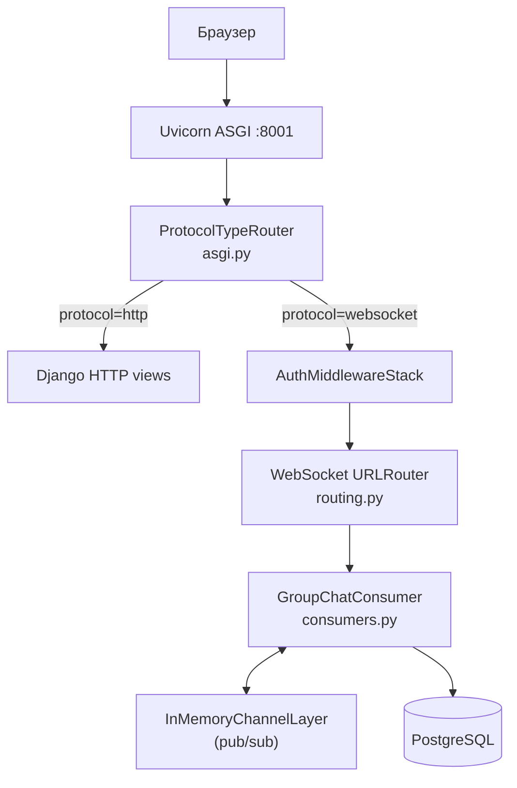

# Туторіал 07 — Async, ASGI та WebSocket чат

**Мета:** зрозуміти чому HTTP не підходить для real-time, як WebSocket вирішує цю проблему, і як Django Channels реалізує груповий чат у CrispyNotes.

---

## Чому HTTP не підходить для чату

HTTP — протокол "запит → відповідь → з'єднання закрито". Сервер **не може** надіслати повідомлення браузеру без запиту.

```
HTTP (класичний):
  Browser ── GET /chat/ ──► Django view → HttpResponse → [закрито]
  Browser ── GET /chat/ ──► Django view → HttpResponse → [закрито]
  (кожного разу нове з'єднання)
```

**Два костильних варіанти для чату:**

| Підхід | Як | Проблема |
|--------|-----|----------|
| **Polling** | Браузер запитує `/new-messages/` кожні 2 секунди | 1000 юзерів = 500 запитів/сек. Повідомлення приходить із затримкою |
| **Long polling** | Браузер надсилає запит, сервер "тримає" відкритим до нового повідомлення | 1000 юзерів = 1000 заблокованих потоків |

**Sync Django + Long polling = катастрофа:**

```
Sync Django: один OS-потік = один активний запит
1000 юзерів у чаті → 1000 потоків заблоковані
Thread pool вичерпаний → решта сайту не відповідає
```

---

## WebSocket — постійне двостороннє з'єднання

WebSocket встановлюється через HTTP Upgrade handshake (один раз), після чого відкрите TCP-з'єднання живе до закриття вкладки:

```
WebSocket flow:
  Browser ══════════ PERSISTENT TCP ═════════ Server
  ↑ Будь-яка сторона може надіслати дані в будь-який момент

  Viktor: ws.send({content: "Привіт!"}) ──────────► consumer.receive()
  Server: consumer.send({author: "Viktor"}) ────────► ws.onmessage у браузері Олі
  Server: consumer.send({author: "Viktor"}) ────────► ws.onmessage у браузері Маші
```

**Браузерний WebSocket API — вбудований, без бібліотек:**

```javascript
// group_chat.js
const ws = new WebSocket('ws://localhost/ws/groups/7/chat/')

ws.onopen    = () => { /* з'єднання встановлено */ }
ws.onmessage = (e) => { const data = JSON.parse(e.data) }
ws.onclose   = (e) => { /* 1000=норм, 1006=аварія */ }

ws.send(JSON.stringify({ content: "Привіт!" }))
```

---

## Sync vs Async — де різниця реальна

```
Sync Django: один потік = одне з'єднання
  1000 юзерів у чаті → 1000 OS-потоків (~8 GB RAM на stack)

Async Django Channels: один event loop = тисячі coroutines
  1000 юзерів у чаті → 1000 Consumer об'єктів (кілька MB)
  CPU зайнятий тільки коли є що обробляти
```

| | Sync | Async |
|--|------|-------|
| Модель | Один потік = одне з'єднання | Event loop = тисячі coroutines |
| 1000 юзерів | 1000 OS-потоків | 1000 легких coroutines |
| CPU поки немає повідомлень | Потік заблокований | Event loop обслуговує інших |

**Async не завжди краще.** Для звичайного CRUD (нотатки, списки, форми) sync достатній і простіший. Async виправданий саме для long-lived з'єднань де sync **архітектурно не підходить**.

---

## Архітектура ASGI стеку



| Компонент | Роль | Аналог в HTTP Django |
|-----------|------|---------------------|
| `ProtocolTypeRouter` | Розрізняє HTTP і WS | `ROOT_URLCONF` |
| `AuthMiddlewareStack` | Читає session cookie → `scope['user']` | `@login_required` |
| `WebSocket URLRouter` | Маршрутизує WS URL до Consumer | `urls.py` |
| `Consumer` | Обробляє WS-з'єднання весь час | `view` (але живе довше) |
| `InMemoryChannelLayer` | Pub/sub broadcast між consumers | _(немає аналога)_ |

---

## asgi.py — точка входу

```python
# notes_project/asgi.py
import os
from django.core.asgi import get_asgi_application
from channels.routing import ProtocolTypeRouter, URLRouter
from channels.auth import AuthMiddlewareStack

# CRITICAL: get_asgi_application() ПЕРЕД будь-яким імпортом з notes_app
# (Django app registry має бути готовий)
os.environ.setdefault('DJANGO_SETTINGS_MODULE', 'notes_project.settings')
django_asgi_app = get_asgi_application()

from notes_project.routing import websocket_urlpatterns

application = ProtocolTypeRouter({
    # HTTP → звичайний Django (views.py, templates, static)
    "http": django_asgi_app,

    # WebSocket → Auth middleware → URL router → Consumer
    "websocket": AuthMiddlewareStack(
        URLRouter(websocket_urlpatterns)
    ),
})
```

---

## routing.py — WebSocket URL patterns

```python
# notes_project/routing.py
from django.urls import re_path
from notes_app import consumers

websocket_urlpatterns = [
    re_path(
        r'^ws/groups/(?P<group_pk>\d+)/chat/$',
        consumers.GroupChatConsumer.as_asgi(),
    ),
]
# WS URL: ws://host/ws/groups/7/chat/
# group_pk=7 потрапить до scope['url_route']['kwargs']['group_pk']
```

---

## settings.py — Channel Layers і Daphne

```python
# settings.py

INSTALLED_APPS = [
    'daphne',    # ← ПЕРШИЙ у списку! Overrides runserver → ASGI
    'channels',
    'notes_app',
    # ...
]

# ASGI application (замість WSGI для runserver)
ASGI_APPLICATION = 'notes_project.asgi.application'

# Channel Layer: InMemory (dev) або Redis (production)
if os.environ.get('REDIS_URL'):
    CHANNEL_LAYERS = {
        "default": {
            "BACKEND": "channels_redis.core.RedisChannelLayer",
            "CONFIG": {"hosts": [os.environ['REDIS_URL']]},
        }
    }
else:
    CHANNEL_LAYERS = {
        "default": {
            "BACKEND": "channels.layers.InMemoryChannelLayer",
        }
    }
```

> **Чому `daphne` першим?** Він override Django `runserver` щоб запускатись через ASGI замість WSGI. Без цього `python manage.py runserver` запускає WSGI і WebSocket не працює.

---

## Consumer — lifecycle та методи

Consumer — аналог view, але живе весь час з'єднання:

```
Consumer lifecycle:
  1. connect()     ← браузер відкрив з'єднання (один раз)
  2. receive()     ← браузер надіслав повідомлення (N разів)
     receive()     ← ...
  3. chat_message() ← channel layer доставив broadcast (N разів)
  4. disconnect()  ← браузер закрив з'єднання (один раз)
```

### connect() — авторизація і підписка

```python
# notes_app/consumers.py
class GroupChatConsumer(AsyncWebsocketConsumer):

    async def connect(self):
        # 1. User вже в scope — AuthMiddlewareStack завантажив з session cookie
        self.user = self.scope['user']

        if not self.user.is_authenticated:
            await self.close()
            return

        # 2. group_pk з URL: /ws/groups/7/chat/ → {'group_pk': '7'}
        self.group_pk = int(self.scope['url_route']['kwargs']['group_pk'])

        # 3. Перевіряємо membership (ORM у окремому потоці через decorator)
        is_member = await self.check_membership(self.group_pk, self.user)
        if not is_member:
            await self.close()
            return

        # 4. Підписуємось на broadcasting group у channel layer
        self.room_group_name = f"chat_group_{self.group_pk}"
        await self.channel_layer.group_add(
            self.room_group_name,
            self.channel_name,   # ← унікальний ID цього з'єднання
        )

        # 5. Приймаємо з'єднання (без accept() → браузер отримає 403)
        await self.accept()

        # 6. Надсилаємо останні 50 повідомлень (history)
        history = await self.load_history(self.group_pk)
        for msg in history:
            await self.send(text_data=json.dumps({
                'type': 'history',
                'author': msg['author__username'],
                'content': msg['content'],
                'timestamp': msg['timestamp'].isoformat(),
            }))
```

### receive() — нове повідомлення від браузера

```python
    async def receive(self, text_data):
        data = json.loads(text_data)
        content = data.get('content', '').strip()

        if not content or len(content) > 2000:
            return

        # Зберігаємо в БД
        msg = await self.save_message(self.group_pk, self.user, content)

        # Broadcast ВСІМ підписникам групи
        await self.channel_layer.group_send(
            self.room_group_name,
            {
                'type': 'chat_message',  # → метод chat_message() у кожного consumer
                'author': self.user.username,
                'content': content,
                'timestamp': msg.timestamp.isoformat(),
            }
        )
```

### chat_message() — отримали broadcast

```python
    async def chat_message(self, event):
        # Надсилаємо JSON нашому браузеру
        await self.send(text_data=json.dumps({
            'type': 'message',
            'author': event['author'],
            'content': event['content'],
            'timestamp': event['timestamp'],
        }))
```

**Ключова деталь:** `'type': 'chat_message'` у `group_send()` → Channels автоматично шукає метод `chat_message()` у Consumer. Крапка в типі → підкреслення: `'chat.message'` → `chat_message()`.

---

## database_sync_to_async — ORM у async context

Django ORM — синхронний. У asyncio event loop він не може виконуватись напряму:

```python
# ❌ НЕПРАВИЛЬНО — SynchronousOnlyOperation виняток:
async def connect(self):
    group = Group.objects.get(pk=self.group_pk)  # sync ORM в async!

# ✅ ПРАВИЛЬНО — @database_sync_to_async:
@database_sync_to_async
def check_membership(self, group_pk, user):
    # Ця функція — звичайна sync def
    # Декоратор запускає її у Django thread pool (worker thread)
    # Event loop вільний поки thread виконує SQL
    try:
        group = Group.objects.get(pk=group_pk)
        return group.user_set.filter(pk=user.pk).exists()
    except Group.DoesNotExist:
        return False

async def connect(self):
    is_member = await self.check_membership(self.group_pk, self.user)
```

### Критично: повертати list, не QuerySet

```python
@database_sync_to_async
def load_history(self, group_pk):
    qs = (
        ChatMessage.objects
        .filter(group_id=group_pk)
        .select_related('author')
        .order_by('-timestamp')[:50]
    )
    messages = list(qs.values('id', 'author__username', 'content', 'timestamp'))
    # ↑ list() виконує SQL ТУТ, у worker thread
    # Якщо повернути QuerySet → ітерація в async context → помилка!
    messages.reverse()  # хронологічний порядок
    return messages
```

---

## Як channel layer доставляє до всіх

```
Стан channel layer: 3 юзери у чаті групи 7

  channel_name Віктора: "specific.abc123"
  channel_name Олі:     "specific.def456"
  channel_name Маші:    "specific.ghi789"

  group "chat_group_7" → підписники: ["abc123", "def456", "ghi789"]

Віктор надсилає "Привіт":
  consumer Віктора: group_send("chat_group_7", {type: "chat_message", ...})
      │
      ├── channel layer знаходить підписників chat_group_7
      │
      ├── consumer Віктора: chat_message() → send("Привіт") → браузер Віктора
      ├── consumer Олі:     chat_message() → send("Привіт") → браузер Олі
      └── consumer Маші:    chat_message() → send("Привіт") → браузер Маші

Результат: "Привіт" з'являється одночасно в усіх трьох браузерах.
```

---

## disconnect() — відписка від group

```python
    async def disconnect(self, close_code):
        """
        ВАЖЛИВО: обов'язково відписатись від group.
        Якщо не відписатись — channel layer спробує доставити наступне
        повідомлення вже закритому з'єднанню → помилка.

        close_code:
          1000 — нормальне закриття (вкладка закрита)
          1006 — аварійне (інтернет обірвався)
        """
        if hasattr(self, 'room_group_name'):
            await self.channel_layer.group_discard(
                self.room_group_name,
                self.channel_name,
            )
```

---

## XSS захист у JS клієнті

Чат показує контент від інших юзерів — без захисту це XSS:

```javascript
// ❌ НЕБЕЗПЕЧНО — user content напряму в innerHTML:
div.innerHTML = data.content
// Зловмисник надсилає: 
// Результат: cookies всіх учасників чату вкрадені!

// ✅ ПРАВИЛЬНО — escapeHtml() перед будь-яким user content:
function escapeHtml(text) {
    return text
        .replace(/&/g, "&amp;")
        .replace(/</g, "&lt;")
        .replace(/>/g, "&gt;")
        .replace(/"/g, "&quot;")
        .replace(/'/g, "&#039;");
}
wrapper.innerHTML = `<div>${escapeHtml(data.content)}</div>`
```

---

## Тестування consumers

WebSocket consumer тестується через `WebsocketCommunicator`:

```python
# notes_app/tests/test_consumers.py
from channels.testing import WebsocketCommunicator
from channels.db import database_sync_to_async
from django.test import TestCase
from notes_project.asgi import application


class GroupChatConsumerTest(TestCase):

    async def test_authenticated_user_can_connect(self):
        user = await database_sync_to_async(
            User.objects.create_user
        )('testuser', password='pass')
        group = await database_sync_to_async(
            Group.objects.create
        )(name='Test Group')
        await database_sync_to_async(group.user_set.add)(user)

        communicator = WebsocketCommunicator(
            application,
            f"/ws/groups/{group.pk}/chat/",
            headers=[(b"cookie", f"sessionid=...".encode())]
        )
        connected, _ = await communicator.connect()
        self.assertTrue(connected)
        await communicator.disconnect()
```

### Запуск consumer тестів

```bash
docker compose run --rm web python manage.py test \
  notes_app.tests.test_consumers -v 2
```

---

## Запуск чату в Docker

```bash
# 1. Піднять весь стек (web + nginx + redis + ngrok)
docker compose up -d

# 2. Відкрий браузер: http://localhost або https://your-domain.ngrok-free.app

# 3. Залогінься → перейди до групи → натисни "Відкрий чат"

# 4. Відкрий другу вкладку під іншим юзером (demo_alice / demo_bob / demo_carol)
#    Пароль: demo1234

# 5. Надішли повідомлення — воно з'явиться миттєво в обох вкладках
```

**Перевір у DevTools → Network → WS:** одне постійне з'єднання замість запитів кожні 2 секунди.

---

## Повний flow — від Enter до появи у всіх

```
Браузер Віктора → ws.send({content: "Привіт!"})
     │
     ▼
Consumer Віктора: receive()
     ├── save_message() → PostgreSQL (через database_sync_to_async)
     └── channel_layer.group_send("chat_group_7", {...})
              │
              ├── Consumer Олі:    chat_message() → ws.send() → браузер Олі
              ├── Consumer Маші:   chat_message() → ws.send() → браузер Маші
              └── Consumer Віктора: chat_message() → ws.send() → браузер Віктора

Результат: "Привіт!" з'являється одночасно — без жодного HTTP запиту.
```

---

## Типові помилки

```python
# ❌ Sync ORM у async view → SynchronousOnlyOperation
async def bad_view(request):
    note = Note.objects.get(pk=1)  # ПОМИЛКА!

# ✅ Async ORM
async def good_view(request):
    note = await Note.objects.aget(pk=1)

# ❌ time.sleep() блокує весь event loop
async def bad_delay(request):
    time.sleep(2)  # ПОМИЛКА!

# ✅ asyncio.sleep()
async def good_delay(request):
    await asyncio.sleep(2)

# ❌ QuerySet повертається з database_sync_to_async → помилка при ітерації
@database_sync_to_async
def bad_history(self, group_pk):
    return ChatMessage.objects.filter(group_id=group_pk)  # lazy → помилка!

# ✅ Матеріалізувати у list всередині decorator
@database_sync_to_async
def good_history(self, group_pk):
    return list(ChatMessage.objects.filter(group_id=group_pk).values(...))
```

---

## Практичне завдання

1. Запусти `docker compose up -d` і відкрий чат групи "Команда розробки" (demo_alice / demo_bob, пароль `demo1234`). Відкрий DevTools → Network → WS. Переконайся що є одне WS-з'єднання.
2. Надішли повідомлення з однієї вкладки — воно з'явилось в іншій без перезавантаження?
3. Знайди в `consumers.py` метод `load_history`. Чому повертається `list(qs.values(...))` а не просто `qs`?
4. У `connect()` знайди рядок `if not is_member`. Що відбувається якщо незареєстрований юзер спробує підключитись до WS?
5. Додай `print(f"User {self.user.username} connected")` у `connect()`. Запусти і відкрий `docker compose logs -f web`. Побач лог при підключенні.

---

## Чеклист самоперевірки

- [ ] `daphne` — перший у `INSTALLED_APPS`
- [ ] `ASGI_APPLICATION` встановлено в `settings.py`
- [ ] `CHANNEL_LAYERS` налаштовано (InMemory або Redis)
- [ ] `asgi.py` імпортує `get_asgi_application()` ПЕРЕД імпортом з `notes_app`
- [ ] `routing.py` підключено до `asgi.py`
- [ ] Всі ORM-виклики у Consumer обгорнуті в `@database_sync_to_async`
- [ ] `load_history` повертає `list`, не `QuerySet`
- [ ] `disconnect()` викликає `group_discard()`
- [ ] JS клієнт використовує `escapeHtml()` для user content

---

## Далі

Наступний крок: [08 — Deployment](08_deployment.md) — Docker Compose, nginx, ngrok, production checklist.

Модулі документації:
- [Async and Realtime](../09_async_and_realtime/README.md)
