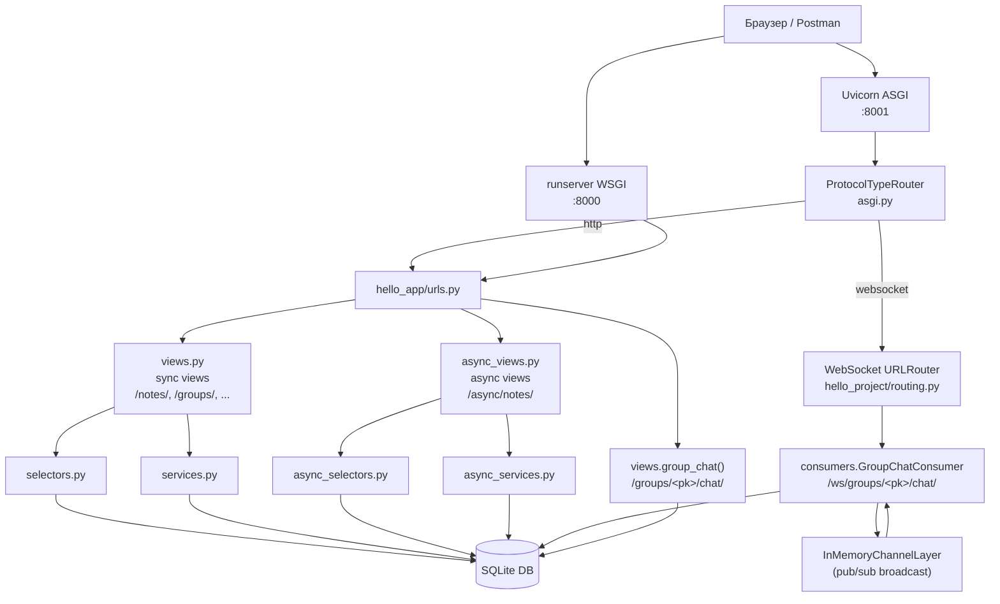
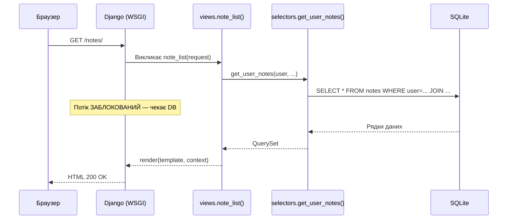
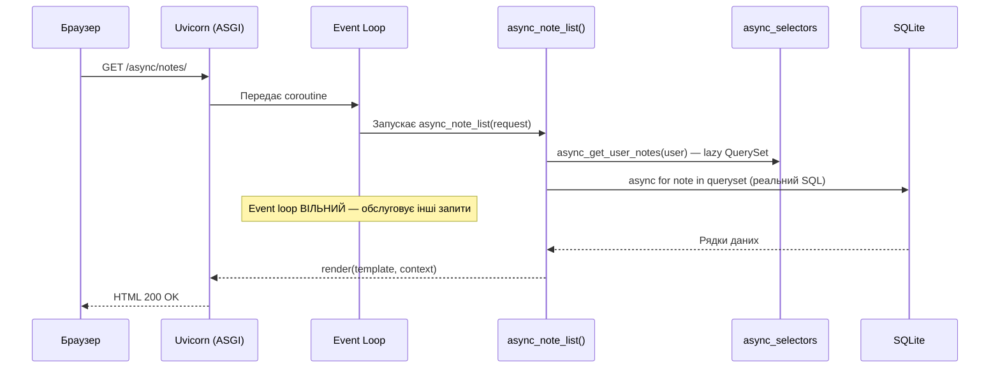

# 7A. Sync vs Async Django — огляд

## Про що цей проєкт

Це вже готовий Django-додаток для нотаток (Notes, Notebooks, Tags, TodoList, ShoppingList).
Ми **не переписуємо його з нуля** — ми додаємо async можливості **поруч** із sync-кодом.

**Дві демонстрації async в одному проєкті:**

```
# Частина 1: Async views (той самий результат — різна архітектура)
http://127.0.0.1:8000/notes/          ← Sync view (класичний Django)
http://127.0.0.1:8001/async/notes/    ← Async view (той самий результат, async ORM)

# Частина 2: Real-time чат (тут async — єдиний правильний підхід)
http://127.0.0.1:8001/groups/<pk>/chat/   ← Груповий WebSocket чат
```

Async views і async ORM показують **як** писати async код.
Груповий чат показує **навіщо** async потрібен — тут sync просто не підходить.

!!! note "Навчальний стан модулів async_*.py"
    `async_selectors.py`, `async_services.py`, `async_views.py` та `test_async_views.py`
    створюються **лише в межах цього навчального кроку** для демонстрації Django async views.

    У фінальній версії **Notes Chat App** ці модулі **відсутні**: вся async-логіка
    реалізована безпосередньо у `consumers.py` (Django Channels) без окремих async_*.py файлів.

---

## Архітектура проєкту



### Таблиця файлів

| Файл | Роль | Чи змінювали? |
|------|------|---------------|
| `models.py` | 9 моделей: Note, Notebook, Tag, ..., **ChatMessage** | ✅ Додали ChatMessage |
| `views.py` | 50+ sync views + **group_chat** | ✅ Додали group_chat |
| `selectors.py` | Sync ORM SELECT-запити | ❌ Без змін |
| `services.py` | Sync business logic | ❌ Без змін |
| `forms.py` | Django Forms | ❌ Без змін |
| **`async_selectors.py`** | **Async ORM SELECT-запити** | **✅ Новий** |
| **`async_services.py`** | **Async business logic** | **✅ Новий** |
| **`async_views.py`** | **Async def views** | **✅ Новий** |
| **`consumers.py`** | **WebSocket Consumer (Django Channels)** | **✅ Новий** |
| **`tests/test_async_views.py`** | **Async тести** | **✅ Новий** |
| `urls.py` | URL routing | ✅ Додали async URLs + chat |
| `requirements.txt` | Залежності | ✅ Додали uvicorn, httpx, channels |
| `settings.py` | Конфігурація Django | ✅ CHANNEL_LAYERS, channels у INSTALLED_APPS |
| `asgi.py` | ASGI точка входу | ✅ ProtocolTypeRouter |
| **`hello_project/routing.py`** | **WebSocket URL patterns** | **✅ Новий** |
| **`static/hello_app/js/group_chat.js`** | **Vanilla JS WebSocket клієнт** | **✅ Новий** |

---

## Sync-версія: класичний Django

Sync-код в цьому проєкті — це стандартний Django без жодних змін.

### Як працює sync request



### Sync URL-и

| URL | Метод | View | Що робить |
|-----|-------|------|-----------|
| `/notes/` | GET | `note_list` | Список нотаток |
| `/notes/<pk>/` | GET | `note_detail` | Деталі нотатки |
| `/notes/new/` | GET/POST | `note_create` | Форма створення |
| `/notes/<pk>/edit/` | GET/POST | `note_edit` | Форма редагування |
| `/notes/<pk>/delete/` | GET/POST | `note_delete` | Видалення |

---

## Async-версія: що ми додали і чому

Ми додали нові файли **не змінюючи** sync-код.
Студент може відкрити `views.py` і `async_views.py` поруч і побачити різницю.

### Як працює async request



### Async URL-и

| URL | Метод | Async View | Sync-аналог |
|-----|-------|-----------|-------------|
| `/async/notes/` | GET | `async_note_list` | `note_list` |
| `/async/notes/<pk>/` | GET | `async_note_detail` | `note_detail` |
| `/async/notes/create/` | GET/POST | `async_note_create` | `note_create` |
| `/async/notes/<pk>/delete/` | GET/POST | `async_note_delete` | `note_delete` |
| `/async/notes/<pk>/pin/` | POST | `async_note_toggle_pin` | _(немає окремого URL)_ |

---

## Коли async виправданий, а коли — ні

Async — це не "краще". Async — це "для іншого типу задач".

### ❌ Async не потрібен (sync достатній)

| Функціонал | Чому sync вистачає |
|------------|-------------------|
| CRUD нотаток | Прості DB запити, один запит = одна відповідь |
| TodoList, ShoppingList | Немає bottleneck, короткі запити |
| Форми, авторизація | CPU-операції без I/O очікування |
| Адмін-панель | Рідкісні складні запити, concurrency не потрібна |

### ✅ Async виправданий

| Функціонал | Чому async потрібен |
|------------|---------------------|
| **Груповий чат (цей проєкт!)** | WebSocket = тисячі відкритих з'єднань одночасно |
| Паралельні API-запити | `asyncio.gather()` → кілька запитів одночасно |
| Streaming відповіді | Server-Sent Events, великі файли |
| High-concurrency API | 10 000+ req/s без блокування потоків |

Якщо переписати весь проєкт в async без реального bottleneck — це
overengineering + складніший код + ті самі результати.

**Ми конвертуємо тільки Notes** щоб студент міг порівняти архітектуру.
**Груповий чат** — це окремий use case де async є єдиним правильним вибором.

---

## Запуск sync Django через runserver

### Крок 1: Перехід до директорії

```bash
cd module_5/lesson_Django_Async/notes_chat_app
```

### Крок 2: Створення virtualenv

```bash
# Створення virtualenv
python -m venv .venv

# Активація (Linux / macOS)
source .venv/bin/activate

# Активація (Windows)
.venv\Scripts\activate
```

### Крок 3: Встановлення залежностей

```bash
pip install -r requirements.txt
# Встановить: Django 5.2, crispy-forms, uvicorn, httpx, та інші
```

### Крок 4: Міграції

```bash
python manage.py migrate
# Створить SQLite db.sqlite3 з усіма таблицями
```

### Крок 5: Суперюзер (опційно)

```bash
python manage.py createsuperuser
# Username: admin
# Password: (введи свій)
# → http://127.0.0.1:8000/admin/
```

### Крок 6: Запуск sync сервера

```bash
python manage.py runserver
# ↑ Django запускається на вбудованому WSGI сервері
# Порт: 8000 (за замовчуванням)
```

Відкрий браузер: **http://127.0.0.1:8000/**

Зареєструйся або логінься. Побач sync-список нотаток: **http://127.0.0.1:8000/notes/**

---

## Запуск async Django через Uvicorn (ASGI)

Uvicorn — ASGI-сервер. На відміну від вбудованого runserver, він використовує
asyncio event loop і обслуговує async views нативно.

### Крок 1: Встанови залежності (включно з wsproto)

```bash
pip install -r requirements.txt
```

> **Чому важливо:** `requirements.txt` містить `wsproto` — бібліотеку WebSocket-протоколу
> для uvicorn. Без неї uvicorn логує `"No supported WebSocket library detected"` і повертає
> HTTP 404 на всі WS-запити. Async views працюють, але **чат — не буде**.

### Крок 2: Запусти ASGI-сервер

```bash
uvicorn notes_project.asgi:application --reload --port 8001
```

Розбір команди:

| Частина | Що означає |
|---------|-----------|
| `uvicorn` | ASGI-сервер (аналог gunicorn для async) |
| `notes_project.asgi` | Python module: `notes_project/asgi.py` |
| `:application` | Об'єкт у модулі (`application = ProtocolTypeRouter(...)`) |
| `--reload` | Автоперезапуск при зміні файлів (тільки для dev!) |
| `--port 8001` | Порт 8001 (8000 зайнятий runserver) |

### Очікуване попередження (НЕ є помилкою)

```
WARNING:  ASGI 'lifespan' protocol appears unsupported.
```

Uvicorn пробує lifespan protocol (startup/shutdown хуки) → Django не реалізує його →
uvicorn логує WARNING і продовжує роботу. Це нормально. Чат і async views працюють
повністю. Ігноруй це повідомлення.

Відкрий браузер: **http://127.0.0.1:8001/**

Тепер ти можеш порівняти:
- **http://127.0.0.1:8000/notes/** — sync view (WSGI)
- **http://127.0.0.1:8001/async/notes/** — async view (ASGI)
- **http://127.0.0.1:8001/groups/** — груповий чат (WebSocket)

> **Важливо:** Обидва сервери підключаються до ОДНОГО `db.sqlite3`.
> Дані — ті самі. Архітектура виконання — різна.

---

## Таблиця порівняння URL-ів

| Sync URL | Async URL | Що порівнюємо |
|----------|-----------|---------------|
| `GET /notes/` | `GET /async/notes/` | Список нотаток, lazy ORM vs async for |
| `GET /notes/<pk>/` | `GET /async/notes/<pk>/` | Деталі нотатки, `.get()` vs `.aget()` |
| `GET/POST /notes/new/` | `GET/POST /async/notes/create/` | Форма + `create_note` vs `sync_to_async` |
| `GET/POST /notes/<pk>/delete/` | `GET/POST /async/notes/<pk>/delete/` | `.delete()` vs `.adelete()` |
| _(немає окремого URL)_ | `POST /async/notes/<pk>/pin/` | `.update(F(...))` vs `.aupdate(F(...))` |

---

## Далі

Наступна глава: **[7A. Async Views та ORM](7a_async_views.md)** — детальний розбір `async_selectors.py`, `async_services.py`, `async_views.py`.
