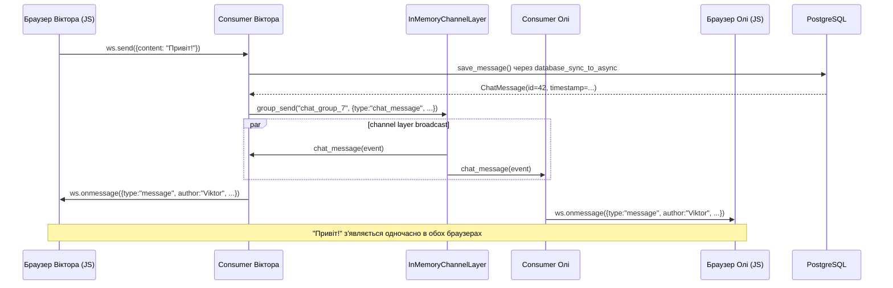

# 7B. Consumer

Consumer — аналог view, але:
- Живе весь час з'єднання (не один запит)
- Виконується як async coroutine
- Обробляє події: connect, receive, disconnect, channel layer events

---

## Consumer lifecycle

```
Браузер відкриває вкладку чату:
  ┌─────────────────────────────────────────────────┐
  │ 1. connect()                                     │
  │    ├── перевіряє авторизацію (is_authenticated) │
  │    ├── перевіряє membership                      │
  │    ├── group_add() → підписується на channel     │
  │    ├── accept() → підтверджує WS з'єднання       │
  │    └── send() history × N повідомлень            │
  │                                                   │
  │ 2. receive() ← браузер надіслав повідомлення     │
  │    ├── валідує content                            │
  │    ├── save_message() → PostgreSQL               │
  │    └── group_send() → broadcast до всіх          │
  │                 │                                 │
  │ 3. chat_message() ← channel layer доставив       │
  │    └── send() → надсилає до браузера             │
  │                                                   │
  │    (2 і 3 повторюються N разів)                  │
  │                                                   │
  │ 4. disconnect()                                   │
  │    └── group_discard() → відписується            │
  └─────────────────────────────────────────────────┘
```

### Різниця між receive() і chat_message()

```
receive()      — браузер ЦЬОГО з'єднання надіслав повідомлення
chat_message() — channel layer доставив broadcast від будь-якого учасника

Коли Оля надсилає "Привіт":
  Consumer Олі:     receive() → group_send("chat_group_7", {...})
  Consumer Олі:     chat_message() ← channel layer → send() → браузер Олі
  Consumer Маші:    chat_message() ← channel layer → send() → браузер Маші
  Consumer Віктора: chat_message() ← channel layer → send() → браузер Віктора
```

---

## GroupChatConsumer: повний код

```python
# notes_app/consumers.py
import json
from channels.generic.websocket import AsyncWebsocketConsumer
from channels.db import database_sync_to_async
from django.contrib.auth.models import Group


class GroupChatConsumer(AsyncWebsocketConsumer):
    """
    WebSocket consumer для групового чату.

    URL: /ws/groups/<group_pk>/chat/

    Client → Server:
        {"content": "Текст повідомлення"}

    Server → Client (history):
        {"type": "history", "author": "...", "content": "...", "timestamp": "..."}

    Server → Client (live):
        {"type": "message", "author": "...", "content": "...", "timestamp": "..."}
    """

    async def connect(self):
        self.user = self.scope['user']

        # 1. Авторизація
        if not self.user.is_authenticated:
            await self.close(code=4001)
            return

        # 2. group_pk з URL kwargs
        self.group_pk = int(self.scope['url_route']['kwargs']['group_pk'])

        # 3. Membership check (ORM у worker thread)
        is_member = await self.check_membership(self.group_pk, self.user)
        if not is_member:
            await self.close(code=4003)
            return

        # 4. Channel group name
        self.room_group_name = f"chat_group_{self.group_pk}"

        # 5. Підписуємось на channel group
        await self.channel_layer.group_add(
            self.room_group_name,
            self.channel_name,
        )

        # 6. Приймаємо з'єднання
        await self.accept()

        # 7. Надсилаємо history
        history = await self.load_history(self.group_pk)
        for msg in history:
            await self.send(text_data=json.dumps({
                'type': 'history',
                'author': msg['author__username'],
                'content': msg['content'],
                'timestamp': msg['timestamp'].isoformat(),
            }))

    async def receive(self, text_data):
        try:
            data = json.loads(text_data)
        except json.JSONDecodeError:
            return

        content = data.get('content', '').strip()

        if not content:
            return
        if len(content) > 2000:
            await self.send(text_data=json.dumps({
                'type': 'error',
                'message': 'Повідомлення занадто довге (максимум 2000 символів)',
            }))
            return

        msg = await self.save_message(self.group_pk, self.user, content)

        await self.channel_layer.group_send(
            self.room_group_name,
            {
                'type': 'chat_message',
                'author': self.user.username,
                'content': content,
                'timestamp': msg.timestamp.isoformat(),
            }
        )

    async def chat_message(self, event):
        await self.send(text_data=json.dumps({
            'type': 'message',
            'author': event['author'],
            'content': event['content'],
            'timestamp': event['timestamp'],
        }))

    async def disconnect(self, close_code):
        # hasattr check: якщо connect() завершився до group_add
        if hasattr(self, 'room_group_name'):
            await self.channel_layer.group_discard(
                self.room_group_name,
                self.channel_name,
            )

    # ─── ORM helpers ─────────────────────────────────────────────────

    @database_sync_to_async
    def check_membership(self, group_pk, user):
        try:
            group = Group.objects.get(pk=group_pk)
            return group.user_set.filter(pk=user.pk).exists()
        except Group.DoesNotExist:
            return False

    @database_sync_to_async
    def load_history(self, group_pk):
        from notes_app.models import ChatMessage
        qs = (
            ChatMessage.objects
            .filter(group_id=group_pk)
            .select_related('author')
            .order_by('-timestamp')[:50]
        )
        messages = list(qs.values('id', 'author__username', 'content', 'timestamp'))
        messages.reverse()
        return messages

    @database_sync_to_async
    def save_message(self, group_pk, user, content):
        from notes_app.models import ChatMessage
        return ChatMessage.objects.create(
            group_id=group_pk,
            author=user,
            content=content,
        )
```

---

## database_sync_to_async: чому ORM потребує обгортки

Django ORM — синхронний. Виконання sync коду напряму в async context блокує event loop і піднімає `SynchronousOnlyOperation`.

### Принцип роботи

```python
# ❌ НЕПРАВИЛЬНО — SynchronousOnlyOperation:
async def connect(self):
    group = Group.objects.get(pk=self.group_pk)
    # ↑ sync ORM у async context → блокує event loop → виняток

# ✅ ПРАВИЛЬНО — @database_sync_to_async:
@database_sync_to_async
def check_membership(self, group_pk, user):
    # Звичайна sync def
    # @database_sync_to_async запускає її у Django thread pool
    # Event loop вільний поки thread виконує SQL
    try:
        group = Group.objects.get(pk=group_pk)
        return group.user_set.filter(pk=user.pk).exists()
    except Group.DoesNotExist:
        return False

async def connect(self):
    is_member = await self.check_membership(self.group_pk, self.user)
    # await = "запусти у thread pool і чекай результат без блокування event loop"
```

### Як працює під капотом

```
Event loop (один потік):
  coroutine connect() виконується...
  
  → зустрічає: await self.check_membership(...)
  → @database_sync_to_async: Submit до thread pool executor
  → Event loop: продовжує обслуговувати ІНШІ з'єднання
  
Thread pool (окремий потік):
  → виконує sync Django ORM query (SELECT ... FROM ...)
  → повертає результат
  
Event loop:
  → отримує результат з thread pool
  → продовжує coroutine connect() з наступного рядка
```

### Критично: повертати list, не QuerySet

```python
# ❌ НЕПРАВИЛЬНО — QuerySet lazy, ітерується у async context:
@database_sync_to_async
def load_history(self, group_pk):
    return ChatMessage.objects.filter(group_id=group_pk).values(...)
    # QuerySet не виконав SQL! SQL виконається при ітерації.
    # Ітерація відбудеться в async context → SynchronousOnlyOperation

# ✅ ПРАВИЛЬНО — list() форсує SQL у worker thread:
@database_sync_to_async
def load_history(self, group_pk):
    qs = (
        ChatMessage.objects
        .filter(group_id=group_pk)
        .select_related('author')
        .order_by('-timestamp')[:50]
    )
    messages = list(qs.values('id', 'author__username', 'content', 'timestamp'))
    # list() виконує SQL ТУТ, у worker thread
    messages.reverse()  # хронологічний порядок
    return messages      # Python list — безпечно повертати
```

### database_sync_to_async як inline wrapper

```python
# Спосіб 1: decorator (найчастіше)
@database_sync_to_async
def save_message(self, group_pk, user, content):
    return ChatMessage.objects.create(group_id=group_pk, author=user, content=content)

# Спосіб 2: inline wrapper (для одноразових операцій)
async def receive(self, text_data):
    msg = await database_sync_to_async(ChatMessage.objects.create)(
        group_id=self.group_pk,
        author=self.user,
        content=content,
    )
```

| Wrapper | Коли використовувати | В цьому проєкті |
|---------|---------------------|-----------------|
| `database_sync_to_async` | Django ORM (оптимізований для Django DB connections) | `check_membership`, `load_history`, `save_message` |
| `sync_to_async` | Будь-який sync код без DB | _(у async_services.py для `create_note`)_ |

---

## Broadcast: channel_layer.group_send

### Як channel layer доставляє повідомлення всім учасникам

```
Channel layer — message bus для Django Channels.
Кожен Consumer підписується на "group" (named channel).
group_send() → доставляє до ВСІХ підписників групи.

Стан channel layer для чату групи 7:
  Group "chat_group_7":
    ├── Consumer Віктора (channel_name: "specific.abc123")
    ├── Consumer Олі     (channel_name: "specific.def456")
    └── Consumer Маші    (channel_name: "specific.ghi789")
```

### group_send flow

```
Віктор надсилає "Привіт":

1. Consumer Віктора: receive("Привіт")
2. Consumer Віктора: group_send("chat_group_7", {
       'type': 'chat_message',
       'author': 'Viktor',
       'content': 'Привіт',
       'timestamp': '2025-01-01T12:00:00',
   })

3. Channel layer знаходить групу "chat_group_7"
   → Consumer Віктора: chat_message(event) → send() → браузер Віктора
   → Consumer Олі:     chat_message(event) → send() → браузер Олі
   → Consumer Маші:    chat_message(event) → send() → браузер Маші

Результат: "Привіт" з'являється одночасно у всіх трьох браузерах.
```

### type → метод mapping

```python
# 'type' у group_send → назва методу у Consumer
# Крапка → підкреслення:

group_send(room, {'type': 'chat_message', ...})     → Consumer.chat_message(event)
group_send(room, {'type': 'chat.message', ...})     → Consumer.chat_message(event)
group_send(room, {'type': 'user.joined', ...})      → Consumer.user_joined(event)
group_send(room, {'type': 'typing.indicator', ...}) → Consumer.typing_indicator(event)
```

**Важлива деталь:** `type: 'chat_message'` у `group_send()` → Django Channels
автоматично шукає метод `chat_message()` у Consumer. Крапка в типі → підкреслення.

### InMemoryChannelLayer pub/sub у пам'яті

```
Стан channel layer коли 3 юзери відкрили чат групи 7:

  channel_name Віктора: "specific.abc123"
  channel_name Олі:     "specific.def456"
  channel_name Маші:    "specific.ghi789"

  group "chat_group_7" → підписники: ["specific.abc123", "specific.def456", "specific.ghi789"]

Оля надсилає "Привіт":
  consumer Олі: group_send("chat_group_7", {type: "chat_message", content: "Привіт"})
                    │
                    ├── channel layer знаходить усіх підписників chat_group_7
                    │
                    ├── доставляє event у consumer Віктора → chat_message() → send("Привіт")
                    ├── доставляє event у consumer Олі    → chat_message() → send("Привіт")
                    └── доставляє event у consumer Маші   → chat_message() → send("Привіт")

Результат: "Привіт" з'являється одночасно у всіх трьох браузерах.
```

`InMemoryChannelLayer` — in-process, для одного сервера. Для production
з кількома серверами використовують `channels-redis` (channel layer через Redis),
але для навчального проєкту InMemory достатній.

---

## Що перевіряти у connect()

Повний список перевірок для безпечного Consumer:

| Перевірка | Код | Close code |
|-----------|-----|-----------|
| Авторизація | `if not self.user.is_authenticated` | `4001` |
| Членство в групі | `check_membership(group_pk, user)` | `4003` |
| Валідний group_pk | Перехопити `ValueError` при `int(...)` | `4004` |
| Група існує | `except Group.DoesNotExist` у `check_membership` | `4003` |
| JSON валідність | `except json.JSONDecodeError` у `receive()` | _(ігнорувати)_ |
| Порожній контент | `if not content` | _(ігнорувати)_ |
| Довжина контенту | `if len(content) > 2000` | _(надіслати error)_ |

### disconnect() cleanup

```python
async def disconnect(self, close_code):
    # hasattr check ОБОВ'ЯЗКОВИЙ:
    # Якщо connect() завершився до group_add (наприклад, відмовили в авторизації),
    # room_group_name може не існувати → AttributeError
    if hasattr(self, 'room_group_name'):
        await self.channel_layer.group_discard(
            self.room_group_name,
            self.channel_name,
        )
```

---

## Повний flow: від натискання Enter до появи повідомлення у всіх



Весь цей шлях — **без жодного HTTP запиту**. Тільки WebSocket frames.

---

## Далі

Наступна глава: **[7B. WebSocket JS клієнт](7b_websocket_client.md)** — Vanilla JS WebSocket API, повний клієнт, XSS захист, escapeHtml.
