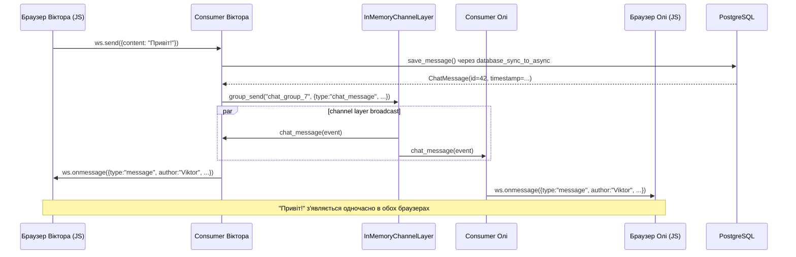

# 7B. WebSocket JS клієнт

---

## Vanilla JS WebSocket API

Браузерний WebSocket API — вбудований, без бібліотек:

```javascript
// Відкрити з'єднання
const ws = new WebSocket('ws://127.0.0.1:8001/ws/groups/7/chat/')
//                        ↑ ws:// для HTTP, wss:// для HTTPS

ws.onopen    = () => { /* з'єднання встановлено */ }
ws.onmessage = (e) => { const data = JSON.parse(e.data) }  // сервер надіслав
ws.onclose   = (e) => { /* код закриття: 1000=норм, 1006=аварія */ }
ws.onerror   = (e) => { /* помилка з'єднання */ }

ws.send(JSON.stringify({ content: "Привіт!" }))  // надіслати на сервер
ws.close()                                        // закрити з'єднання
```

### readyState значення

| `ws.readyState` | Константа | Значення |
|-----------------|-----------|----------|
| `0` | `WebSocket.CONNECTING` | З'єднання встановлюється |
| `1` | `WebSocket.OPEN` | З'єднання відкрите, можна надсилати |
| `2` | `WebSocket.CLOSING` | З'єднання закривається |
| `3` | `WebSocket.CLOSED` | З'єднання закрите |

### Close codes

| Код | Значення |
|-----|----------|
| `1000` | Нормальне закриття — НЕ перепідключатись |
| `1001` | Сторінка закривається — НЕ перепідключатись |
| `1006` | Аварійне (інтернет обірвався) — перепідключитись |
| `4001` | Custom: не авторизований |
| `4003` | Custom: не є членом групи — НЕ перепідключатись |

---

## Повний JS клієнт notes_chat_app

```javascript
// notes_app/static/notes_app/js/group_chat.js

document.addEventListener('DOMContentLoaded', function () {
    const container = document.getElementById('chat-container');
    const groupPk = container.dataset.groupPk;
    const messagesDiv = document.getElementById('chat-messages');
    const messageInput = document.getElementById('message-input');
    const sendButton = document.getElementById('send-button');

    // ws:// для HTTP, wss:// для HTTPS (ngrok)
    const wsProtocol = window.location.protocol === 'https:' ? 'wss:' : 'ws:';
    const wsUrl = `${wsProtocol}//${window.location.host}/ws/groups/${groupPk}/chat/`;

    let ws = null;
    let reconnectAttempts = 0;
    const MAX_RECONNECT = 5;

    function connect() {
        ws = new WebSocket(wsUrl);

        ws.onopen = function () {
            reconnectAttempts = 0;
            sendButton.disabled = false;
            updateStatus('connected', 'Підключено');
        };

        ws.onmessage = function (event) {
            const data = JSON.parse(event.data);
            if (data.type === 'history' || data.type === 'message') {
                addMessage(data);
            } else if (data.type === 'error') {
                showError(data.message);
            }
        };

        ws.onclose = function (event) {
            sendButton.disabled = true;

            // Custom close codes — не перепідключатись
            if (event.code === 4001 || event.code === 4003) {
                updateStatus('error', 'Доступ заборонено');
                return;
            }

            if (reconnectAttempts < MAX_RECONNECT) {
                reconnectAttempts++;
                const delay = Math.min(1000 * reconnectAttempts, 5000);
                updateStatus('reconnecting', `Перепідключення (${reconnectAttempts}/${MAX_RECONNECT})...`);
                setTimeout(connect, delay);
            } else {
                updateStatus('error', 'Помилка підключення. Перезавантажте сторінку.');
            }
        };
    }

    function sendMessage() {
        const content = messageInput.value.trim();
        if (!content || !ws || ws.readyState !== WebSocket.OPEN) return;
        ws.send(JSON.stringify({ content: content }));
        messageInput.value = '';
        messageInput.focus();
    }

    sendButton.addEventListener('click', sendMessage);

    messageInput.addEventListener('keydown', function (e) {
        if (e.key === 'Enter' && !e.shiftKey) {
            e.preventDefault();
            sendMessage();
        }
    });

    function addMessage(data) {
        const wrapper = document.createElement('div');
        wrapper.className = 'chat-message';
        // escapeHtml() — ОБОВ'ЯЗКОВО для XSS захисту
        wrapper.innerHTML = `
            <span class="chat-author">${escapeHtml(data.author)}</span>
            <span class="chat-time">${formatTime(data.timestamp)}</span>
            <div class="chat-content">${escapeHtml(data.content)}</div>
        `;
        messagesDiv.appendChild(wrapper);
        messagesDiv.scrollTop = messagesDiv.scrollHeight;
    }

    function escapeHtml(text) {
        const div = document.createElement('div');
        div.appendChild(document.createTextNode(text));
        return div.innerHTML;
    }

    function formatTime(isoString) {
        return new Date(isoString).toLocaleTimeString('uk-UA', {
            hour: '2-digit', minute: '2-digit',
        });
    }

    function updateStatus(type, message) {
        const el = document.getElementById('connection-status');
        if (el) { el.textContent = message; el.className = `status-${type}`; }
    }

    function showError(message) {
        const el = document.createElement('div');
        el.className = 'alert alert-warning';
        el.textContent = message;
        messagesDiv.appendChild(el);
        setTimeout(() => el.remove(), 5000);
    }

    connect();
});
```

---

## Шаблон чату

```html
{# notes_app/templates/notes_app/group_chat.html #}




<div id="chat-container"
     data-group-pk="{{ group.pk }}"
     class="d-flex flex-column"
     style="height: 80vh;">

  <h2>{{ group.name }} — Чат</h2>

  <div id="connection-status" class="mb-2 text-muted small">Підключення...</div>

  <div id="chat-messages"
       class="flex-grow-1 overflow-auto border rounded p-3 mb-2 bg-light">
  </div>

  <div class="input-group">
    <input id="message-input"
           type="text"
           class="form-control"
           placeholder="Введіть повідомлення... (Enter — надіслати)"
           maxlength="2000">
    <button id="send-button" class="btn btn-primary" disabled>
      Надіслати
    </button>
  </div>
</div>



<script src=""></script>

```

**Як `group_pk` потрапляє до JS:**
```html
<div id="chat-container" data-group-pk="{{ group.pk }}">
```
```javascript
const groupPk = container.dataset.groupPk;
// ↑ dataset.groupPk читає data-group-pk атрибут
```

---

## Стан з'єднання (status bar у UI)

```
connecting → connected → (якщо аварія) disconnected → (авторепідключення) connecting → ...

Логіка авторепідключення:
  1000 = нормальне закриття  → НЕ перепідключатись
  1001 = сторінка закривається → НЕ перепідключатись
  4001 = не авторизований → НЕ перепідключатись (покажи "Доступ заборонено")
  4003 = не є членом → НЕ перепідключатись (покажи "Доступ заборонено")
  1006 = аварія (інтернет, сервер впав) → перепідключитись через N сек

Exponential backoff:
  Спроба 1: через 1000ms
  Спроба 2: через 2000ms
  Спроба 3: через 3000ms
  ...
  Максимум: через 5000ms (Math.min(1000 * attempts, 5000))
  Після 5 спроб: "Помилка підключення. Перезавантажте сторінку."
```

### Два типи повідомлень від сервера

| `type` | Коли | Від чого | Що відображається |
|--------|------|----------|-------------------|
| `history` | Одразу після connect() | `load_history()` у consumer | Останні 50 повідомлень з БД |
| `message` | Real-time | `chat_message()` у consumer | Нове повідомлення від будь-кого |

---

## XSS захист: escapeHtml функція

Чат показує контент від інших юзерів — класична точка XSS атаки.

### Вектор атаки

```
Зловмисник надсилає в чат:
  

Якщо JS клієнт вставляє через innerHTML без escaping:
  div.innerHTML = data.content  ← НЕБЕЗПЕЧНО

→ Браузер парсить HTML → img не завантажується → onerror спрацьовує
→ fetch() відправляє cookies на evil.com → сесії вкрадені
→ Session Hijacking: зловмисник отримує sessionid всіх учасників чату
```

### Три безпечних варіанти

```javascript
// ✅ Метод 1: textContent (тільки текст, HTML не парситься)
messageDiv.textContent = data.content

// ✅ Метод 2: createTextNode
messageDiv.appendChild(document.createTextNode(data.content))

// ✅ Метод 3: escapeHtml() перед innerHTML (якщо потрібна HTML верстка)
function escapeHtml(text) {
    const div = document.createElement('div')
    div.appendChild(document.createTextNode(text))
    return div.innerHTML
    // & → &amp;  < → &lt;  > → &gt;  " → &quot;
}
wrapper.innerHTML = `<strong>${escapeHtml(data.author)}</strong>: ${escapeHtml(data.content)}`
```

### Чому innerHTML небезпечний без escaping

```javascript
// ❌ НЕБЕЗПЕЧНО: user content напряму в innerHTML
div.innerHTML = data.content  // зловмисник надсилає <script>...</script> → XSS

// ✅ ПРАВИЛЬНО: escapeHtml() перед будь-яким user content
wrapper.innerHTML = `<div class="chat-content">${escapeHtml(data.content)}</div>`
// escapeHtml замінює: & → &amp;  < → &lt;  > → &gt;  " → &quot;  ' → &#039;
```

**У notes_chat_app** використовуємо метод 3 (`escapeHtml`) — нам потрібна HTML верстка повідомлення (автор, час, контент у різних елементах), тому `textContent` не підійде.

---

## Повний flow: від натискання Enter до появи повідомлення у всіх



Весь цей шлях — **без жодного HTTP запиту**. Тільки WebSocket frames.

---

## Тестування чату в браузері

**Крок 1:** Запусти ASGI-сервер (чат вимагає ASGI, не runserver):

```bash
# Локально:
uvicorn notes_project.asgi:application --reload --port 8001

# Або через Docker:
docker compose up -d
```

**Крок 2:** Відкрий http://127.0.0.1:8001/ і залогінься.

**Крок 3:** Перейди до будь-якої групи (http://127.0.0.1:8001/groups/) і натисни «Відкрити чат».

**Крок 4:** Відкрий той самий URL у другій вкладці (або іншому браузері) під іншим користувачем.

**Крок 5:** Надішли повідомлення — воно з'явиться в обох вкладках **миттєво** без перезавантаження.

### Що перевірити в DevTools

```
DevTools → Network → WS вкладка:
  - Знайди рядок ws://... (WebSocket з'єднання)
  - Кліпни на нього
  - Вкладка "Messages" — всі WS frames в реальному часі
  - ↑ Зелені = надіслані браузером (send)
  - ↓ Білі  = отримані від сервера (receive)
```

> **Щоб побачити різницю:** спробуй уявити той самий чат через polling (GET кожні 2 сек).
> При WebSocket — один рядок (WS-з'єднання).
> При polling — новий рядок кожні 2 секунди, навіть коли ніхто нічого не пише.

---

## Далі

Наступна глава: **[Checkpoint](checkpoint.md)** — чеклисти 7A і 7B, Consumer тести, типові помилки, навігація.
